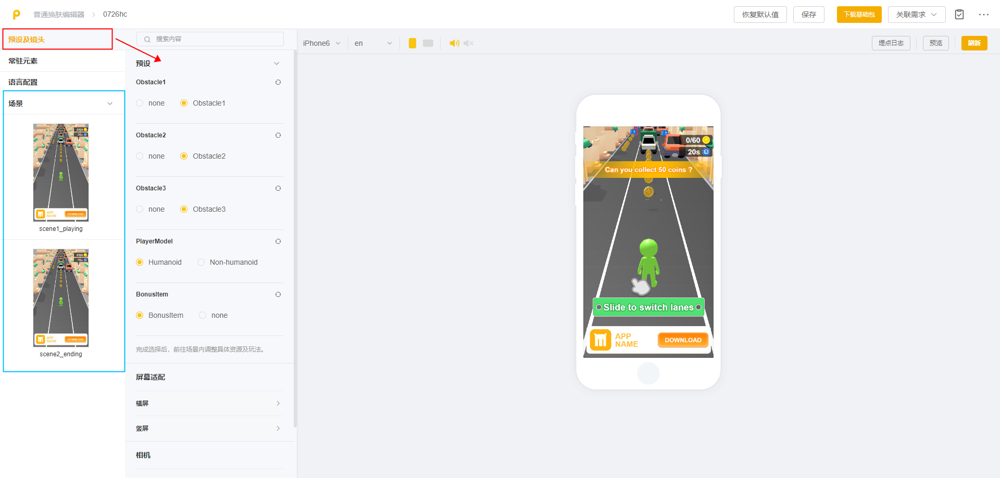

# 3D模板

Playturbo现已支持3D类型的可玩素材产出，可通过模版换肤制作的方式对3D模版进行迭代

<mark style="color:red;">**注意：当前3D模版仅支持 【换肤制作-普通制作】**</mark>

## <mark style="color:blue;">一、项目创建</mark>

1）在「模版库」-「可玩模版」页面，筛选类型为「3D」的模板，即可展示当前所有3D模版

<figure><figcaption></figcaption></figure>

2）点击模版进行预览。预览界面会展示当前模板的玩法标签，以及该模板使用的模板数量与动作数量

温馨提示：一个模板可能包含多套皮肤，用于替换不同的模型和玩法参数；可切换皮肤进行预览，并选择最适合的皮肤创建项目

3）确认皮肤后，点击「换肤制作」 - 「普通制作」 ，填写项目名称后即进入编辑页面

<figure><figcaption></figcaption></figure>

## <mark style="color:blue;">二、换肤制作</mark>

💡对比2D模板，3D模板换肤制作项目，编辑页面新增了【预设及镜头】这一模块

💡**建议操作流程：**

1）先在「预设及镜头」，对预设、屏幕适配、相机 这三部分参数进行调整

2）再依次进入「常驻元素」和「场景」，对3D模型资源及其他2D资源进行替换、调整

3）如有翻译多语言版本的需求，可进入「语言配置」模块添加或修改语言

<figure><figcaption></figcaption></figure>

### 1.预设及镜头 

「预设及镜头」包含三部分：预设、屏幕适配、相机

<figure><figcaption></figcaption></figure>

#### <mark style="background-color:blue;">1.1 预设</mark>

* 「预设」是一系列游戏逻辑、素材模型的集合，可通过切换预设，实现不同游戏逻辑、不同场景、不同模型的素材产出
* 「预设」为单选切换
* **调整「预设」后可能会使用到不同的模型，需前往场景内调整具体资源及玩法**

<figure><figcaption>
示例：在[3D经典躲避跑酷]模板的「预设」中,可分别对模板的人物模型、有无奖励、有无障碍进行调整
</figcaption></figure>

#### <mark style="background-color:blue;">1.2 屏幕适配</mark>

在「屏幕适配」下，可分别调整横屏和竖屏的**FOV偏移值**

* FOV偏移值指的是视场角（Field of View，简称FOV）的偏移量或调整值，是指摄像机或视点能够看到的视野范围
* FOV偏移值用于调整视场角的中心点，使得视野可以向某个方向偏移，从而改变用户的视觉体验
* 较大的FOV值提供更广阔的视野，适用于开放环境；较小的FOV值提供更集中的视野，适用于狭窄空间

<figure><figcaption>
调整前
</figcaption></figure>

<figure><figcaption>
调整后
</figcaption></figure>

#### <mark style="background-color:blue;">1.3 相机</mark>

帮助精确控制和调整相机的视角和运动，以提供更好的视觉体验和交互效果。**每个模板可调整的相机参数的数量和内容各不相同，由模板的玩法决定**

例如在\[3D经典躲避跑酷]模板中，可调整的三个相机参数分别为：开头特写、跑酷主相机、结算镜头

<figure><figcaption></figcaption></figure>

展开每个相机参数，可对相机位置角度进行调整，以实现不同的视觉效果

可调整的参数包含：极角、方位角、径向距离、X轴视角偏移、Y轴视角偏移、Z轴视角偏移、阻尼系数

* **极角：**代表相机上下(俯仰)旋转的角度，越大则代表越向上旋转
* **方位角：**代表相机左右(水平)旋转的角度，越大则代表越向右旋转
* **径向距离：**代表相机和目标物体之间的距离，越大则代表相机越远
* **X/Y/Z轴视角偏移：**对相机的X、Y、Z轴坐标进行调整，以改变相机视角的位置
* **阻尼系数：**用于平滑相机运动，阻尼系数越大，则相机移动旋转越慢

<figure><figcaption>
具体效果可自行调整体验
</figcaption></figure>

### 2.场景: 3D资源

进入「场景」，除常规2D资源外，还可看到该项目内的所有3D模型资源，并可对3D模型资源，进行编辑、替换、下载等操作

#### <mark style="background-color:blue;">2.1 模型替换</mark>

点击模型资源上的「替换」按钮，调起「模型库」弹窗，可从中选择资源进行替换

<mark style="color:red;">需注意：</mark>

* <mark style="color:red;">3D资源当前仅支持从【模型库】中选取预设好的模型进行替换，暂不支持本地上传</mark>
* <mark style="color:red;">3D资源仅支持同类型资源的替换，如人替换人、动物替换动物</mark>

<figure><figcaption></figcaption></figure>

#### <mark style="background-color:blue;">2.2 模型编辑</mark> 

点击模型资源上的「编辑」按钮，调起「模型编辑」弹窗（或替换模型资源后自动进入编辑窗口）

「模型编辑」窗口左侧为参数调整区域，右侧为预览区域

* **预览区域**含"修改前"和"修改后"，可对调整的参数进行实时预览
* 当前支持三种预览模式，用以控制相机镜头。最后一个按钮为「重置镜头」
  * 默认模式：左键拖拽旋转以调整角度
  * 平移模式：左键拖拽进行预览相机的平移
  * 缩放模式：左键拖拽进行缩放

<figure><figcaption></figcaption></figure>

**参数调整区域**包含三部分：「基础」参数、「皮肤」参数、「动作」参数（部分模型）

<figure><figcaption></figcaption></figure>

**1）参数：基础**

可对模型X、Y、Z的位置、旋转、缩放进行修改

温馨提示："缩放值"默认联动缩放；**如不需要，可点击图示按钮解除联动**

<figure><figcaption></figcaption></figure>

**2）参数：皮肤**

可对模型进行「部位改色」和「材质参数」的调整

* **部位改色：**支持对该模型不同部位的颜色进行修改
* 注：支持改色的部位是内部结合模型较为明显或通用的部位所抽取的，暂不支持自定义部位
* 支持颜色的清除、重置

<figure><figcaption></figcaption></figure>

* **材质参数：**可对模型的「主颜色-叠色」、「环境遮蔽强度」、「粗糙度」、「金属光泽」、「镜面强度」、「自发光颜色」等参数进行修改（具体修改效果可自行体验）
* 支持重置参数

<figure><figcaption></figcaption></figure>

**3）参数：动作**

注：部分模型有对应的动作，则在模型编辑窗口内有「动作」Tab页，展示该模型关联的所有动作资源

对于动作资源，支持：替换动作、调整播放速率、调整关键帧

* **替换：**支持替换动作资源

<figure><figcaption></figcaption></figure>

* **速率：**滑动或输入数值以调整其播放「速率」，在右侧预览区可实时预览该动作

<figure><figcaption></figcaption></figure>

* **关键帧调整：**对于部分动作，动作播放到第n帧时会触发相应的其他事件，被称为关键帧。_如「攻击」动作到第5帧时，触发「出血」事件_
* 该关键帧的位置可以在右侧预览进度条区域通过 **移动菱形滑块** 进行调整<mark style="color:red;">（尤其注意替换动作之后，关键帧的位置可能需要调整）</mark>

<figure><figcaption></figcaption></figure>

完成「预设及镜头」和「3D资源」的调整后，可继续对其他常规2D资源进行替换与调整，具体操作可查阅  [bian-ji-ye-mian-fen-qu-jie-shao](bian-ji-ye-mian-fen-qu-jie-shao/ "mention")
