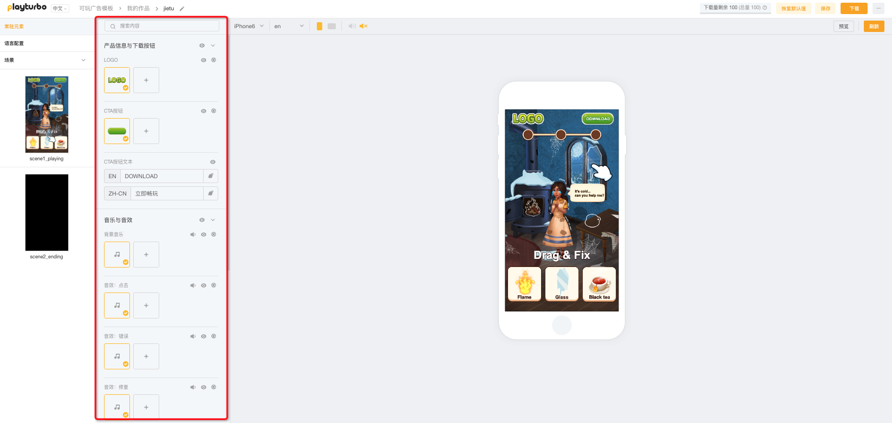

# 参数设置-参数调整区

选择「常驻元素」和「场景」层级时，参数调整区会出现各种类型的参数内容。

选择「语言配置」层级时，参数调整区会出现多语言配置的相关内容。

<figure><figcaption></figcaption></figure>

常驻元素/场景： [can-shu-lei-xing-jie-shao.md](can-shu-lei-xing-jie-shao.md "mention")

语言配置： [duo-yu-yan-pei-zhi-yu-zhi-neng-fan-yi.md](duo-yu-yan-pei-zhi-yu-zhi-neng-fan-yi.md "mention")
