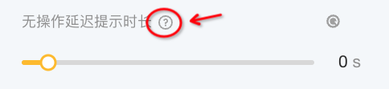

# 参数类型介绍

<mark style="color:red;background-color:red;">**温馨提示：**</mark>

* 建议您在正式换肤前，先按照图示路径将模板的全部资源下载到本地
* 下载成功后，在本地解压文件，即可看到该模板内的所有资源
* 处理需要替换的图片资源：使用图像处理工具打开对应的模板图片资源，按照模板图片资源的尺寸大小、元素分布位置来处理自己的资源
* 所有图片资源处理完毕，即可进入【换肤编辑器】进行资产替换

<figure><figcaption></figcaption></figure>

**换肤编辑器支持修改包括但不限于以下参数：**

图片/音频/文本/视频/颜色/玩法参数

## 1. 图片（<mark style="color:red;">包括单图和序列帧</mark>）

上传、选择、删除、编辑、更换、隐藏

#### **操作提醒：**

* 建议在调整或上传图片/序列帧的时候，先查看弹出的资源信息，减少包体和尺寸问题

<figure><figcaption></figcaption></figure>

* 双击资源时，可以获取现有资源的信息，并进行轻微调整

<figure><figcaption></figcaption></figure>

### 1）图片

* 支持从【图片库】和【我的资产库】中选取资产进行上传或替换
* 【我的资产库】只展示符合当前格式要求的资产
* 可从【我的资产库】中选择以往资产，或从本地上传新资产

<figure><figcaption></figcaption></figure>

### **2）序列帧**

<mark style="color:red;">**【请注意】上传格式要求：**</mark>

* 包含多个**png**的**zip**文件 (特别提示: zip压缩包内只能包含1个文件夹 或 直接包含多个png文件)
* 文件大小限制：最大8MB
* **PNG命名限制：**命名不能出现空格；同时需以数字结尾，且数字要按顺序进行编号
* 上传数量限制：**大于等于**原本坑位数量即可

<mark style="color:red;">Tips：将鼠标悬浮于+号图标处，会出现当前资产坑位具体的格式要求哦！</mark>

<figure><figcaption></figcaption></figure>

* 上传后可在右侧参数调整区拖动调整序列帧的顺序

<figure><figcaption></figcaption></figure>

* 支持从【公共动图库】和【我的资产库】中选取资产进行上传或替换

<figure><figcaption></figcaption></figure>

* 可从【我的资产库】中选择以往资产，或从本地上传新资产
* 注意：【我的资产库】仅允许上传**符合当前类型资产格式要求**的资产

<figure><figcaption></figcaption></figure>

## 2. 音频

上传、选择、删除、更换、音量控制、隐藏

* 支持从【公共音效库】和【我的资产库】中选取资产进行上传或替换
* 【我的资产库】只展示符合当前格式要求的资产
* 可从【我的资产库】中选择以往资产，或从本地上传新资产

<figure><figcaption></figcaption></figure>

## 3. 文本

修改文本、修改字体、修改颜色、修改大小、修改字间距、修改粗细、多语言修改、隐藏

<figure><figcaption></figcaption></figure>

**补充：关于字体**

1）支持从【字体库】中选择公共字体使用；

**2）支持通过【本地上传】添加自定义字体；**

3）支持将当前文本字体【应用到同语言的所有文本】

**补充：自定义字体**

字体文件格式：ttf;otf，且大小不超过10M

操作说明：

* 点击【+本地上传】按钮，调起本地资源弹窗，选择符合要求的资源
* 上传成功后在【当前素材字体】下方增加【已上传】，显示上传成功的字体
* 若字体被删除，再次打开项目则会弹出字体丢失弹窗，需要重新选择字体

<figure><figcaption></figcaption></figure>

## 4. 视频

可对原模板中的视频进行调节（部分模板自带）

* 支持从【我的资产库】中选取资产进行上传或替换
* 【我的资产库】只展示符合当前格式要求的资产
* 可从【我的资产库】中选择以往资产，或从本地上传新资产

<figure><figcaption></figcaption></figure>

## 5. 颜色

修改、清空

<figure><figcaption></figcaption></figure>

## 6. 玩法参数

可对某些特定玩法内容进行调节，鼠标移到「小问号」处，能够查看参数详细描述

<figure><figcaption></figcaption></figure>

<mark style="color:red;">参数类型包括：</mark>

<table><thead><tr><th width="233.5">参数类型</th><th>截图参考</th><th data-hidden></th></tr></thead><tbody><tr><td>拖拽条：slider</td><td></td><td></td></tr><tr><td>文本输入框：input</td><td></td><td></td></tr><tr><td>开关：switch</td><td></td><td></td></tr><tr><td>单选：radio</td><td></td><td></td></tr><tr><td>复选：checkbox</td><td></td><td></td></tr><tr><td>选择组件：select</td><td></td><td></td></tr></tbody></table>

