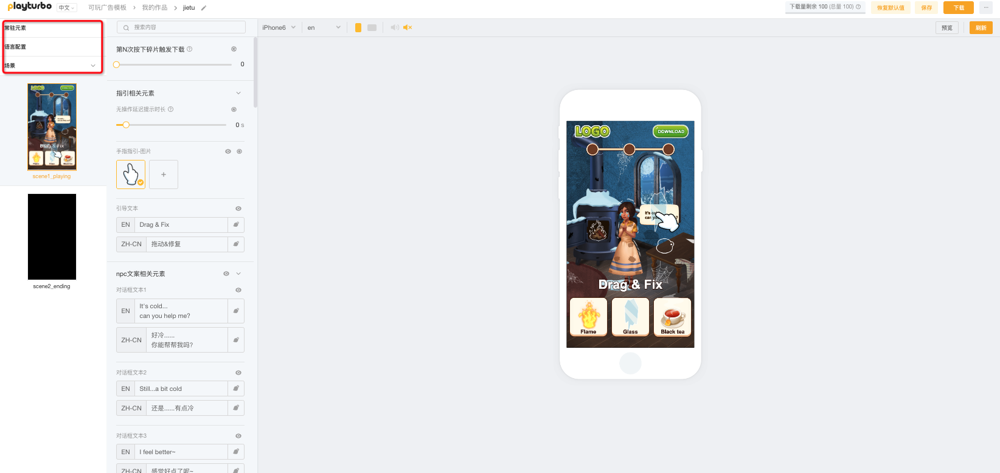

# 参数设置-层级选择区

参数设置区-层级选择区，包括三个部分：常驻元素/语言配置/场景（展开有n个场景缩略图）

<mark style="color:red;">注意：选择不同的层级，对应的参数内容会在参数调整区展开</mark>

<figure><figcaption></figcaption></figure>

## 常驻元素

* 一般来说，贯穿玩法的内容都会被放在该层级中，如LOGO,常驻按钮,背景音乐,跳转参数等
* 里面会包括各种类型的参数提供调整 [can-shu-lei-xing-jie-shao.md](can-shu-she-zhi-can-shu-tiao-zheng-qu/can-shu-lei-xing-jie-shao.md "mention")

## 语言配置

* 在此进行语言相关的设置
* 包括多语言配置和多语言智能翻译 [duo-yu-yan-pei-zhi-yu-zhi-neng-fan-yi.md](can-shu-she-zhi-can-shu-tiao-zheng-qu/duo-yu-yan-pei-zhi-yu-zhi-neng-fan-yi.md "mention")

## 场景

* 场景层级下面，会有作品流程划分的多个场景缩略图
* 选中场景缩略图后，里面会包括各种类型的参数提供调整 [can-shu-lei-xing-jie-shao.md](can-shu-she-zhi-can-shu-tiao-zheng-qu/can-shu-lei-xing-jie-shao.md "mention")
