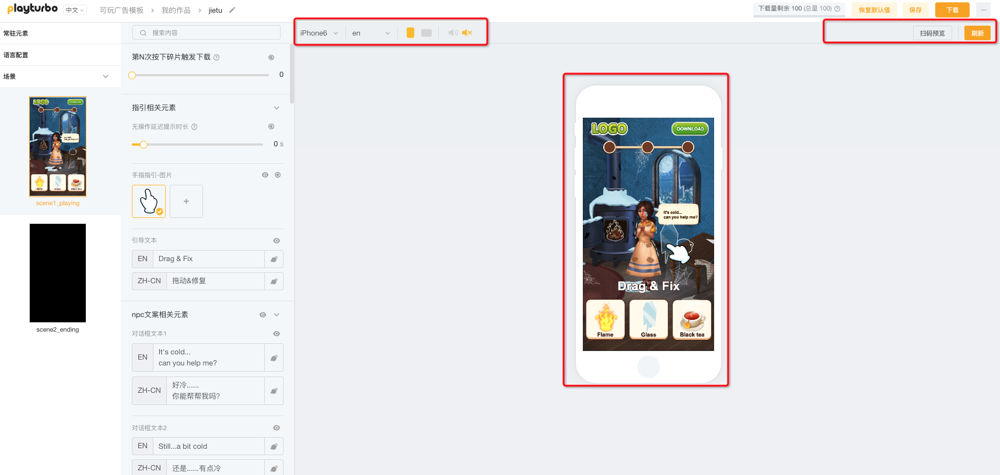

# 预览素材

## 1. 保存和刷新

* 完成编辑时，记得点击右上角的\[保存]按钮。如果需要预览，建议先点击\[刷新]按钮，刷新当前更新的内容
* 你的每一次编辑都可以通过保存刷新去实时预览

<figure><figcaption></figcaption></figure>

## 2. 选择预览相关的选项

* 你可以通过选择机型、语言、横竖屏选项，去选择你想要预览的载体内容
* 你也可以通过扫二维码，用手机去预览素材效果

<figure><figcaption></figcaption></figure>

