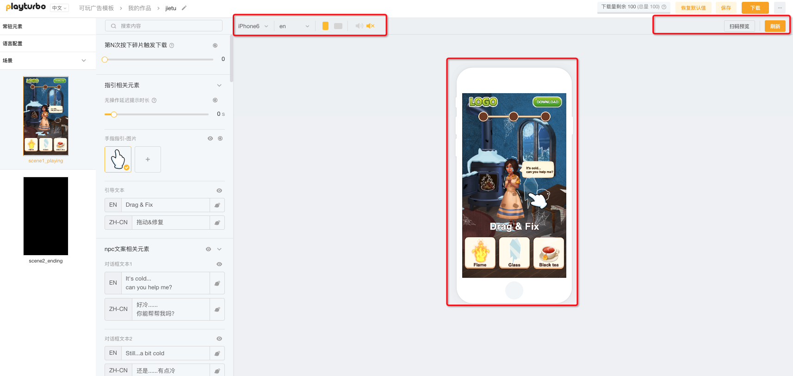

# 编辑页面分区介绍

换肤编辑器的编辑界面主要分为三大部分：

[1.-can-shu-she-zhi-qu](1.-can-shu-she-zhi-qu/ "mention")

[2.-zuo-pin-yu-lan-qu](2.-zuo-pin-yu-lan-qu/ "mention")

[3.-xiang-mu-cao-zuo-lan](3.-xiang-mu-cao-zuo-lan/ "mention")

<figure><figcaption></figcaption></figure>

## [1.-can-shu-she-zhi-qu](1.-can-shu-she-zhi-qu/ "mention")

你可以在此处完成作品的所有调整和替换：

* 图片/视频/音频的替换
* 文本调整和语言调整
* 玩法参数的调整

<figure><figcaption></figcaption></figure>

## [2.-zuo-pin-yu-lan-qu](2.-zuo-pin-yu-lan-qu/ "mention")

通过选择各个选项，你可以对可玩素材进行预览

<figure><figcaption></figcaption></figure>

## [3.-xiang-mu-cao-zuo-lan](3.-xiang-mu-cao-zuo-lan/ "mention")

顶部区域为项目操作栏，可以对项目进行 保存/推送/下载 相关的操作，也可以通过左侧导航返回主页

<figure><figcaption></figcaption></figure>
