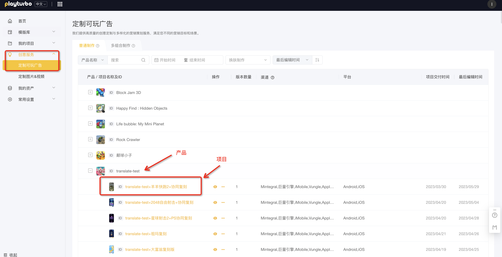

# 定制版本制作-版本新建指南

### STEP1 登入页面

[ding-zhi-yong-hu-ye-mian-zhi-nan.md](../../huan-ying-shi-yong-playturbo/ding-zhi-yong-hu-ye-mian-zhi-nan.md "mention")

### STEP2 选择制作方式

进入定制可玩广告页面后，需要我们选择本次制作的方式：

<figure><figcaption></figcaption></figure>

* **普通制作**&#x20;

用户根据自己的需要创建单个版本，然后对需要编辑的元素及参数进行调节，参数包括图片、文字、音频、视频、颜色、玩法等

* **多组合制作** [jiang-jie-bu-chong-duo-zu-he-zhi-zuo-fang-shi.md](../huan-fu-bian-ji-qi-shi-yong-zhi-nan/jiang-jie-bu-chong-duo-zu-he-zhi-zuo-fang-shi.md "mention")

一种批量制作方式，可更高效的产出多个版本进行ABtest。用户可以对所需调整的位置添加备选，一次性下载多个元素排列组合后的全部版本（最多组合数为27个）

###

### STEP3 选择产品和项目

点击对应的项目名称，进入项目页面

<figure><figcaption></figcaption></figure>

### STEP4 新建版本

点击新建版本按钮>>>填写版本名称并确认

<figure><figcaption></figcaption></figure>

