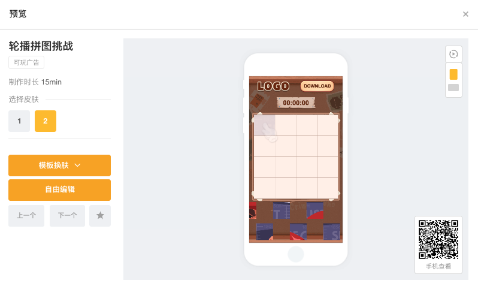

# 模板换肤制作-项目新建指南

### STEP1 海量模板任你挑选 

* 方法一：可根据玩法、行业或模版类型快速查找适合的模版
* 方法二：也可在搜索栏中输入关键字快速搜索相关的模版

<figure><figcaption></figcaption></figure>

### STEP2 选中模板

* 选中模版后会弹出以下界面，可预览模版效果，查看是否为期望的效果，也可用手机扫码预览
* 每个模板还会预设2套皮肤，供广告主更高效地制作符合自己产品风格的可玩广告

<figure><figcaption></figcaption></figure>

### STEP3 选择制作方式

点击换肤制作后，需要我们选择本次制作的方式

<figure><figcaption></figcaption></figure>

* **普通制作**&#x20;

用户根据自己的需要创建单个版本，然后对需要编辑的元素及参数进行调节，参数包括图片、文字、音频、视频、颜色、玩法等

* **多组合制作** [jiang-jie-bu-chong-duo-zu-he-zhi-zuo-fang-shi.md](../huan-fu-bian-ji-qi-shi-yong-zhi-nan/jiang-jie-bu-chong-duo-zu-he-zhi-zuo-fang-shi.md "mention")

一种批量制作方式，可更高效的产出多个版本进行ABtest。用户可以对所需调整的位置添加备选，一次性下载多个元素排列组合后的全部版本（最多组合数为27个）

### STEP4 输入作品名称

选中制作方式后，输入作品名称，点击确定后进入到作品编辑页

<figure><figcaption></figcaption></figure>
