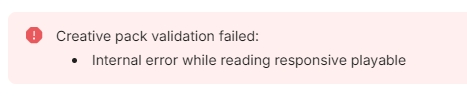

# 常见问题-导出&投放问题

## <mark style="color:blue;">1.关联推广产品相关问题</mark> 

### **Q1：**制作完可玩素材，关联推广产品输入产品信息时，商店链接粘贴到平台会出现乱码，同时上传到渠道后会提示商店链接无效  

**A：**需检查商店链接里是否含有非法字符（如混入产品日文名），需要删除这些字符，然后重新下载即可

<figure><figcaption></figcaption></figure>

### **Q2：**可玩素材关联推广产品，除Google Play和App Store外，支持其他的商店链接吗？如OPPO/华为/三星 

**A：**暂时不支持哦，因为平台当前仅支持 Web标准中的HTTP或HTTPS协议地址

（但一般来说，广告平台投放的跳转地址跟Playturbo这里录入的产品信息无关。 不过录入产品信息之后，信息会记录在库里，如果下次基于这个产品去做素材，然后投放到外部渠道(如imobile、Adcolony、Chartboost、Snapchat、applovin和unity)，这些渠道规范要求打包商店链接就会有影响的。 所以建议还是按照真实的商店链接来填写，不然始终会是一个隐患呢）

### **Q3：**导出时同时关联iOS和Android两个端，次数扣减是算1次还是2次？ 

**A：**1 次。次数主要和下载的渠道数量 以及导出的版本数量挂钩

## <mark style="color:blue;">2.可玩素材与Mintegral平台相关问题</mark>

### **Q1：Mintegral平台支持下载可玩素材吗？** 

**A：**不支持的。无论是从Playturbo推送过去的，还是用其他工具制作的可玩，都不支持下载哦

### Q2：可玩素材在预览和测试Mintegral渠道时，都可以正常试玩，下载其他渠道URL也能正常试玩。但推送到Mintegral后，在Mintegral获取的试玩链接，对素材的任何操作都会直接跳转到商店页面，无法正常试玩素材 

**A：**这可能是因为您在制作可玩项目时，将场景1勾选为了【结束场景】，这代表一进入试玩就会上报试玩结束，所以在Mintegral平台会出现一点击就跳转商店的情况（目前Vungle和Mintegral渠道，会要求设置【上报试玩结束】，所以如果设置的时机不对，会在这两个渠道有这种情况出现，其他渠道则没有）。

**解决办法：**取消勾选场景1为【结束场景】，同时在跳转商店的事件后面补一个【上报试玩结束】的响应事件即可

相关内容可查阅： [zuo-pin-zhi-zuo-zhong-yao-ti-shi.md](../zuo-pin-zhi-zuo-zhong-yao-ti-shi.md "mention")

### **Q3：**在Mintegral渠道投放，同样的Offer 使用可玩模板就起量了，自己空白制作的素材没有起量，可能是什么原因呢？ 

**A：**①首先，请确保您已往创意组中上传了视频素材（因为大盘跑互动的流量主要在"video+pl"，即可玩素材需要搭配视频素材一起投放）；②若您仍选择不上传视频素材，请检查您的可玩项目是否**只有1个场景 或**者 **有2个场景时场景2勾选为了Ending Scene**（这是因为当创意组内没有视频素材时，Playable(pl)类型的素材可以起量，但Endcard(iec)类型的素材不可以。若您的项目符合前述两种情况，则会被判定为Endcard类型的素材，这可能就是素材不起量的原因。而我们的模板大多属于pl类型素材）

**解决办法：**在项目内新建一个空白场景，放置在最后，不需要任何操作，仅仅让场景数量大于2个即可

相关内容可查阅： [mintegral-chuang-yi-cao-zuo-zhi-nan.md](../../qi-ta-jiao-cheng/zuo-pin-tou-fang-xiang-guan-wen-dang/mintegral-chuang-yi-cao-zuo-zhi-nan.md "mention")

## <mark style="color:blue;">3.可玩素材与其他平台相关问题</mark>

### **Q1：**导出Facebook渠道的可玩素材，上传到渠道会显示无效的json且提示CTA按钮问题，但预览素材时是可以正常跳转商店页面的 

**A：**建议您先根据 [ke-wan-guang-gao-qu-dao-shang-chuan-gui-fan.md](../../qi-ta-jiao-cheng/zuo-pin-tou-fang-xiang-guan-wen-dang/ke-wan-guang-gao-qu-dao-shang-chuan-gui-fan.md "mention")来对可玩素材进行测试，若测试时显示 _CTAClick not yet activated_，这需要您在测试的试玩区域点击一下下载按钮的，这样就没有问题了

<figure><figcaption></figcaption></figure>

### **Q2：**导出Google渠道的可玩素材，上传到渠道后被拒并提示诱导下载相关，可能的原因是？ 

**A：**当前Google渠道关于素材"引导下载"的规范，供您参考：

❎结束页不允许诱导，具体要求如下:&#x20;

* 结束页CTA按钮文案不允许用：Download/下载/跳转商店；
* 结束页不可出现指引手;&#x20;
* 常驻下载按钮文案不允许用：Download/下载；

✅被允许的情况:&#x20;

* 结束页/常驻下载按钮文案：Next/Play now;
* 结束页CTA按钮上使用缩放白色圆点代替指引手;
* 结束页使用无文案的空白按钮

## <mark style="color:blue;">4.预览试玩相关问题</mark>

### **Q1：**做好了可玩素材，在平台预览没问题，但用手机扫码试玩会鬼畜式加载或根本加载不出来，无法正常试玩？ 

**A：**出现这种情况，您可先自行检查是否是项目内的场景数量和视频资源过多，这会直接导致试玩加载缓慢甚至卡顿。建议：减少场景数量到≤4个；视频不要剪辑得太碎或交互次数过多
