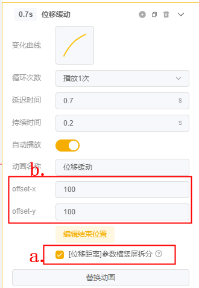

# 常见问题-动画问题

## <mark style="color:blue;">1.模板的动画可以调整吗？</mark>

### **Q1：在使用某模板进行自由制作时，想调整某个图层的动画可以吗？**

**A1：**需要结合具体的模板查看：选中想调整动画的 单个图层 或 所在的组图层，查看右侧【动画】参数一栏有无可调整的动画参数

* 若有，则支持调整，修改其动画参数或新增动画即可；
* 若无，则不支持调整

            

**相关阅读：** [#yi-tiao-zheng-zi-you-du-xu-zhi](../zi-you-bian-ji-qi-zhi-zuo-ji-qiao-zhong-xin/mu-ban-zi-you-zhi-zuo-xu-zhi.md#yi-tiao-zheng-zi-you-du-xu-zhi "mention")

## <mark style="color:blue;">2.动画的变化曲线怎么调整？</mark>

### **Q1：在使用通用动画时，想自定义曲线形状、添加关键帧，要怎么操作？**

**A：**点击曲线缩略图打开【曲线编辑器】，双击曲线的任意位置即可添加关键帧；选中并拖动关键帧可调整位置，拖动手柄可调整曲线弧度

**相关阅读：** [#id-2.-te-bie-shuo-ming-bian-hua-qu-xian](../zi-you-bian-ji-qi-shi-yong-zhi-nan/bian-ji-ye-mian-fen-qu-jie-shao/can-shu-she-zhi-qu/can-shu-lei-xing-jie-shao/dong-hua.md#id-2.-te-bie-shuo-ming-bian-hua-qu-xian "mention")

<figure><figcaption></figcaption></figure>

## <mark style="color:blue;">3.预览时发现动画有问题，没有呈现出参数设置的样子？</mark>

### **Q1：我给手指设置了位移动画，然后①隐藏了手指图层，想通过事件去显示并播放位移动画；②或是给动画设置了延迟播放。但发现每次预览时 手指运动的起始位置都不一样？位置有偏移**

**A：**这可能是因为没有关闭位移动画的【自动播放】。虽然设置了延迟或隐藏了手指，但在进入该场景的同时动画已经开始自动播放了，不过是没有显示在画面中；由于触发显示动画的时机不同，手指在那一瞬间显示出的位置也就不同。

<mark style="color:red;">若不是入场就需要播放的动画，其他都建议关闭动画的【自动播放】，通过设置事件去精准控制动画播放的时机。</mark>其他类型的动画也同理

<figure><figcaption></figcaption></figure>

### Q2：为什么在竖屏做好了位移动画，切换到横屏预览时位置都错了？

**A：**位移动画的\[位移距离]是默认横竖屏拆分设置的

* 若您想要位移动画在横竖屏下的位移距离都一样，可以先将竖屏的参数调整好，然后在竖屏状态下取消勾选拆分的设置\[标记a]。这样再切换到横屏预览 就是和竖屏一样的位移距离了
* 若横竖屏的位移距离不一样，则需要保持勾选拆分按钮，然后分别在竖屏和横屏下调整对应XY的距离\[标记b]

<figure><figcaption></figcaption></figure>

## <mark style="color:blue;">4.横竖屏想做不同的手指动画？</mark>

### Q1：横竖屏想做不同的手指动画要怎么设置？通用动画的曲线能否拆分横竖屏设置？

**A：**曲线不支持拆分横竖屏设置的。解决办法：添加2组手指，一组用于竖屏，一组用于横屏>>>然后拆分横竖屏来【显示/隐藏】对应手指>>>分别在横竖屏下调整不同手指图层的动画即可

<figure><figcaption></figcaption></figure>

