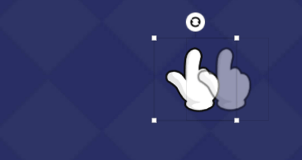

# 动画

**动画是什么？为什么要添加动画？**

动画是指在静止图片上添加一些过渡或强调效果，使图片看起来像是在运动。

在制作可玩素材时，我们几乎都会使用到静帧图片，通过给静帧图片设置动画，画面能够变得更加生动，指引性更强，从而提升内容的吸引力和用户的试玩体验。例如，利用动画可以模拟物体的移动、缩放、旋转等动态效果，达到更具表现力的视觉效果。

## <mark style="color:blue;">一、动画的使用</mark> 

### 1.添加动画 

1）选中需要添加动画的 单个图层 或 组图层

2）点击【+添加动画】，从四种动画类型中选择合适的动画即可

3）进一步调整动画参数，完成动画的设置

<figure><figcaption></figcaption></figure>

### 2.预览动画

1）点击图示按钮或【播放】，可在画布内预览当前单个动画

2）若同一图层有多个动画，可点击【播放全部动画】在画布内预览该图层的所有动画

3）点击【停止】或【停止动画播放】，暂停预览动画，动画回到初始状态

<figure><figcaption></figcaption></figure>

### 3.替换/删除动画

点击图示按钮，可替换当前动画类型/删除动画

<figure><figcaption></figcaption></figure>

### 4.复制动画

1-1）复制单个动画：点击图示按钮，复制当前单个动画

<figure><figcaption></figcaption></figure>

1-2）复制多个动画：选中有动画的图层，点击复制按钮

<figure><figcaption></figcaption></figure>

2）而后选中需要应用该动画的图层>>>粘贴>>>仅粘贴图层动画

<figure><figcaption></figcaption></figure>

### 5.应用到分组下全部图层

点击图示按钮【应用到分组下全部图层】，可将当前选中图层的所有动画一键复制粘贴到<mark style="color:red;">和该图层同一层级的所有图层</mark>下

（当您有较多同一层级的图层 需要制作相同的动画时，可使用该功能快速复用）

<figure><figcaption></figcaption></figure>

## <mark style="color:blue;">二、动画的类别及参数</mark>

动画包含**【进场动画】【退场动画】【强调动画】【通用】**4种动画类型，不同的动画其参数也不相同

<figure><figcaption></figcaption></figure>

### 1.循环次数/延迟时间/持续时间/自动播放/动画名称/位移/缩放/透明度/旋转角度/颜色变化

<table><thead><tr><th width="205">截图</th><th width="121">参数类型</th><th width="174">参数说明</th><th>补充说明</th></tr></thead><tbody><tr><td></td><td><strong>循环次数</strong></td><td>
支持3种选项：

播放1次

单向循环

双向循环
</td><td>
<strong>1.播放1次：</strong>动画仅播放1次，播完停止

<strong>2.单向循环：</strong>重复K1~K3的动画  <strong>3.双向循环：</strong>从K1到K3后，再从K3回到K1，如此往复 
</td></tr><tr><td></td><td><strong>延迟时间</strong></td><td>动画延迟出现/播放的时长</td><td>/</td></tr><tr><td></td><td><strong>持续时间</strong></td><td>完整播一次动画所需要的时长</td><td>同一个动画，其持续时间越长，动画播放速度越慢；反之则越快</td></tr><tr><td>

</td><td><strong>自动播放</strong></td><td>
默认自动播放；

支持关闭自动播放
</td><td>
<strong>1.自动播放：</strong>进入动画所在的场景后开始自动播放

<strong>2.关闭自动播放：</strong>关闭后，动画默认不播放，需通过设置事件控制动画的播放
</td></tr><tr><td></td><td><strong>动画名称</strong></td><td>支持自定义动画名称</td><td>Tips：当项目内添加了较多动画，可重命名动画，方便在设置事件时查找使用</td></tr><tr><td></td><td><strong>透明度</strong></td><td>需设置"起始状态"和"结束状态"数值</td><td>
数值范围0%~100%

0%：完全透明

100%：完全显示
</td></tr><tr><td></td><td><strong>缩放</strong></td><td>
需设置"起始比例"和"结束比例"数值；

支持起始/结束比例设置成当前值
</td><td>
Scale X：图层横向的比例

Scale Y：图层纵向的比例
</td></tr><tr><td>

</td><td><strong>位移</strong></td><td>
<strong>1.需设置X轴和Y轴的位移距离：</strong>正数为向下/向右；负数为向上/向左；

可点击图示标红箭头微调位移距离；

<strong>2.支持快捷编辑位移结束位置：</strong>点击【编辑结束位置】，在画布中将半透明图层拖拽到目标位置后【保存结束位置】即可
</td><td>
<mark style="color:red;"><strong>3.位移距离支持横竖屏拆分设置：</strong></mark>

默认勾选，勾选则代表竖屏与横屏的位移距离需分别调整(如已经在竖屏下设置好的位移距离不会应用于横屏)；

取消勾选代表横竖屏共用相同的位移距离，无需切换调整

</td></tr><tr><td></td><td><strong>旋转角度</strong></td><td>需设置"起始状态"和"结束状态"数值</td><td>数值无要求，可设置任意角度</td></tr><tr><td></td><td><strong>颜色变化</strong></td><td>需设置"开始颜色"和"结束颜色"</td><td>
在色板中选取颜色或使用取色器快捷选色

</td></tr></tbody></table>

### <mark style="color:red;">2.特别说明:变化曲线</mark>

【通用】类动画额外支持编辑动画的 变化曲线

<figure><figcaption></figcaption></figure>

#### 2.1 什么是变化曲线？

"变化曲线"是对动画的自定义、精细化编辑。若当前预设的动画都无法满足您的制作需求，可通过自定义"变化曲线"来制作更高阶更复杂的动画

#### 2.2 编辑变化曲线

**1）点击曲线缩略图打开曲线编辑器：**

* 横轴代表时间，纵轴代表动画对应的各种变量（位移、透明度、缩放比例、旋转角度等）；
* 起点(0, 0)为动画运动的默认初始状态，终点(1, 1)为动画运动的默认结束状态；
* 横向移动锚点会直接改变物体运动时间，调整曲线斜率会直接改变物体运动速度的分布（曲线越陡峭速度越快，曲线越平缓速度越慢）

<figure><figcaption></figcaption></figure>

**2）编辑曲线样式：**

* **选择曲线模板：**曲线编辑器预设了6种曲线样式，点击即可使用
* **自定义曲线样式：**
  * <mark style="color:red;">在曲线的任意位置</mark><mark style="color:red;">**双击**</mark><mark style="color:red;">可添加关键帧</mark>
  * 选中关键帧，拖拽手柄或点击右侧选项可调整曲线弧度
  * 选中关键帧后支持删除当前关键帧
  * 针对自定义的曲线样式，可点击【保存当前曲线】并编辑名称，将曲线样式设为模板，方便后续调用
* 曲线设置完成后，需点击【保存】才会生效

<figure><figcaption></figcaption></figure>

<figure><figcaption></figcaption></figure>

#### 2.3 举例说明

以动画_位移缓动_为例，横轴代表时间，纵轴代表位移距离，下面列举2个常见动画的调整方法

| **a. 物体在起点停留一段时间后，再开始运动**                                                                                    | **b. 物体在始末位置停留一段时间，并来回运动**                                                                                       |
| ------------------------------------------------------------------------------------------------------------ | ---------------------------------------------------------------------------------------------------------------- |
| 将曲线起点向右移动（延迟动画开始时间），物体会在红框时间段内完成移动；                                                                          | 
① 动画【循环次数】选择：双向循环；

② 将曲线起点向右移动，并将曲线终点向左移动（延迟动画开始时间并提早结束动画），物体会在红框时间段内完成移动；
                          |
|  |  |
|                            |                                |

更多常用动画的设置方法可查阅 [zhi-zuo-ji-qiao-dong-hua-she-zhi.md](../../../../zi-you-bian-ji-qi-zhi-zuo-ji-qiao-zhong-xin/tong-yong-zhi-zuo-ji-qiao/zhi-zuo-ji-qiao-dong-hua-she-zhi.md "mention")

## <mark style="color:blue;">三、支持添加动画的资产类型</mark>

资产类型决定了其是否支持添加和使用动画，详情如下：

<table><thead><tr><th width="187">资产类型</th><th>动画功能支持情况</th></tr></thead><tbody><tr><td><strong>图片</strong> </td><td>✅</td></tr><tr><td><strong>文本</strong></td><td>✅ </td></tr><tr><td><strong>序列帧</strong></td><td>✅</td></tr><tr><td><strong>粒子</strong></td><td>✅</td></tr><tr><td><strong>龙骨</strong></td><td>✅</td></tr><tr><td><strong>组图层</strong></td><td>✅</td></tr><tr><td><strong>视频</strong></td><td>不支持动画</td></tr><tr><td><strong>音频</strong></td><td>不支持动画</td></tr><tr><td><strong>背景音乐</strong></td><td>不支持动画</td></tr><tr><td><strong>手势区域</strong></td><td>不支持动画</td></tr><tr><td><strong>场景</strong></td><td>不支持动画</td></tr></tbody></table>
