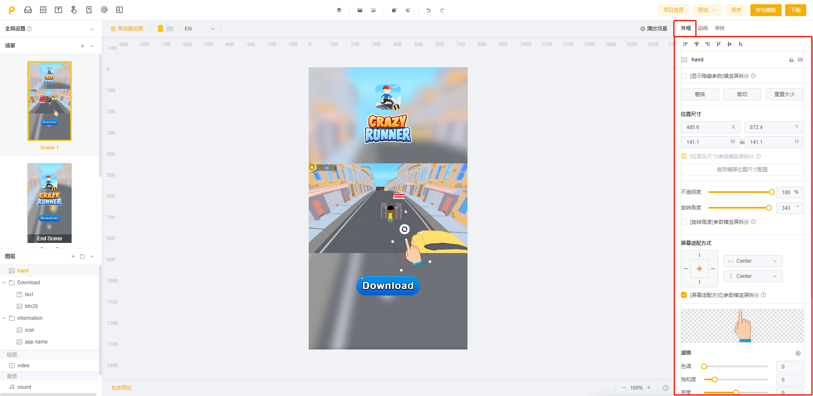

# 外观

外观参数包含**【常规参数】**和**【其他参数】**

<figure><figcaption></figcaption></figure>

## 常规参数

即普通资产的通用参数，一般包括对齐方式、显示隐藏参数、位置尺寸、复用横竖屏位置尺寸配置、透明度、旋转角度、屏幕适配方式、锚点、缩放比例

<table><thead><tr><th width="161">图片</th><th width="103">参数类型</th><th width="195">说明</th><th width="311">操作步骤</th></tr></thead><tbody><tr><td></td><td><strong>对齐方式</strong></td><td>支持【全局对齐】【局部对齐】两种对齐方式</td><td>
<strong>【全局对齐】</strong> 选中一个素材，点击对齐快捷键即可进行全局对齐

<strong>【局部对齐】</strong> 按住Ctrl键选中多个素材，点击对齐快捷键即，可进行多图层局部对齐 
</td></tr><tr><td></td><td><strong>显示隐藏参数</strong></td><td>支持对图层的显示或隐藏进行横竖屏拆分的设置</td><td>
<strong>【横竖屏拆分】</strong>

默认不拆分；若需要拆分设置，直接勾选即可
</td></tr><tr><td></td><td><strong>位置</strong></td><td>支持【拖拽调整】【编辑参数调整】两种模式</td><td>
<strong>【拖拽调整】</strong> 点击需要调整位置的素材，拖拽调整位置即可

<strong>【编辑参数调整】</strong> 1. 支持X轴、Y轴具体参数调整 2. 修改对应参数即可调整位置
</td></tr><tr><td></td><td><strong>尺寸</strong></td><td>支持【拉伸调整】【编辑参数调整】两种模式</td><td><strong>【拉伸调整尺寸】</strong> 1. 选中需要调整尺寸的素材，拖拽调整尺寸即可 2. 按住按住Shift键，可进行等比尺寸调整 <strong>【编辑参数调整】</strong> 1. 支持宽、高具体参数调整 2. 修改对应参数即可调整尺寸</td></tr><tr><td></td><td><strong>复用横竖屏位置尺寸</strong></td><td>支持横屏&#x26;竖屏制作模式下使用</td><td>点击【复用横/竖屏位置尺寸配置】按钮，即可成功复用 </td></tr><tr><td></td><td><strong>透明度</strong></td><td> 支持【滑块调整】【手动修改】透明度参数</td><td><strong>【滑块调整】</strong> 拖动滑块中的不透明度定位点，即可调整 <strong>【手动修改】</strong> 手动修改不透明度具体参数，即可调整</td></tr><tr><td></td><td><strong>旋转角度</strong></td><td>支持【手动调整】【编辑参数调整】两种方式</td><td><strong>【手动调整】</strong> 选中需要旋转角度的素材，点击素材上方的旋转按钮即可随意旋转该图层角度 <strong>【编辑参数调整】</strong> 手动修改对应参数即可进行旋转角度修改</td></tr><tr><td></td><td><strong>屏幕适配方式</strong></td><td> 1.默认为全局居中 2.支持【点击适配】和【选择适配】两种适配方式</td><td><strong>【点击适配】</strong> 1. 选中需要适配的素材 2. 点击定位适配框中即可进行点击适配 <strong>【选择适配】</strong> 1. 选中需要适配的素材 2. 点击横向/纵向适配列表，调起选项卡列表框 3. 选择适配方式，即可完成适配配置</td></tr><tr><td></td><td><strong>锚点</strong></td><td>为图层进行锚点设置，支持【编辑参数调整】</td><td>
<strong>【锚点】</strong>

默认为（50,50），可直接输入数字进行修改
</td></tr><tr><td></td><td><strong>缩放比例</strong></td><td>在原始尺寸基础上进行缩放调整</td><td>
1. 支持宽、高具体参数调整 2. 修改对应参数即可进行素材缩放

3.支持横竖屏拆分设置
</td></tr></tbody></table>

## 其他参数

除常规参数以外的，我们一般归为其他参数，其他参数主要是针对各资产类型（图层）的不同有所不同

**不同素材类型差异对比** [wai-guan](../fen-chang-jing-qu-jie-shao/tu-ceng/wai-guan/ "mention")

<table><thead><tr><th width="171">素材类型 </th><th>外观参数差异对比 </th></tr></thead><tbody><tr><td><strong>场景</strong></td><td><del>无外观参数</del> </td></tr><tr><td><strong>图片</strong></td><td>替换/裁切/重置大小/滤镜/点九图</td></tr><tr><td><strong>文本</strong></td><td>对齐方式/文案配置/字体/基础样式/描边/阴影/应用到其他语言/其他语言设置</td></tr><tr><td><strong>序列帧</strong></td><td>重置大小/序列帧编辑/播放/暂停/时间设置/播放次数/滤镜</td></tr><tr><td><strong>龙骨</strong></td><td>替换龙骨/播放设置/开始播放/暂停播放 </td></tr><tr><td><strong>粒子</strong></td><td>替换粒子贴图/播放设置/粒子参数/物理参数</td></tr><tr><td><strong>手势区域</strong></td><td><del>无外观参数</del></td></tr><tr><td><strong>组节点</strong></td><td><del>无外观参数</del></td></tr><tr><td><strong>视频</strong></td><td>播放视频/暂停视频/重新播放/替换/剪辑/重置大小/播放设置/声音设置</td></tr><tr><td><strong>音效</strong></td><td>音效播放/替换/剪辑/音量设置/播放设置</td></tr><tr><td><strong>背景音乐</strong></td><td><del>无外观参数</del></td></tr></tbody></table>
