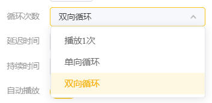

# 常规参数

常规动画参数包含：循环次数、延迟时间、持续时间、自动播放

## 常规动画参数说明

<table><thead><tr><th width="191">图片</th><th width="114">参数类型</th><th>说明</th><th>操作步骤</th><th align="center">补充说明</th></tr></thead><tbody><tr><td></td><td><strong>循环次数</strong></td><td>支持【播放1次/单向循环/双向循环】3种循环模式</td><td>点击循环次数列表框，调起选项卡列表进行选择即可</td><td align="center">  单向循环：重复K1~K3的动画   双向循环：K1到K3后，再从K3回到K1，如此往复 </td></tr><tr><td></td><td><strong>延迟时间</strong></td><td>动画延迟运行时间节点</td><td>编辑时间参数，即可延迟该动画运行时间节点</td><td align="center"><strong>/</strong></td></tr><tr><td></td><td><strong>持续时间</strong></td><td>动画运行时长</td><td>编辑时间参数，即可设置该动画的时间周期</td><td align="center"><strong>/</strong></td></tr><tr><td></td><td><strong>自动播放</strong></td><td>默认自动播放该动画</td><td>点击开关，即可关闭自动播放</td><td align="center">  开启自动播放  关闭自动播放 </td></tr></tbody></table>
