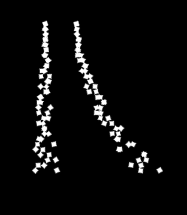

# 物理参数

物理参数支持调整X方向的重力与Y方向的重力

<table data-full-width="true"><thead><tr><th width="204">图片</th><th width="113">功能</th><th width="415">说明</th><th>预览图</th></tr></thead><tbody><tr><td></td><td><strong>重力</strong></td><td>
 1. 建议数值范围：-2000～-2000，按照50的倍数调整效果更佳 2. 为粒子增加重力加速度，可以让粒子在原本轨迹的基础上，模拟真实世界，增加抛物线的效果 3. 重力数值与XY轴方向的对应关系如图：

以发射器的中心为原点  X轴原点左侧为负值，原点右侧为正值 Y轴原点下面为正值，原点上面为负值 
</td><td></td></tr></tbody></table>
