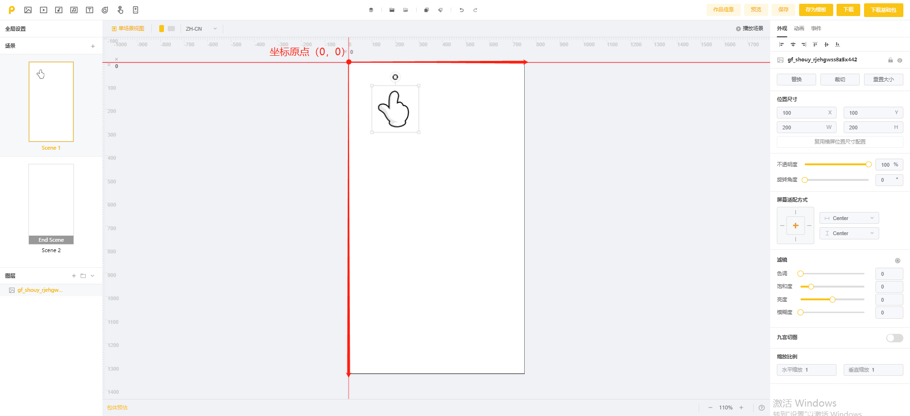

# 屏幕适配方式

入口：参数设置区>>>外观>>>屏幕适配方式

<figure><figcaption></figcaption></figure>

## <mark style="color:blue;">**1.适配规则: 图层的XY坐标距离原点的计算**</mark>

如下图，坐标原点(0,0)位于画布的左上角

画布中每个图层的坐标，是以图层的左上角为基准计算的。例如：手指图层的x、y坐标是(100,100），指的是手指图层左上角到原点的距离是（100,100）

<figure><figcaption></figcaption></figure>

## <mark style="color:blue;">**2.默认适配方案**</mark>

**图层以画布中心点为基准，相对画布的中心点坐标不变。**

各资产/图层在被添加到项目中时，其图层的屏幕适配方式都默认“水平居中&垂直居中”，即无论在多大的屏幕上预览，该资产都会出现在画面中央。

💡也就是说，<mark style="color:red;">默认我们是不需要调整图层的屏幕适配方式的，这样在画布中编辑的排版/位置是怎样的，在不同机型下预览就是怎样的，会自动等比适配；</mark>偶尔会需要对部分图层的屏幕适配方式进行调整，以在不同机型下获得最佳的视觉效果，如将产品信息设为"居中贴底"

建议阅读：  [#id-2.-tiao-zheng-ping-mu-shi-pei-fang-shi](../../../zi-you-bian-ji-qi-zhi-zuo-ji-qiao-zhong-xin/tong-yong-zhi-zuo-ji-qiao/zhi-zuo-ji-qiao-shi-pei-xiang-guan.md#id-2.-tiao-zheng-ping-mu-shi-pei-fang-shi "mention")

<figure><figcaption></figcaption></figure>

## <mark style="color:blue;">**3.不同的适配方式展示**</mark>

**若调整四边适配，则图层将以画布的四条边为基准，不同屏幕相对的边缘距离不变。**

例如，当图层选择左边和顶部(即左上角)适配时，在750\*1334的画布上，图层左上角相对画布左上角的原点是（100,100），那么换成其他尺寸的屏幕时，图层相对画布左上角的原点仍然是（100,100）

<table><thead><tr><th width="72" align="center">序号</th><th width="134" align="center">适配方案</th><th align="center">屏幕适配按钮</th><th align="center">iPhone6【750*1334（默认）】</th><th align="center">iPhone X【828*1972】</th><th align="center">ipad【768*1024】</th></tr></thead><tbody><tr><td align="center">1</td><td align="center">居中适配 默认适配方案</td><td align="center"></td><td align="center"></td><td align="center"></td><td align="center"></td></tr><tr><td align="center">2</td><td align="center">顶部适配</td><td align="center"></td><td align="center"></td><td align="center"></td><td align="center"></td></tr><tr><td align="center">3</td><td align="center">底部适配</td><td align="center"></td><td align="center"></td><td align="center"></td><td align="center"></td></tr><tr><td align="center">4</td><td align="center">居左适配</td><td align="center"></td><td align="center"></td><td align="center"></td><td align="center"></td></tr><tr><td align="center">5</td><td align="center">居右适配</td><td align="center"></td><td align="center"></td><td align="center"></td><td align="center"></td></tr><tr><td align="center">6</td><td align="center">左上角适配</td><td align="center"></td><td align="center"></td><td align="center"></td><td align="center"></td></tr><tr><td align="center">7</td><td align="center">右上角适配</td><td align="center"></td><td align="center"></td><td align="center"></td><td align="center"></td></tr><tr><td align="center">8</td><td align="center">左下角适配</td><td align="center"></td><td align="center"></td><td align="center"></td><td align="center"></td></tr><tr><td align="center">9</td><td align="center">右下角适配</td><td align="center"></td><td align="center"></td><td align="center"></td><td align="center"></td></tr></tbody></table>

## <mark style="color:blue;">4.调整适配的建议</mark>

💡因素材各不相同，您可根据实际需要对图层的屏幕适配方式进行适当调整。<mark style="color:red;">需注意，屏幕适配方式默认拆分横竖屏单独设置，您需要分别调整横屏和竖屏；若横竖屏的适配方式相同，则可以取消勾选</mark>

<figure><figcaption></figcaption></figure>

💡当设置完屏幕适配方式，建议您及时预览，并且**切换不同设备&横竖屏**来确认最终效果！
