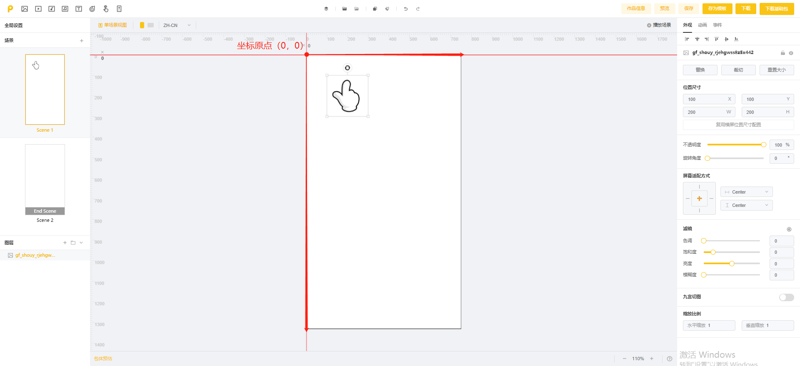
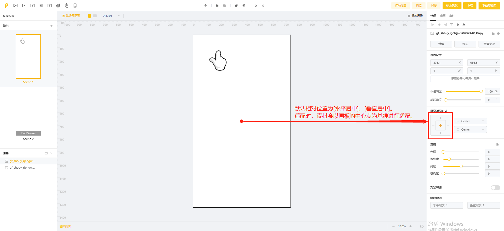

# 适配规则与适配方式

入口：参数设置区>>>屏幕适配方式

<figure><figcaption></figcaption></figure>

## 适配相关问题

### **1.作品原点与素材XY的计算**

如下图，作品的坐标原点(0,0)位于画板的左上角

画板中每个素材的坐标，也是以素材的左上角为基准。例如：手指素材的x、y坐标是(100,100），指的是手指素材左上角到原点的距离是（100,100）

<figure><figcaption></figcaption></figure>

###

### **2.默认适配方案**

素材以画面中心点为基准，相对画板的中心点坐标不变

如果您的素材本身也在画板中央，那无论在多大的屏幕上，素材都会出现在画面中央。\

<figure><figcaption></figcaption></figure>

###

### **3.四边适配**

如果您想让素材进行四边适配，即分别以画板的四条边为基准，素材相对所适配画板边缘距离不变

比如，当素材选择左边和顶部适配时，在750\*1334的画板上，素材相对画板的左上角原点是（100，100），那么换成其他尺寸的屏幕时，素材相对画板的左上角原点仍然是（100，100）\
<mark style="color:red;">**注意：同一素材在横竖屏的屏幕适配方式需要分别调整**</mark>

<table><thead><tr><th width="87" align="center">序号</th><th width="134" align="center">适配方案</th><th align="center">屏幕适配按钮</th><th align="center">iPhone6【750*1334（默认）】</th><th align="center">iPhone X【828*1972】</th><th align="center">ipad【768*1024】</th></tr></thead><tbody><tr><td align="center">1</td><td align="center">居中适配 默认适配方案</td><td align="center"></td><td align="center"></td><td align="center"></td><td align="center"></td></tr><tr><td align="center">2</td><td align="center">顶部适配</td><td align="center"></td><td align="center"></td><td align="center"></td><td align="center"></td></tr><tr><td align="center">3</td><td align="center">底部适配</td><td align="center"></td><td align="center"></td><td align="center"></td><td align="center"></td></tr><tr><td align="center">4</td><td align="center">居左适配</td><td align="center"></td><td align="center"></td><td align="center"></td><td align="center"></td></tr><tr><td align="center">5</td><td align="center">居右适配</td><td align="center"></td><td align="center"></td><td align="center"></td><td align="center"></td></tr><tr><td align="center">6</td><td align="center">左上角适配</td><td align="center"></td><td align="center"></td><td align="center"></td><td align="center"></td></tr><tr><td align="center">7</td><td align="center">右上角适配</td><td align="center"></td><td align="center"></td><td align="center"></td><td align="center"></td></tr><tr><td align="center">8</td><td align="center">左下角适配</td><td align="center"></td><td align="center"></td><td align="center"></td><td align="center"></td></tr><tr><td align="center">9</td><td align="center">右下角适配</td><td align="center"></td><td align="center"></td><td align="center"></td><td align="center"></td></tr></tbody></table>
