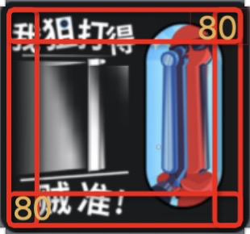

# 图片参数

图片图层的特殊参数包含：替换/裁切/重置大小/滤镜/点九图

**特殊参数说明**

<table data-full-width="false"><thead><tr><th width="112">图片</th><th width="95">参数类型</th><th width="134">说明</th><th width="279">操作步骤</th><th>补充</th></tr></thead><tbody><tr><td></td><td><strong>替换</strong></td><td>支持替换当前图片素材</td><td> 1. 点击按钮，调起图片素材面板 2. 选择/上传替换图片素材 3. 点击添加即可完成替换</td><td></td></tr><tr><td></td><td><strong>裁切</strong></td><td>支持图片裁切</td><td> 1. 点击裁切按钮 2. 进入裁切图片弹窗 3. 支持图片缩放，调整到合适的裁切大小 4. 点击【确定】，即可完成裁切</td><td></td></tr><tr><td></td><td><strong>重置大小</strong></td><td>支持图片重置为原始大小</td><td>点击重置大小按钮，即可恢复原始图片大小</td><td>/</td></tr><tr><td></td><td><strong>滤镜</strong></td><td>支持滤镜参数调整/重置滤镜参数</td><td> 1. 点击滤镜参数滑块/编辑滤镜具体参数，即可完成滤镜调整 2. 点击按钮可重置滤镜参数</td><td>/</td></tr><tr><td></td><td><strong>点九图</strong></td><td>即点九切图法，设置参数后图片可进行参数内区域不变形拉伸</td><td> 1. 点击开启点九图模式 2. 设置上下左右参数 3. 此时参数内区域，拉伸不变形 备注：红色框选区域就是设置的参数区域</td><td></td></tr></tbody></table>
