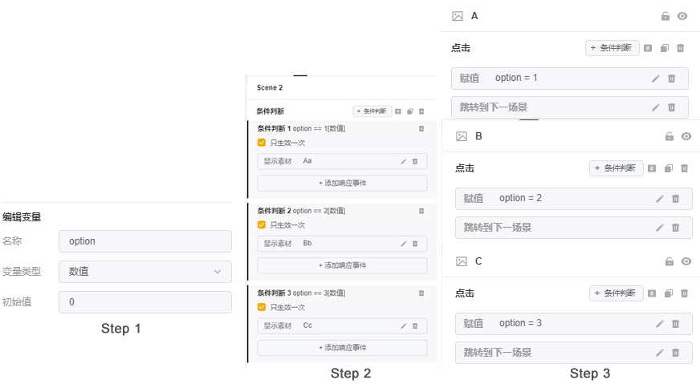

# 全局变量

入口：顶部资产库>>>全局变量

<figure><figcaption></figcaption></figure>

## 一、全局变量是什么

* 一种特殊的事件参数，可以在**所有场景**中被调用（普通事件仅可在当前场景被调用）
* 添加全局变量后，在各个场景通过判断全局变量当前的值，来触发所需的响应事件
* 全局变量的值可以是数值、文本、布尔值（真或假）
* 通常会在我们制作**玩法相对复杂**的素材时，若需要设置大量事件或根本无法通过普通事件实现时，全局变量就可以帮助我们<mark style="color:red;">将复杂的制作简单化</mark>

## 二、全局变量使用操作

简单来说，我们通常需要**3**个步骤就能完成一个全局变量的输出：

* 添加全局变量，根据实际需求设置变量类型（数值/文本/布尔值）
* 添加条件判断，来实现“只有当该条件成立时，才触发对应的响应事件”
* 添加响应事件

下面，我们依次展开详细介绍

### 1.添加【全局变量】

1）新增变量：点击【全局变量】-【添加变量】

2）对新增变量进行设置

* 名称：输入变量名称（自定义）
* 变量类型：选择数据类型，包括【数值】【文本】【布尔值】
* 初始值：根据选择的变量数据类型输入初始值（初始值可以为任意值）
* 描述：输入变量描述（非必填）

<figure><figcaption></figcaption></figure>

**附：变量类型表**

<table><thead><tr><th width="237">图标</th><th width="97">变量类型</th><th width="136">说明</th><th>操作说明</th></tr></thead><tbody><tr><td></td><td><strong>数值</strong></td><td>可输入任意数字作为初始值</td><td>

<ul><li>一般用于计算，包括大小判断和加减乘；</li><li>变量等于不同的值时，可以触发不同的行为；</li><li><mark style="color:red;">如，点击某个元素，参数变量根据点击次数进行累加，累加不同的值，可以分别触发不同的行为。</mark></li></ul></td></tr><tr><td></td><td><strong>文本</strong></td><td>可输入任意文本作为初始值</td><td>

<ul><li>用于传递文本属性的值，可以将用户输入的文本赋值给参数，结合条件执行判断。</li></ul></td></tr><tr><td></td><td><strong>布尔值</strong></td><td>可选择【true】或【false】两种状态作为初始值</td><td>

<ul><li>用于传递布尔值，可以将用户选择的布尔值给参数，结合条件执行判断。</li></ul></td></tr></tbody></table>

### 2.添加【条件判断】 

1）条件判断即对事件添加一个约束条件，当该条件成立时事件生效，否则不触发该事件

2）条件判断可以**作为一个触发事件直接添加**，也可以**添加于其他任意触发事件之上：**

* 直接添加【条件判断】事件：在场景中实时触发响应事件，即当条件判断成立时，响应事件会立刻触发；
* 在其他触发事件之上，添加【条件判断】事件：在场景中，当触发事件（如：点击）发生时，才会触发响应事件；

<table><thead><tr><th width="246">类型</th><th>操作步骤</th><th>图片</th></tr></thead><tbody><tr><td>直接添加【条件判断】事件</td><td>

<ul><li>点击添加事件</li><li>选择条件判断</li><li>添加条件：选择全局变量、判定方式、对比变量类型、对比数值</li><li>选择完毕后勾选即可成功添加【条件判断】事件</li></ul></td><td></td></tr><tr><td>在其他触发事件之上，添加【条件判断】事件</td><td>

<ul><li>点击触发事件旁的【条件判断】</li><li>添加条件：选择全局变量、判定方式、对比变量类型、对比数值</li><li>选择完毕后勾选即可在其他触发事件之上，添加【条件判断】事件</li></ul></td><td></td></tr></tbody></table>

**附：条件判断参数表**

<table><thead><tr><th width="261">图标</th><th width="153.33333333333331">参数名称</th><th>操作说明</th></tr></thead><tbody><tr><td></td><td><strong>全局变量</strong></td><td>

<ul><li>选择已有的全局变量进行条件判断</li></ul></td></tr><tr><td>      </td><td><strong>判定方式</strong></td><td>

<ul><li>当全局变量为数值时，可以对变量进行大小对比或相等判定（如左图）；</li><li>当全局变量为文本或布尔值时，仅可以对变量进行相等判定，即等于或不等于（如右图）；</li></ul></td></tr><tr><td></td><td><strong>对比变量类型</strong></td><td><ul><li>可选择【当前全局变量的参数类型】或其他【全局变量】进行对比判定</li></ul></td></tr><tr><td></td><td><strong>对比数值</strong></td><td><ul><li>根据当前全局变量参数类型输入需要对比的同类数值。如，当前条件判断为布尔值变量，则对比数值只能是布尔值。</li></ul></td></tr></tbody></table>

### 3.添加【响应事件】 

**响应事件可对已添加的变量进行【赋值】，也可触发【其他响应事件】；**

* 【赋值】：对变量进行赋值运算，改变变量值，从而触发不同的条件判断；
* 【其他响应事件】：触发如“点击”、“跳转下一场景”等其他响应事件；

<table><thead><tr><th width="192">类型</th><th>操作步骤</th><th>图片</th></tr></thead><tbody><tr><td>【赋值】</td><td>

<ul><li>添加响应事件</li><li>选择【赋值】</li><li>选择全局变量、运算方法、运算数，点击保存即可</li></ul></td><td></td></tr><tr><td>【其他响应事件】</td><td>

<ul><li>在【条件判断】下直接添加响应事件</li><li>选择响应事件即可</li></ul></td><td></td></tr></tbody></table>

**附：响应事件-赋值参数表**

<table><thead><tr><th width="266.3333333333333">图标</th><th width="144">参数名称</th><th>说明</th></tr></thead><tbody><tr><td></td><td><strong>全局变量</strong></td><td>

<ul><li>选择已有的全局变量进行赋值；</li></ul></td></tr><tr><td></td><td><strong>运算方式</strong></td><td>

<ul><li>当全局变量为数值时，可以对变量进行自由的加减乘除运算（如图1）；</li><li>当全局变量为文本或布尔值时，仅可以对变量进行相等判定（如图2）；</li></ul></td></tr><tr><td></td><td><strong>运算数</strong></td><td>

<ul><li>可选择【当前全局变量的参数类型】或其他【全局变量】进行运算；</li></ul></td></tr><tr><td></td><td><strong>运算数值</strong></td><td>

<ul><li>根据当前全局变量参数类型输入需要运算的同类数值。如，当前条件判断为布尔值变量，则对比数值只能是布尔值；</li></ul></td></tr></tbody></table>

### 4.补充：添加多个【条件判断】 

当一个场景需要同时添加多个条件判断时，存在“并且（and）”和“或（or）”的关系：

* 并且（and）：符合所有条件时，触发响应事件；
* 或（or）：符合任意一个条件时，触发响应事件；

<table><thead><tr><th width="160">类型</th><th>操作步骤</th><th>图片</th></tr></thead><tbody><tr><td>并且（and）</td><td>

<ul><li>在已有条件判断中添加其他条件</li><li>+添加条件，选择全局变量、判定方式、对比变量类型、对比数值</li><li>勾选保存即可</li></ul></td><td></td></tr><tr><td>或（or）</td><td>

<ul><li>新增一个条件判断</li><li>+条件判断，选择全局变量、判定方式、对比变量类型、对比数值</li><li>勾选保存即可</li></ul></td><td></td></tr></tbody></table>

## 三、应用场景举例

了解了全局变量及其操作步骤，我们再来举两个例子，来深入学习全局变量

### 1.限制试玩交互次数

当我们想要限制试玩的交互次数，如点击视频3次后，必须跳转商店：

* 普通事件：设置复杂；
* 全局变量：简单3步快速实现

<figure><figcaption></figcaption></figure>

### 2.多选项指向不同结果

当我们在制作例如三选一玩法的素材时，想要玩家点击不同的按钮选项展示不同的内容时：

* 普通事件：将会用到4个场景，事件量也成倍增加；
* 全局变量：压缩场景至2个，事件量大大减少

<figure><figcaption></figcaption></figure>

通过以上两个例子，我们不难看出：<mark style="color:red;">使用全局变量，可大大减少场景数量和响应事件量，避免重复的制作步骤，提高制作效率。</mark>

## 四、全局变量功能教学视频

[jin-jie-quan-ju-bian-liang-gong-neng.md](../../../../playturbo-an-li-jiao-xue-ji-di/ke-wan-zi-you-bian-ji-qi-an-li/zhuang-ban-wan-fa-an-li/jin-jie-quan-ju-bian-liang-gong-neng.md "mention")


