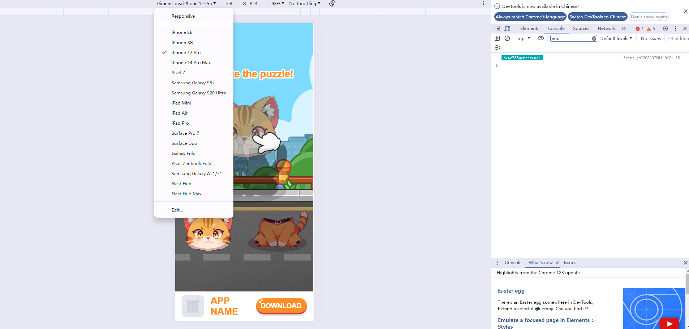

# 预览

入口：项目操作栏>>>预览

<figure><figcaption></figcaption></figure>

点击【预览】按钮，跳转进入预览页面。您可选择【完整预览】或【从当前场景开始预览】

预览页面可查看作品完成后在各机型、横竖屏、各语言环境下的预览效果

## <mark style="color:blue;">1.切换预览设备/预览</mark>

* 点击设备下拉按钮，调起设备选项弹窗
* 点击选择想要预览的设备，即可完成预览设备更换
* 当前预览界面支持预览iPhoneX/iPad/iPhone6/redmi/vivo五种机型下的效果<mark style="color:red;">（同比例的适配是可以随机型的不同等比放大的，因此当前的五种机型基本能够覆盖到市面上大部分机型的预览效果）</mark>

<figure><figcaption></figcaption></figure>

<mark style="color:red;">**若您想预览其他机型下的效果：**</mark>

1）可以点击【预览】按钮，使用手机扫码或【复制链接】进行预览试玩

2）或点击【在浏览器中打开】，然后按F12键进入开发者模式，可在上方切换更多机型进行预览

<figure><figcaption></figcaption></figure>

<figure><figcaption></figcaption></figure>

## <mark style="color:blue;">2.切换横竖屏预览</mark>

* 支持横屏/竖屏两种预览方式
* 点击横屏/竖屏图标，即可完成屏幕预览方式切换

<figure><figcaption></figcaption></figure>

## <mark style="color:blue;">3.切换不同语言预览</mark>

* 点击语言下拉按钮，调起已添加默认语言弹窗
* 点击想要预览的语言，即可完成切换语言环境预览

<figure><figcaption></figcaption></figure>

## <mark style="color:blue;">4.开启/关闭音频预览</mark>

* 音频预览方式默认开启，开启音频预览模式图标自动高亮为
* 关闭音频预览模式图标为
* 点击对应音频模式图标即可完成音频预览模式的切换

<figure><figcaption></figcaption></figure>

## <mark style="color:blue;">5.埋点日志</mark>

可直接查阅[kuai-jie-ding-wei.md](../zuo-pin-yu-lan-qu/kuai-jie-ding-wei.md "mention")[#san-bu-chong-jie-shao-mai-dian-ri-zhi](../zuo-pin-yu-lan-qu/kuai-jie-ding-wei.md#san-bu-chong-jie-shao-mai-dian-ri-zhi "mention")

## <mark style="color:blue;">6.重玩</mark>

* 点击【重玩】按钮，即可在当前预览模式下重新加载，进行重玩

<figure><figcaption></figcaption></figure>

