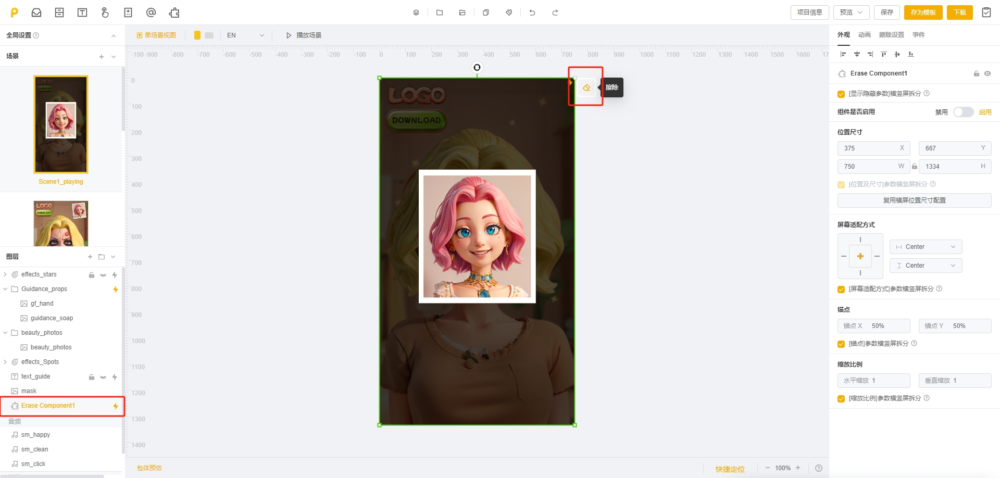

# 擦除组件

✨模板自由制作入口：作品预览区>>>自由画线按钮 或 图层区>>>Erase Component

<figure><figcaption></figcaption></figure>

✨空白制作入口：玩法模板>>>组件库>>>擦除组件

<figure><figcaption></figcaption></figure>

相关案例教学可查阅 [ca-chu-zu-jian-kong-bai-zhi-zuo-jiao-cheng.md](../../../playturbo-an-li-jiao-xue-ji-di/ke-wan-zi-you-bian-ji-qi-an-li/ca-chu-wan-fa-an-li-jiao-hu-hou-xian-shi-mu-biao-yuan-su/ca-chu-zu-jian-kong-bai-zhi-zuo-jiao-cheng.md "mention")

## <mark style="color:blue;">一、擦除组件通俗介绍</mark>

* 适用玩法：适用于"擦除遮罩以显示底图"或"涂抹上色"等在区域内滑动进行擦除/涂抹的玩法
* 底层逻辑：设置「蒙层」与「底图」，让玩家通过"擦除蒙层后显示底图"来实现擦除效果
* <mark style="color:red;">擦除组件支持在【空白制作】和【模板自由制作】中使用</mark>。对于新增的擦除组件，需完成组件的 「外观」、「擦除笔触」、「组件图层」、「事件判定」、「事件」等参数的设置，擦除组件才可正式生效
* <mark style="color:red;">注意：同个场景仅支持添加一个组件，但可跨场景添加组件或复制组件</mark>

## <mark style="color:blue;">二、擦除组件使用说明</mark>

### 1.添加擦除组件

* 点击擦除组件右下方的"+"号即可成功添加一个擦除组件

<figure><figcaption></figcaption></figure>

擦除组件可调整的参数分四部分：「外观」、「动画」、「擦除设置」、「事件」。接下来，我们依次介绍。

### 2.参数: 外观

* 组件是否启用：可在「外观」参数下通过调节此开关来启用/禁用擦除组件（默认启用）
* 其他参数的使用同常规图层一样，在此不作说明

<figure><figcaption></figcaption></figure>

### 3.参数: 动画

在此处设置的动画是对整个擦除组件生效的，具体的使用同常规图层一样，在此不作说明

### 4.参数: 擦除设置

擦除设置包含三部分：「擦除笔触设置」、「组件图层(蒙层与底图)」、「事件判定」

* 擦除笔触 决定了擦除的笔触形状、大小及样式
* 组件图层(蒙层与底图) 决定了可被擦除及擦除后展示的图层样式
* 事件判定 决定了擦除是否到达指定阶段，是否需要触发后续事件

<mark style="color:red;">注意：「擦除设置」为擦除组件最核心的参数，请务必将各部分设置完成</mark>

<figure><figcaption></figcaption></figure>

#### <mark style="background-color:red;">Part1：擦除笔触设置</mark>

「擦除笔触设置」包含：笔触样式、跟手图片。其决定了擦除时手指移动过程中笔触的实际形状、大小及样式

**1）笔触样式**

* 圆形：擦除时笔触为一圆形，具体大小可通过【尺寸】进行设置
* 矩形：擦除时笔触为一矩形，具体大小可通过【尺寸】进行设置
* 图片识别：可上传png或序列帧图片，将识别该图片的轮廓作为擦除笔触。同样可设置图片的尺寸

<figure><figcaption>
不同的笔触样式效果对比
</figcaption></figure>

**2）跟手图片**

* 决定擦除过程中跟随手指移动的图片样式（与擦除笔触无关），非必需上传
* 若添加跟手图片，可点击图片，在弹窗内修改其尺寸、旋转角度、跟手锚点等外观参数
* 跟手锚点：即笔触中心点，决定了在擦除时笔触出现的位置。可移动绿点进行调整

<figure><figcaption></figcaption></figure>

#### <mark style="background-color:red;">Part2：组件图层(蒙层与底图)</mark>

组件图层包含蒙层与底图

**1）蒙层（对应组件图层下的Mask）**

* 蒙层即"可被擦除的对象"
* 可上传单张或多张静帧图片共同作为蒙层
* 可通过开关按钮决定蒙层是默认启用或禁用。禁用后，可通过事件控制在特定时机下再启用

<figure><figcaption></figcaption></figure>

* 点击蒙层，可在弹窗内设置蒙层外观、动画等参数
* 支持在画布区直接拖拽蒙层图片来调整蒙层位置
* 擦除过程中，当擦除笔触移动到蒙层上时，根据笔触大小和轨迹将擦除蒙层（若蒙层多张图片发生了重叠，则重叠部分会被一并擦除）

<figure><figcaption></figcaption></figure>

**2）底图（对应组件图层下的Buttom image）**

* 底图即"不可擦除/不可被遮挡的对象"，会始终处于蒙层下方
* 底图支持上传单张或多张静帧图片、动图、序列帧

<figure><figcaption></figcaption></figure>

* 点击底图，可在弹窗内设置底图外观、动画等参数
* 同样支持在画布区直接拖拽底图来调整位置
* 擦除过程中，当上方蒙层被擦除时，底图会随之显现

<figure><figcaption></figcaption></figure>

**3）自定义图层**

支持添加自定义图层分组。添加时需要设定其【分组名称】及【是否可以被擦除】

* 可被擦除：相当于蒙层。在擦除过程中，该分组下的所有图层都可以被擦除
* 不可擦除：相当于底图。不可以被擦除

<figure><figcaption></figcaption></figure>

自定义图层的适用场景：可用于设置某些特殊图层

如障碍物：既不是蒙层，也不是底图，但不可擦除，然后可通过事件设置来控制擦除时碰到该图层会触发某种效果

#### <mark style="background-color:red;">Part3：事件判定</mark>

判定某个区域擦除是否达到了某个百分比（如蒙层是否擦除了80%），并以此作为后续事件的触发条件

举例：如设置"抬手时判定"、"蒙层区域擦除超过80%时"触发后续的跳转场景事件。这里的「超过80%」的判断，就需要通过「事件判定」参数来设置

<figure><figcaption></figcaption></figure>

**1）判断时机**

分为抬手时判定和擦除过程实时判定

* 抬手时判定：在擦除抬手时进行判定，判定区域擦除情况是否达到设定阶段
* 擦除过程实时判定：在擦除过程中实时计算，判定区域擦除情况是否达到设定阶段(该选项可能会引起性能问题，建议非必要不设置为实时判定)

**2）事件判定**

2-1）判定区域选择：可选择若干个蒙层图层，或若干个自定义判定区域

<figure><figcaption></figcaption></figure>

<mark style="background-color:yellow;">自定义判定区域</mark>

* 添加自定义判定区域：可点击【添加/管理自定义判定区域】调起弹窗，然后点击【添加自定义判定区域】，并编辑名称、添加矩形，完成添加
* 添加矩形：点击「添加矩形」，在画布中添加若干个矩形并编辑其位置、大小。若添加了多个矩形，范围会取多个矩形的并集
* 每个自定义区域可进行预览、编辑、复制、删除

<figure><figcaption></figcaption></figure>

2-2）阶段设置

* 通过「新增阶段」按钮，可新增单个或多个阶段
* 可调节每个阶段的百分比，设定阶段的具体数值（如擦除区域到达60%为阶段1；到达80%为阶段2），以此作为后续事件的触发条件

<figure><figcaption></figcaption></figure>

### 5.参数: 事件

「擦除组件」存在独特的触发事件和响应事件

#### <mark style="background-color:red;">5-1）触发事件</mark>

擦除组件的独特「触发事件」包含：「开始擦除」、「抬手」、「到达某一阶段」、「未到达某一阶段」，<mark style="color:red;">只可以添加在「擦除组件」下</mark>

<figure><figcaption></figcaption></figure>

1）开始擦除：按下手指，在启用的可被擦除分组的图层上滑动，视为触发开始擦除

2）抬手：触发开始擦除后 抬起手指，视为触发抬手

3）到达某一阶段：根据「事件判定」中设置的条件，到达了某一阶段，视为触发到达某一阶段

4）未到达某一阶段：根据「事件判定」中设置的条件，若未到达某一阶段，视为触发未到达某一阶段

<mark style="color:red;">注：对于以上触发事件，均可设置「只生效一次」。若未勾选，则该事件可反复触发；若勾选，则只触发一次。</mark>

<figure><figcaption></figcaption></figure>

#### <mark style="background-color:red;">5-2）响应事件</mark>

擦除组件独特的「响应事件」包含：①启用/禁用擦除组件、②清除擦除痕迹、③显示/隐藏分组、④启用/禁用可被擦除分组、⑤显示并播放/暂停播放 分组的全部序列帧、⑥播放/暂停播放/继续播放 分组的单个/全部动画、⑦替换跟手图片 七类。

以上响应事件，在添加了「擦除组件」的前提下，均可被添加设置

<figure><figcaption></figcaption></figure>

**1）启用/禁用擦除组件**

触发后，擦除组件可以被禁用或再次启用

_如设置：抬手-禁用擦除组件，则代表在擦除完抬手时，擦除组件将被禁用，不再生效_

<figure><figcaption></figcaption></figure>

**2）清除擦除痕迹**

触发后，会清除组件内已完成的擦除痕迹

_如设置：抬手-清除擦除痕迹，则效果对比如图所示_

<figure><figcaption></figcaption></figure>

<figure><figcaption></figcaption></figure>

**3）显示/隐藏分组**

需选择具体某个分组(蒙层、底图或自定义分组)，触发后，即可显示或隐藏对应分组

_如设置：到达某一阶段后-隐藏蒙层_

<figure><figcaption></figcaption></figure>

**4）启用/禁用可被擦除分组**

需选择具体某个可被擦除的分组(蒙层或自定义分组），触发后，使之允许被擦除/不允许被擦除

_如设置：到达某一阶段后-禁用蒙层，则在擦除到达指定阶段后，蒙层不能再被擦除掉_

<figure><figcaption></figcaption></figure>

**5）显示并播放/暂停播放 分组的全部序列帧**

需选择具体某个分组，触发后，可播放/暂停播放 此分组下的所有序列帧图层

<figure><figcaption></figcaption></figure>

**6）播放/暂停播放/继续播放 分组的单个/全部动画**

需选择具体某个分组，触发后，可播放/暂停播放/继续播放 此分组下的单个/全部图层的动画

<figure><figcaption></figcaption></figure>

**7）替换跟手图片**

需选择具体某张跟手图片，触发后，当前跟手图片将被替换为此处设置的这张图片

_如示例：触发后跟手图片由左图变成右图_

<figure><figcaption></figcaption></figure>

<figure><figcaption></figcaption></figure>

