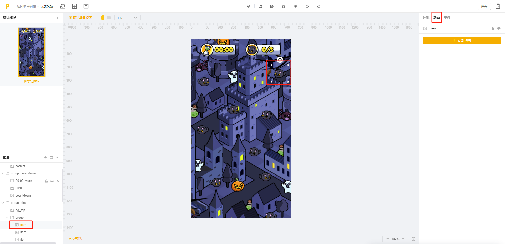

# 模板自由制作技巧

## <mark style="color:blue;">一、调整自由度需知</mark>

### 1.不建议自由调整

因可玩模板中大部分模板是由 设计+开发 共同完成的，核心玩法基本由代码控制，若您随意调整可能会导致模板报错，无法正常使用。<mark style="color:red;">因此在您使用模板进行</mark><mark style="color:red;">**【自由制作】**</mark><mark style="color:red;">时，我们建议您参照以下调整自由度来对模板进行调整</mark>

<table><thead><tr><th width="217"></th><th width="210">普通场景</th><th>玩法模板</th></tr></thead><tbody><tr><td><strong>替换资产</strong></td><td>可以</td><td>可以</td></tr><tr><td><strong>新增资产</strong></td><td>可以</td><td>不建议（可在普通场景新增）</td></tr><tr><td><strong>新增场景</strong></td><td>可以（不影响核心玩法的情况下,可以在开头/结尾新增场景）</td><td>不建议（可在普通场景新增）</td></tr><tr><td><strong>其他非删除操作</strong>(如调整资产位置/大小;隐藏资产)</td><td>可以</td><td>不建议（适当操作,尽量避免大动作调整）</td></tr><tr><td><strong>删除资产</strong></td><td>不建议 (可以隐藏)</td><td>十分不建议，高几率报错</td></tr><tr><td><strong>调整动画</strong></td><td>可以（若"动画"参数一栏有相关动画）</td><td>不建议（适当操作）</td></tr><tr><td><strong>新增动画</strong></td><td>可以</td><td>不建议（适当操作）</td></tr><tr><td><strong>调整事件</strong></td><td>可以（若"事件"参数一栏有相关事件）</td><td>暂不支持</td></tr><tr><td><strong>新增事件</strong></td><td>可以</td><td>暂不支持</td></tr></tbody></table>

注：模板是否包含【玩法模板】，可查阅 [ke-wan-gong-ju-tong-yong-mo-ban-zui-xin-zi-xun.md](../../qi-ta-jiao-cheng/qi-ta-mo-kuai/ke-wan-gong-ju-tong-yong-mo-ban-zui-xin-zi-xun.md "mention")&#x20;

### 2.支持自由调整

少部分模板由设计独立完成，支持您随意调整。当前这类模板有：

* 《动态画面循环播放》《二选一决策》《2步滑动交互视频》《3步点击交互视频》《多结局交互视频》
* 《点击物品后隐藏》《拖拽到指定位置放置》《多要素点击切换》《丝滑循环展示》《扭蛋机》
* 《多组合装扮》《全套换装》《梦想装修》《美妆擦除》《厨房经营v2》《放置经营餐厅》
* 《看图选答题》《多选问答题》《模拟清理工具》《模拟来电》《滑屏社交》《合成进化升级》

<figure><figcaption>
“入门”难度下的模板都为设计独立制作
</figcaption></figure>

## <mark style="color:blue;">二、调整顺序建议</mark>

在您使用【模板自由制作】进行素材迭代时，我们通常建议您按照以下步骤进行制作，可以保证操作的有序和便捷

### 1.资产&场景调整

#### 1）调整资产

* 将需要的资产进行替换
* 将不需要的资产进行隐藏

<mark style="color:red;">**注意：**</mark>若您在【模板自由制作】的过程中觉得部分资产不需要，可以通过【隐藏该图层】和【调整该图层透明度为0】这两种方法将资产隐藏，不要随意删除图层，否则可能导致素材报错！

<figure><figcaption>
隐藏图层
</figcaption></figure>

<figure><figcaption>
调整透明度
</figcaption></figure>

#### 2）新增资产&场景

* 资产新增：添加想要的资产到画布中，并调整各个资产的位置大小，并对同类资产进行编组，方便后续制作
* 场景新增：可根据实际需求，通过【新建场景】或【复制场景】来增加场景
  * 新建场景：想增加的场景和现有场景的相关性较低，基本不需要用到现有场景里的资产（如以产品信息为主的结束页面）
  * 复制场景：想增加的场景和现有场景的相关性较高，需要用到现有场景里的较多资产（如想以当前场景画面作为背景图，添加遮罩和结算信息）

<figure><figcaption></figcaption></figure>

### 2.动效调整

#### 1）调整动画

若您想调整模板中某一资产的动画效果，可选中该资产图层，在右侧参数设置区的【动画】一栏查看是否有可调整的动画参数

* 若该位置有动画参数，则代表可以调整

<figure><figcaption></figcaption></figure>

* 若该位置无动画参数，则可能由代码控制，不可以调整

<figure><figcaption></figcaption></figure>

#### 2）新增动画

若有需要，还可在图层或场景上添加动画

<figure><figcaption></figcaption></figure>

#### 3）调整粒子特效

* 可以替换现有粒子贴图
* 可以新增粒子特效，并调整其位置大小到合适
* 同样，对于不需要的粒子特效，可以将其图层隐藏或调整该图层透明度为0

<figure><figcaption></figcaption></figure>

### 3.事件设置

#### 1）修改事件

同理动画，若您想调整模板的事件，可在右侧参数设置区的【事件】一栏查看是否有可调整的事件参数

* 若该位置有事件参数，则可以调整
* 若该位置无事件参数，则可能由代码控制，不可以调整

<figure><figcaption></figcaption></figure>

#### 2）新增事件

若有需要，还可为图层添加事件

* 可直接在现有触发事件中添加响应事件
* 也可额外添加触发事件和响应事件

<figure><figcaption></figcaption></figure>

### 4.多语言文本翻译

在大致内容调整完成后，我们点击【全局设置】，对语言进行调整和新增

* 调整语言：在【默认语言】处点击笔刷图标，调起文本翻译窗口
* 新增语言：在【默认语言】处点击【添加语言】，调起文本翻译窗口

具体操作步骤可查看[duo-yu-yan-pei-zhi-yu-zhi-neng-fan-yi.md](../zi-you-bian-ji-qi-shi-yong-zhi-nan/bian-ji-ye-mian-fen-qu-jie-shao/can-shu-she-zhi-qu/fen-chang-jing-qu-jie-shao/quan-ju-chang-jing/quan-ju-she-zhi/duo-yu-yan-pei-zhi-yu-zhi-neng-fan-yi.md "mention")

<figure><figcaption></figcaption></figure>

### 5.横屏适配

<mark style="color:red;">**注意：**</mark>每个场景的竖屏调整完成后，均需进行横屏排版（建议多使用“复用竖屏位置尺寸配置”按钮）

同时需注意横屏下各图层的屏幕适配方式是否正确

<figure><figcaption></figcaption></figure>

### 6.玩法参数调整

模板自由制作和模板换肤制作一样，也可以调整玩法参数，一般位于核心玩法场景（场景1）的参数设置区

<figure><figcaption></figcaption></figure>

### 7.整体预览

全部调整完成后，我们对不同机型/不同语言/横竖屏进行整体预览试玩，确认无误就可以推送或下载了

<figure><figcaption></figcaption></figure>

## <mark style="color:blue;">三、资产替换需知</mark>

### 1.资产替换技巧

在【替换资产】时，有两种方法都比较快捷，您可任选一种进行制作

<figure><figcaption></figcaption></figure>

#### 1）换肤制作-普通制作

* 选择模板，然后选择【换肤制作-普通制作】
* 在【换肤编辑器】内完成所有资产替换，然后【复制到自由制作】进行迭代即可

<figure><figcaption></figcaption></figure>

#### 2）自由制作

* 选择模板，然后选择【自由制作】
* 点击【项目资产】，将需要替换的所有资产一次性上传到项目资产内，后续替换资产会很方便

<figure><figcaption></figcaption></figure>

<mark style="color:red;">**Tips：**</mark>若有相同的资产出现在多个场景中，同时您又想全部替换掉：可以在【项目资产】窗口内选中该资产，点击【替换资产】，这样便可以一次性快速完成所有场景的替换哦！

<figure><figcaption></figcaption></figure>

### 2.部分资产找不到在哪？

在进行模板自由制作时，若发现部分资产(如图片/文本)在左侧图层区没有找到，那么大概率是位于【玩法模板】内。玩法模板包含两部分：玩法编辑、快捷排版

<figure><figcaption></figcaption></figure>

#### **1）玩法编辑**

* 通用的 / 各类玩法的模板可能都会有
* <mark style="color:red;">注意：玩法编辑支持【替换】资产，其他操作不建议，否则容易报错</mark>

#### **2）快捷排版-棋盘**

* 特殊的 / 仅适用于消除、拼图类模板
* 支持更改棋盘布局（网格布局、元素布局）和替换资产（网格背景、元素图片）
*   当前模板库支持棋盘组件的模板有：

    * 消除类：糖果三消/三消清理障碍/方正点消/点消解围/清屏方正点消/自由落体点消/刷新道具点消/射球消除砖块/连线掉落消除v1/连线掉落消除v2/连线掉落消除v3
    * 拼图类：方形拼图/轮播拼图挑战

    注：在【可玩模板】界面点击【快捷排版】，即可快速筛选出支持棋盘组件的模板哦！

<figure><figcaption></figcaption></figure>

注：极少模板的部分资产可能在【玩法模板】中也没有，这是因为该资产由开发通过代码控制，在自由编辑器内无法或不推荐修改，否则容易报错，因此我们不展示该资产坑位。

关于【玩法模板】的详细内容可查看[wan-fa-mo-ban.md](../zi-you-bian-ji-qi-shi-yong-zhi-nan/bian-ji-ye-mian-fen-qu-jie-shao/ding-bu-zi-chan-ku/wan-fa-mo-ban.md "mention")
