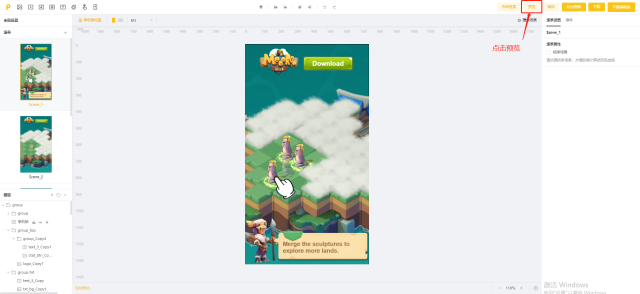
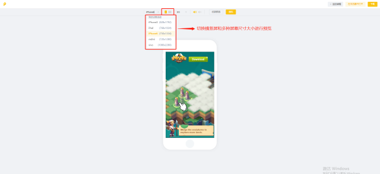

# 适配相关

## 1.视觉方面的总体建议

建议在预览时，多切换横竖屏和多种屏幕尺寸大小，以预览不同情况下的作品呈现情况。\

<figure><figcaption></figcaption></figure>

<figure><figcaption></figcaption></figure>

## 2.投放适配：横竖屏制作 / 单方向制作

* 当选择横竖屏同时制作时，需要点击横竖屏切换按钮，分别制作竖屏和横屏的素材适配。<mark style="color:red;">建议在制作过程中，当前场景完成横竖屏制作，再进行下一场景制作。</mark>
* 当选择单方向制作时，只需制作当前屏幕方向的素材即可，无需切换横竖屏。
* 不同制作方式在投放时的效果详见：[适配说明](../../zuo-pin-zhi-zuo-xin-jian-zhi-nan.md)

## 3. 适配相关问题

适配相关问题可移步[shi-pei-gui-ze-yu-shi-pei-fang-shi.md](../../zi-you-bian-ji-qi-shi-yong-zhi-nan/bian-ji-ye-mian-fen-qu-jie-shao/can-shu-she-zhi-qu/shi-pei-gui-ze-yu-shi-pei-fang-shi.md "mention")进行查看

## 4.模糊背景兜底方案

建议您设置一张背景图片，背景图将自动填充全屏。这样在较大屏幕下预览时，不会出现黑色，而是呈现背景图

* 大小要求：不能大于300k
* 建议尺寸：1334\*1334
* 格式：jpg、png

<figure><figcaption></figcaption></figure>
