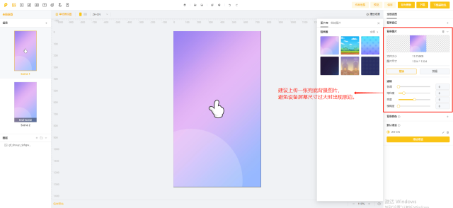

# 适配相关

## 适配方向

在新建空白制作项目时，需要选择适配方向

* 若选择【横屏&竖屏】，则在制作时需要分别对竖屏和横屏进行排版制作<mark style="color:red;">（建议您在完成每个场景竖屏的排版后，及时切换到横屏进行调整，通过“复用竖屏位置尺寸配置”按钮可以大大提高效率）</mark>
* 若选择单方向【横屏】或【竖屏】，只需制作当前屏幕方向的素材即可，无需切换横竖屏

不同适配方向呈现出的效果可查看[zuo-pin-zhi-zuo-xin-jian-zhi-nan.md](../../zuo-pin-zhi-zuo-xin-jian-zhi-nan.md "mention") [#step3-xuan-ze-kuo-pei-fang-xiang](../../zuo-pin-zhi-zuo-xin-jian-zhi-nan.md#step3-xuan-ze-kuo-pei-fang-xiang "mention")

<figure><figcaption></figcaption></figure>

## 3. 适配相关问题

适配相关问题可移步[shi-pei-gui-ze-yu-shi-pei-fang-shi.md](../../zi-you-bian-ji-qi-shi-yong-zhi-nan/bian-ji-ye-mian-fen-qu-jie-shao/can-shu-she-zhi-qu/shi-pei-gui-ze-yu-shi-pei-fang-shi.md "mention")进行查看

## 4.模糊背景兜底方案

建议您设置一张背景图片，背景图将自动填充全屏。这样在较大屏幕下预览时，不会出现黑色，而是呈现背景图

* 大小要求：不能大于300k
* 建议尺寸：1334\*1334
* 格式：jpg、png

<figure><figcaption></figcaption></figure>
