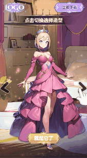
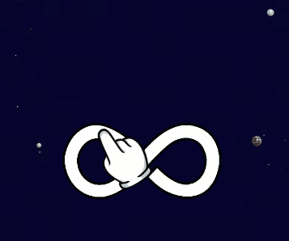

# 制作技巧-动画设置

## <mark style="color:blue;">一、效果实现</mark>

### 1.常用操作指引（手指动画）

<table data-full-width="true"><thead><tr><th width="132">手指动画</th><th width="163">图示</th><th width="453">制作步骤</th><th>图示</th></tr></thead><tbody><tr><td><strong>原地点击</strong></td><td></td><td><ul><li>手指图片：添加动画-通用-缩放缓动，参数设置如右图1</li><li>点击特效图片（选做）：添加动画-通用-缩放缓动，参数设置如右图2；继续添加透明度缓动，参数设置如右图3；若想实现双层光圈效果，可再复制一个光圈图层，将两个动画的“延迟时间”改为0.2s即可</li></ul></td><td>

</td></tr><tr><td><strong>移动点击</strong></td><td></td><td><ul><li>手指图片：添加动画-通用-位移缓动，参数设置如右图</li></ul></td><td></td></tr><tr><td><strong>按钮二选一</strong></td><td></td><td><ul><li>手指图片：添加动画-通用-位移缓动，参数设置如右图1；继续添加缩放缓动，参数设置如右图2</li><li>选项按钮：为左侧按钮组添加动画-通用-缩放缓动，参数设置如右图3；复制该动画到右侧按钮组，调整动画曲线为反方向即可，参数设置如右图4</li></ul></td><td></td></tr><tr><td><strong>按钮四选一</strong></td><td></td><td><ul><li>手指图片(横向运动)：添加动画-通用-位移缓动，参数设置如右图1；(选做)继续添加缩放缓动&#x26;透明度缓动，参数设置如右图2&#x26;3</li><li>手指图片组(纵向运动)：添加动画-通用-位移缓动，参数设置如右图4</li><li>选项按钮：添加动画-通用-缩放缓动，依次调整曲线即可</li></ul></td><td>

</td></tr><tr><td><strong>左右滑动</strong></td><td></td><td><ul><li>手指图片：添加动画-通用-位移缓动，参数设置如右图</li></ul></td><td></td></tr><tr><td><strong>滑动切割</strong></td><td></td><td><ul><li>手指组：添加动画-通用-位移缓动，参数设置如右图1；继续添加透明度缓动，参数设置如右图2</li><li>拖尾效果（选做）：可直接将拖尾图片置于手指组内，跟随组动画一起运动</li></ul></td><td></td></tr><tr><td><strong>八字滑动</strong></td><td></td><td><ul><li>手指图片(横向运动)：添加动画-通用-位移缓动，参数设置如右图1</li><li>手指图片组(纵向运动)：添加动画-通用-位移缓动，参数设置如右图2</li></ul></td><td></td></tr><tr><td><strong>从A点拖到B点</strong></td><td></td><td><ul><li>手指图片：添加动画-通用-位移缓动，参数设置如右图1</li><li>开头结尾透明度效果（选做）：在手指组上添加动画-通用-透明度缓动，参数设置如右图2；继续添加透明度缓动，参数设置如右图3</li></ul></td><td></td></tr></tbody></table>

### 2.如何设置人物呼吸感动画

1）选中人物图层，将锚点修改为（50,100）

<figure><figcaption></figcaption></figure>

2）为人物图层添加动画-通用-缩放缓动，具体参数设置如下：

注：可根据实际需求，通过调整【结束比例】来控制人物缩放幅度的大小

<figure><figcaption></figcaption></figure>

### 3.如何制作进度条

1）准备两张图片：底图+进度条

<mark style="color:red;">注意：进度条图片左右需贴边，不能留空</mark>

2）选中进度条图层，将锚点修改为（0,50），并调整到合适位置

<figure><figcaption></figcaption></figure>

3）为进度条图层添加动画-通用-缩放缓动，重要参数设置：播放1次 / 起始比例X轴设为0，Y轴不变默认为1，结束比例不变默认为1。

具体参数设置如下：

<figure><figcaption></figcaption></figure>

### 4.如何制作血条

1）准备两张图片：底图+血条

注意：血条图片左右需贴边，不能留空

2）选中血条图层，将锚点修改为（0,50），并调整到合适位置

<figure><figcaption></figcaption></figure>

3）为血条图层添加动画-通用-缩放缓动，重要参数设置：播放1次 / 起始比例不变，结束比例Y轴不变，都默认为1，仅调整结束比例X轴的数值即可（此处的数值代表最终血量）。

具体参数设置如下：

<figure><figcaption></figcaption></figure>
