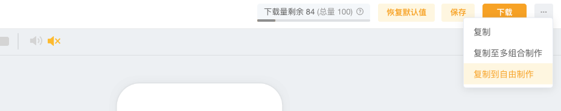
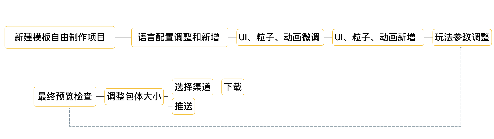
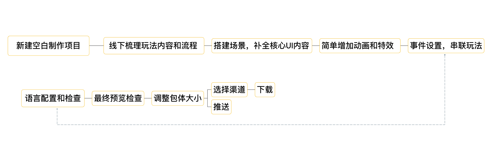

# 作品制作-流程概要

## 1）路径一：模板自由制作-内容迭代

小技巧：建议通过换肤编辑器先进行【换肤步骤】，再进入自由编辑器【进阶编辑】

<figure><figcaption></figcaption></figure>

<figure><figcaption></figcaption></figure>

## 2）路径二：空白制作-从零搭建

<figure><figcaption></figcaption></figure>
