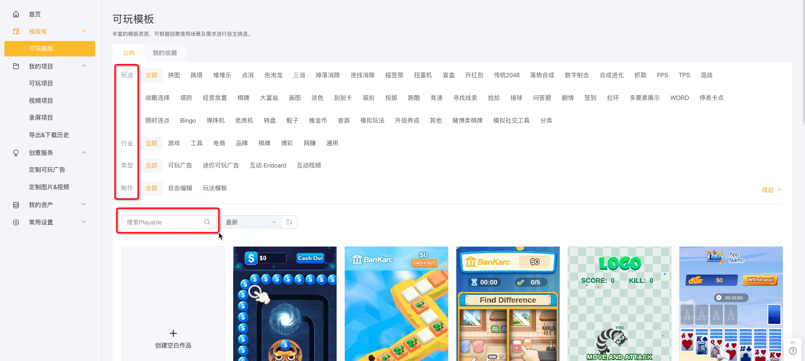

# 作品制作-新建指南

【模板自由制作】和【空白制作】的项目新建方式并无特别大的差异

## 1）模板自由制作

### STEP1 海量模板任你挑选 

* 方法一：可根据玩法、行业或模版类型快速查找适合的模版
* 方法二：也可在搜索栏中输入关键字快速搜索相关的模版

<figure><figcaption></figcaption></figure>

### STEP2 选中模板

* 选中模版后会弹出以下界面，可预览模版效果，查看是否为期望的效果，也可用手机扫码预览
* 模版中还会预设2套皮肤，供广告主更高效地制作符合自己产品风格的可玩广告

<figure><figcaption></figcaption></figure>

### STEP3 选择制作方式

点击模板自由制作，完成制作方式选定

<figure><figcaption></figcaption></figure>

### STEP4 输入作品名称

选中制作方式后，输入作品名称，点击确定后进入到作品编辑页

温馨提示：【作品名称】只允许数字、字母、下划线，50个字符以内

<figure><figcaption></figcaption></figure>

## 1）空白制作

### STEP1 新建空白项目 

* 进入可玩项目页面-自由编辑制作栏
* 新建项目-空白项目

<figure><figcaption></figcaption></figure>

### STEP2 填写作品名称

温馨提示：【作品名称】只允许数字、字母、下划线，50个字符以内

<figure><figcaption></figcaption></figure>

### STEP3 选择适配方向

* 支持横屏&竖屏、横屏、竖屏3种适配方式
* 项目创建后，不支持修改适配方向。
* 如果一开始选择错误，建议复制项目后重新选择并编辑

<figure><figcaption></figcaption></figure>

#### **1）横屏&竖屏**

* 在1个作品内需要同时完成横屏和竖屏的场景制作
* 投放时，作品会根据当前App的展示方向，自动选择合适的方向（例如：App竖屏时，则展示作品的竖屏设计；App横屏时，则展示作品的横屏设计）
* 具体适配效果如下：

<table data-header-hidden><thead><tr><th width="207"></th><th></th></tr></thead><tbody><tr><td></td><td></td></tr><tr><td>竖屏</td><td>横屏</td></tr></tbody></table>

**2）竖屏**

* 在1个作品内，仅需完成竖屏的场景制作。
* 投放时，不论当前App的展示方向是什么，都只展示竖屏设计，多余的区域默认填充黑色。
* 具体适配效果如下：

<table data-header-hidden><thead><tr><th width="205"></th><th></th></tr></thead><tbody><tr><td></td><td></td></tr><tr><td>竖屏（仅设计竖屏）</td><td>横屏（空白区域默认填充黑色）</td></tr></tbody></table>

**3）横屏**

* 在1个作品内，仅需完成横屏的场景制作​
* 投放时，不论当前App的展示方向是什么，都只展示横屏设计，多余的区域默认填充黑色
* 具体适配效果如下：

<table data-header-hidden><thead><tr><th width="213"></th><th></th></tr></thead><tbody><tr><td></td><td></td></tr><tr><td>横屏（仅设计横屏）</td><td>竖屏（空白区域默认填充黑色）</td></tr></tbody></table>
