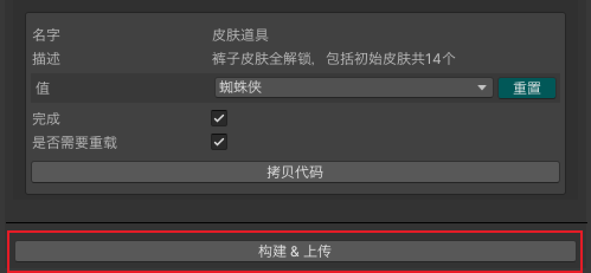

# Mindworks录屏插件使用说明

## 一、插件安装

### 1. 下载插件

进入playturbo【录屏项目】页面，点击右上角的【下载Mindworks插件】按钮，即可获取相关文档

.png>)

### 2. 安装插件

根据文档内的指引，<mark style="color:red;">@研发人员</mark> 需要完成Mindworks插件的安装

1）Unity 需要安装 WebGL Build Support 模块

.png>)

2）运行 Unity 项目，打开 Window > Package Manager，然后点击左上角的"+"

号选择 Add Package from disk

.png>)

3）选择并打开 Unity 录屏插件根目录中的 package.json 文件，选择后会自动安装Mindworks插件，然后会显示在上方菜单栏中

.png>)

## 二、参数配置

### 1. <mark style="color:red;">@设计人员</mark> 需求配置

1）打开 https://playturbo.mindworks-creative.com 登录自己的订阅账号，点击【录屏项目】

2）点击右上角的【+新建项目】，填写【基本信息】与【录屏参数】完成项目的创建

.png>)

### 2. <mark style="color:red;">@研发人员</mark> 参数配置

1）在Unity项目打开 MindWorks>Build，进入登录页面，输入自己的订阅账号登录插件，会进入到项目列表 Project List 中

\*搜索功能：可通过输入项目的id 或者 name 搜索到对应的项目

2）在Project List会看到对应的项目，点击select进入Build界面，可以看到@设计人员 在playturbo平台创建的项目信息、产品信息、以及设定的参数信息

<figure><figcaption></figcaption></figure>

3）自定义参数

参数的类型有单选项、多选项、单选下拉、多选下拉和数值，可以在 Build 界面选择对应参数的 CopyCode 按钮获取并在游戏中添加设置，参数的变化会在游戏中呈现出来。

【如： MWRuntime.getCfgValue\<double>("角色攻击力")；】

4）参数面板的信息：

①name：该参数的名字

②desc：该参数的描述

③value：该参数的值

④active：该参数在录屏编辑页面中是否展示，如果该参数已经设置在项目

中生效，建议勾选

⑤reload：更新参数的变化是否重新试玩，若打勾后在更新参数时会调用重

新试玩

<figure><figcaption></figcaption></figure>

5）Reload

5-1）如果不勾选 reload，参数信息修改时不会实时刷新同步到游戏中，如果需

要实时监听参数变化，建议使用以下方法设置：

①可在 update 里面获取参数的值来实时监听参数变化

②如果不在 update 中设置，可以通过设置

MWRuntime.UpdateGameConfigEvent += this.onGameConfigChanged

添加参数监听，onGameConfigChanged 为参数监听的回调，当参数发生变

化时触发该回调，例如：

void Start()

{

Debug.Log("this is a test");

MWRuntime.UpdateGameConfigEvent += this.onGameConfigChanged;

// onGameConfigChanged("1111", MWRuntime.getCfgValue\<string>("1111"));

}private void onGameConfigChanged(string key, object value)

{

if (key != "1111" || value == null) return;

var txt = this.gameObject.GetComponent\<Text>();

var str = "测试";

if (value is string\[])

{

string\[] strs = value as string\[];

for (int i = 0; i < strs.Length; i++)

{

str += "," + strs\[i];

}

}

else if (value is string)

{

str += "," + value;

}

txt.text = str;

}

5-2）如果勾选 reload，则当参数变化时会调用重新试玩

①重新试玩默认自动刷新场景 1

②如果不想执行①操作可以设置 MWRuntime.GameRetryEvent +=

this.onGameRetry 添加重新试玩监听，onGameRetry 为重新试玩监听的回调

6）在需要设置参数的地方完成参数的设置后点击 active 激活参数

<figure><figcaption></figcaption></figure>

\*第三方 SDK

必须避免任何涉及广告或向外部服务器发送/接收任何类型的分析数据的SDK 或套件，否则会有异常

## 三、构建和上传

<mark style="color:red;">@研发人员</mark> 完成参数配置后，点击 Build\&Upload 按钮，开始上传录屏项目，点击后需要耐心等待几分钟：

<figure><figcaption></figcaption></figure>

1）如果构建成功，则会在 Unity 控制台打印结果，同时将尝试上传到playturbo平台，如果上传成功即可在playturbo平台看到项目状态是【已上传】

.png>)

2）如果构建失败，Unity控制台将显示错误，请先解决这些问题，然后再尝试重新构建

## 四、开始录制

<mark style="color:red;">@设计人员</mark> 在playturbo【录屏项目】页面，点击"+"号创建版本后，即可开始录制视频

.png>)
