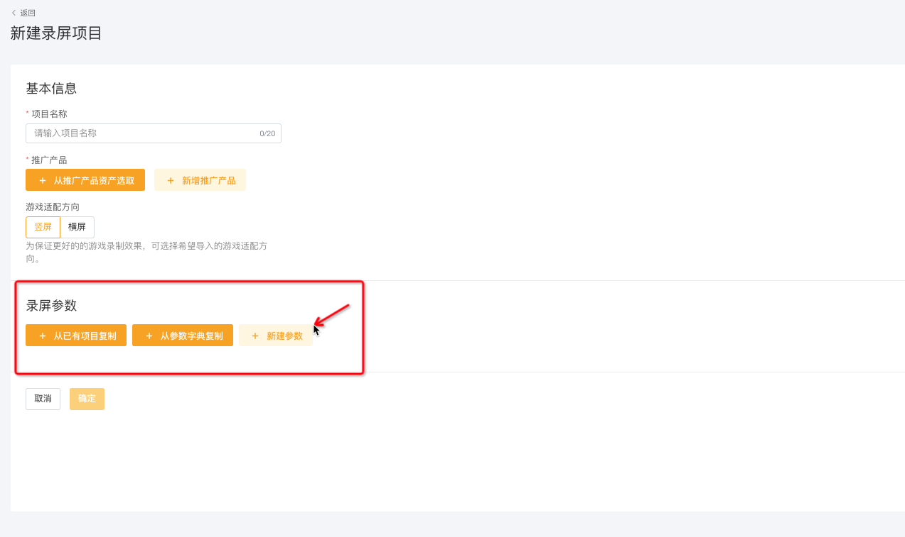

# 项目新建&参数填写指南

## STEP1 新建项目

* 在录屏工具页面右上角点击【新建项目】，进入项目填写页面

<figure><figcaption></figcaption></figure>

* 填写项目基本信息

<figure><figcaption></figcaption></figure>

## STEP2 新建参数

* 点击录屏参数下方的【新建参数】，进入参数填写页

<figure><figcaption></figcaption></figure>

*   填写预想参数的相关信息

    * <mark style="color:red;">参数名称：</mark>建议名称简单好理解，方便@研发人员 对齐代码内容
    * <mark style="color:red;">说明：</mark>建议适当补充参数具体内容，减少@研发人员 理解错误情况
    * <mark style="color:red;">参数类型：</mark>根据实际参数需求，进行类型选择
    * <mark style="color:red;">默认值：</mark>需要先选好一个默认版本的内容

## 其他补充

除了【新建参数】的方式以外，我们在后续新建项目的时候，可以选择【从已有项目复制】和【从参数字典复制】的方式去进行参数添加。

<figure><figcaption></figcaption></figure>

####

