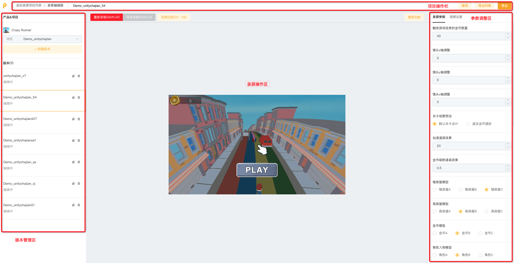

# 3. 正式录制：功能分区介绍

录屏编辑页主要分成以下几个分区：

[ban-ben-guan-li-qu.md](ban-ben-guan-li-qu.md "mention")

[can-shu-tiao-zheng-qu.md](can-shu-tiao-zheng-qu.md "mention")

[lu-zhi-cao-zuo-qu.md](lu-zhi-cao-zuo-qu.md "mention")

[xiang-mu-cao-zuo-lan.md](xiang-mu-cao-zuo-lan.md "mention")

<figure><figcaption></figcaption></figure>
