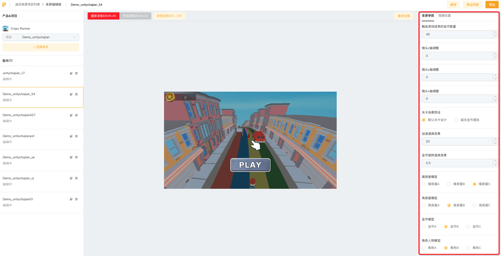
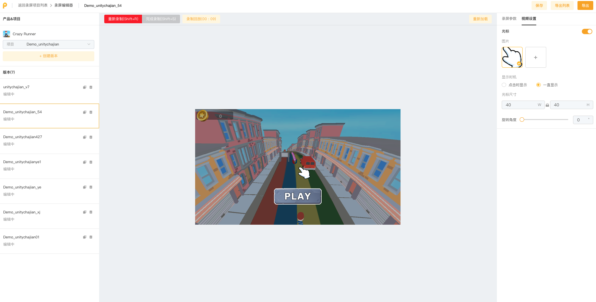

# 参数调整区

&#x20;**录屏编辑页右侧区域为【参数调整区】**

### **1）录屏参数**

* 完成参数配置后，所有的参数都会在此处显示
* 用于调整当前版本使用的参数对应值
* <mark style="color:red;">注意：录制完成后，可以通过调整参数值直接改变版本内容，无需重录</mark>

<figure><figcaption></figcaption></figure>

### **2）视频设置**

* 添加光标跟踪功能
* 替换想要的光标图片

<figure><figcaption></figcaption></figure>
