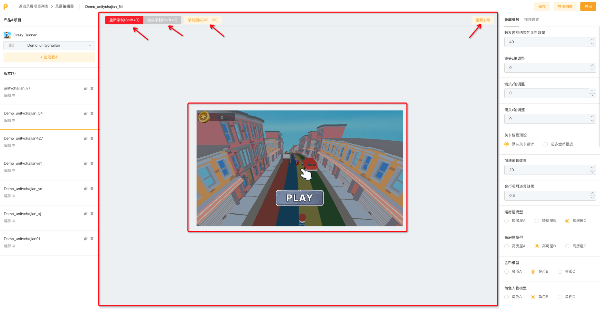

# 录制操作区

**录屏编辑页中间核心区域为【录制操作区】**

### **1）区域上方：录制相关按钮**

* 【开始录制/重新录制】为录制启动按钮，点击后开始录屏
* 【完成录制】为录制停止按钮，点击后结束录屏
* 【录屏回放】可以回放预览最新一次的录屏内容
* 【重新加载】在调整参数后，可以点击该按钮刷新预览内容

### 2）区域中间：操作区和预览区

* 点击【开始录制/重新录制】后，使用鼠标在该区域中进行游戏操作
* 点击【录屏回放】后，可以在该区域中进行录屏预览

<figure><figcaption></figcaption></figure>
