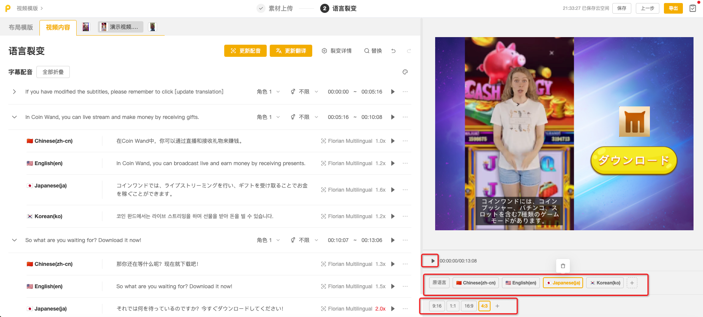

# 《情侣翻越 1》跑酷视频（分段）

### 《情侣翻越-1》跑酷视频（分段）

3d跑酷类游戏由于涉及模型、场景等元素，开发制作难度较高。😎但利用游戏录屏作为原料进行playable制作，可以简单快速地达到“以假乱真”的效果！**本讲将通过一个案例，教会大家如何利用录制+分割游戏录屏，制作出可以多次互动的playable！**

### 一、教学目的

* **游戏录屏选择+分割：**录制包含多次操作的游戏录屏，并通过分割录屏，完成制作可以多次互动的playable；<mark style="background-color:red;">游戏录屏</mark>

### 二、特征标签

* 【制作难度】：⭐⭐⭐
* 【适用产品】：超休闲
* 【玩法】跑酷、竞速
* 【交互方式】：点击
* 【线程】：单线程
* 【功能】：强调动画、定时触发

### 三、作品预览

### 四、制作思路

#### 1. 游戏录屏选择✨

**游戏录屏选择标准：**<mark style="background-color:red;">游戏录屏</mark>

① 选择游戏关卡中操作尽可能简单清晰的部分进行录制（如：点击、滑动等）；

② 关卡录屏包含多次交互操作；

③ 游戏录屏时，在每次玩家互操作前的画面稍作停留，以便留下动态画面，方便后续分割视频作为动态操作指引场景；（具体可参考以下本例视频）



#### 2. 场景拆分✨

**场景/视频拆分核心思想：**根据交互操作，将游戏录屏拆分到不同场景，让单个场景里的动画和事件尽可能少，场景拆分逻辑清晰，图层结构简单。

<table data-header-hidden><thead><tr><th width="83"></th><th></th><th></th><th></th><th></th><th></th><th></th><th></th></tr></thead><tbody><tr><td><strong>场景拆分</strong></td><td><strong>场景1-第一次指引</strong></td><td><strong>场景2-第一次翻越</strong></td><td><strong>场景3-第二次指引</strong></td><td><strong>场景4-第二次翻越</strong></td><td><strong>场景5-第三次指引</strong></td><td><strong>场景6-第三次翻越</strong></td><td><strong>场景7-结束页</strong></td></tr><tr><td><strong>效果图</strong></td><td></td><td></td><td></td><td></td><td></td><td></td><td></td></tr><tr><td><strong>✨场景描述</strong></td><td>初始画面循环播放情侣拥抱动作，引导玩家点击屏幕开始游戏</td><td>情侣翻越第一段路程</td><td>翻越暂停，循环播放情侣待机动作，出现第二次操作指引</td><td>情侣翻越第二段路程</td><td>翻越暂停，循环播放情侣待机动作，出现第三次操作指引</td><td>情侣翻越第三段路程，完成后自动跳转结束页</td><td>展示产品信息和CTA按钮</td></tr><tr><td><strong>动画/特效</strong></td><td>
【文字指引】：通用动画-缩放缓动

【手指指引】：通用动画-位移缓动

【爱心】特效库-爱心特效（选做）
</td><td>/</td><td>（与场景1相同）</td><td>/</td><td>（与场景1相同）</td><td>【庆祝特效】：特效库-emoji特效、特效库-彩带喷射</td><td>【CTA按钮】：强调动画-脉冲向前</td></tr><tr><td><strong>场景事件</strong></td><td>
触发对象：场景1

触发操作：点击

响应事件：跳转到下一场景
</td><td>
触发对象：视频片段2

触发操作：结束时

响应事件：跳转到下一场景
</td><td>
触发对象：场景3

触发操作：点击

响应事件：跳转到下一场景
</td><td>
触发对象：视频片段4

触发操作：结束时

响应事件：跳转到下一场景
</td><td>
触发对象：场景5

触发操作：点击

响应事件：跳转到下一场景
</td><td>
触发对象：场景6

触发操作：定时触发

响应事件1：执行延迟2s - 显示素材【庆祝特效】

响应事件2：再执行延迟2s - 跳转到下一场景
</td><td>/</td></tr><tr><td><strong>核心物料清单</strong></td><td>
【图片】：背景图、logo、手指指引、CTA按钮

【文本】：文字指引

【视频】：视频片段1<mark style="background-color:red;">游戏录屏</mark>

【背景音乐】
</td><td>
【视频】：视频片段2<mark style="background-color:red;">游戏录屏</mark>

【音效】：点击反馈音效（可选）
</td><td>【视频】：视频片段3<mark style="background-color:red;">游戏录屏</mark></td><td>
【视频】：视频片段4<mark style="background-color:red;">游戏录屏</mark>

【音效】点击反馈音效（可选）
</td><td>【视频】：视频片段5<mark style="background-color:red;">游戏录屏</mark></td><td>
【视频】：视频片段6<mark style="background-color:red;">游戏录屏</mark>

【音效】点击反馈音效（可选）、胜利奖励音效（可选）
</td><td>/</td></tr></tbody></table>

**✨录屏分割**游戏录屏

场景1-第一次指引



场景2-第一次翻越



场景3-第二次指引



场景4-第二次翻越



场景5-第三次指引



场景6-第三次翻越



### 五、制作指南

#### Step1 - 基础场景搭建

<table data-header-hidden><thead><tr><th></th><th width="40"></th><th></th></tr></thead><tbody><tr><td><strong>图示</strong></td><td></td><td><strong>步骤</strong></td></tr><tr><td></td><td>1</td><td>
<strong>全局设置</strong>

在<a href="https://playturbo-doc.mindworks-creative.com/bian-ji-qi-gong-neng-jie-shao/quan-ju-she-zhi">全局设置</a>中添加背景图片、背景音乐
</td></tr></tbody></table>

#### Step2 - 制作场景1（第一次指引）

**核心目标：**在游戏录屏视频片段上，添加合适的操作指引，引导玩家操作。

<table data-header-hidden><thead><tr><th></th><th width="40"></th><th></th></tr></thead><tbody><tr><td><strong>图示</strong></td><td></td><td><strong>步骤</strong></td></tr><tr><td></td><td>1</td><td>
<strong>✨添加【视频片段1】游戏录屏</strong>

添加提前剪辑好的视频片段1，并调整至合适的大小和位置。

Tips：视频勾选“无限循环”按钮。
</td></tr><tr><td></td><td>2</td><td>
<strong>添加【Logo和CTA按钮】</strong>

添加并调整logo和CTA按钮的大小/位置。
</td></tr><tr><td>

</td><td>3</td><td>
<strong>✨添加【操作指引】</strong>

添加文字指引&#x26;手指指引，并设置合适动画。

（推荐动画：【文字指引】：通用动画-缩放缓动、【手指指引】：通用动画-位移缓动）
</td></tr><tr><td></td><td>4</td><td>
<strong>添加【爱心特效】（选做）</strong>

特效库中有各种爱心特效可供选择。
</td></tr><tr><td></td><td>5</td><td>
<strong>横屏排版</strong>

每个场景竖屏制作完成后，均需进行<a href="https://playturbo-doc.mindworks-creative.com/playturbo-ke-wan-guang-gao-zi-you-bian-ji-zhi-zuo/xin-shou-ru-men/shi-yong-ru-kou#di-er-bu-chuang-jian-zuo-pin">横屏排版</a>。
</td></tr><tr><td></td><td>6</td><td>
<strong>屏幕适配</strong>

对各机型/横竖屏进行<a href="https://playturbo-doc.mindworks-creative.com/bian-ji-qi-gong-neng-jie-shao/zhi-zuo-jian-yi/4.-shi-jue-wen-ti#b.-mo-ren-kuo-pei-fang-an">屏幕适配</a>，并预览适配效果是否合适。
</td></tr></tbody></table>

#### Step3 - 制作场景2（第一次翻越）

**核心目标：**替换录屏视频片段。

<table data-header-hidden><thead><tr><th></th><th width="40"></th><th></th></tr></thead><tbody><tr><td><strong>图示</strong></td><td></td><td><strong>步骤</strong></td></tr><tr><td></td><td>1</td><td>
<strong>创建场景2</strong>

可复制场景1，保留/删减一些元素成为场景2。
</td></tr><tr><td></td><td>2</td><td>
<strong>✨替换【视频片段1】为【视频片段2】</strong><mark style="background-color:red;"><strong>游戏录屏</strong></mark>

为确保各场景视频片段无缝衔接，推荐使用“替换”功能直接替换视频。
</td></tr><tr><td></td><td>3</td><td>
<strong>横屏排版</strong>

每个场景竖屏制作完成后，均需进行<a href="https://playturbo-doc.mindworks-creative.com/playturbo-ke-wan-guang-gao-zi-you-bian-ji-zhi-zuo/xin-shou-ru-men/shi-yong-ru-kou#di-er-bu-chuang-jian-zuo-pin">横屏排版</a>。
</td></tr><tr><td>/</td><td>4</td><td>
<strong>屏幕适配</strong>

对各机型/横竖屏进行<a href="https://playturbo-doc.mindworks-creative.com/bian-ji-qi-gong-neng-jie-shao/zhi-zuo-jian-yi/4.-shi-jue-wen-ti#b.-mo-ren-kuo-pei-fang-an">屏幕适配</a>，并预览适配效果是否合适。
</td></tr></tbody></table>

#### Step4 - 制作场景3（第二次指引）

**核心目标：**为视频添加合适的操作指引。

<table data-header-hidden><thead><tr><th></th><th width="40"></th><th></th></tr></thead><tbody><tr><td><strong>图示</strong></td><td></td><td><strong>步骤</strong></td></tr><tr><td></td><td>1</td><td><strong>创建场景3</strong></td></tr><tr><td></td><td>2</td><td>
<strong>✨替换【视频片段2】为【视频片段3】游戏录屏</strong>

为确保各场景视频片段无缝衔接，推荐使用“替换”功能直接替换视频。
</td></tr><tr><td></td><td>3</td><td>
<strong>✨添加【第二次指引】</strong>

可直接复制场景1中的操作指引到场景3。
</td></tr><tr><td></td><td>4</td><td>
<strong>横屏排版</strong>

每个场景竖屏制作完成后，均需进行<a href="https://playturbo-doc.mindworks-creative.com/playturbo-ke-wan-guang-gao-zi-you-bian-ji-zhi-zuo/xin-shou-ru-men/shi-yong-ru-kou#di-er-bu-chuang-jian-zuo-pin">横屏排版</a>。
</td></tr><tr><td>/</td><td>5</td><td>
<strong>屏幕适配</strong>

对各机型/横竖屏进行<a href="https://playturbo-doc.mindworks-creative.com/bian-ji-qi-gong-neng-jie-shao/zhi-zuo-jian-yi/4.-shi-jue-wen-ti#b.-mo-ren-kuo-pei-fang-an">屏幕适配</a>，并预览适配效果是否合适。
</td></tr></tbody></table>

#### Step5 - 制作场景4（第二次翻越）

**核心目标：**替换录屏视频片段。

<table data-header-hidden><thead><tr><th></th><th width="47"></th><th></th></tr></thead><tbody><tr><td><strong>图示</strong></td><td></td><td><strong>步骤</strong></td></tr><tr><td></td><td>1</td><td><strong>创建场景4</strong></td></tr><tr><td></td><td>2</td><td>
<strong>✨替换【视频片段3】为【视频片段4】</strong><mark style="background-color:red;"><strong>游戏录屏</strong></mark>

为确保各场景视频片段无缝衔接，推荐使用“替换”功能直接替换视频。
</td></tr><tr><td></td><td>3</td><td>
<strong>横屏排版</strong>

每个场景竖屏制作完成后，均需进行<a href="https://playturbo-doc.mindworks-creative.com/playturbo-ke-wan-guang-gao-zi-you-bian-ji-zhi-zuo/xin-shou-ru-men/shi-yong-ru-kou#di-er-bu-chuang-jian-zuo-pin">横屏排版</a>。
</td></tr><tr><td>/</td><td>4</td><td>
<strong>屏幕适配</strong>

对各机型/横竖屏进行<a href="https://playturbo-doc.mindworks-creative.com/bian-ji-qi-gong-neng-jie-shao/zhi-zuo-jian-yi/4.-shi-jue-wen-ti#b.-mo-ren-kuo-pei-fang-an">屏幕适配</a>，并预览适配效果是否合适。
</td></tr></tbody></table>

#### Step6 - 制作场景5（第三次指引）

**核心目标：**为视频添加合适的操作指引。

<table data-header-hidden><thead><tr><th></th><th width="40"></th><th></th></tr></thead><tbody><tr><td><strong>图示</strong></td><td></td><td><strong>步骤</strong></td></tr><tr><td></td><td>1</td><td><strong>创建场景5</strong></td></tr><tr><td></td><td>2</td><td>
<strong>✨替换【视频片段4】为【视频片段5】</strong><mark style="background-color:red;"><strong>游戏录屏</strong></mark>

为确保各场景视频片段无缝衔接，推荐使用“替换”功能直接替换视频。
</td></tr><tr><td></td><td>3</td><td>
<strong>✨添加【第三次指引】</strong>

可直接复制场景1中的操作指引到场景5。
</td></tr><tr><td></td><td>4</td><td>
<strong>横屏排版</strong>

每个场景竖屏制作完成后，均需进行<a href="https://playturbo-doc.mindworks-creative.com/playturbo-ke-wan-guang-gao-zi-you-bian-ji-zhi-zuo/xin-shou-ru-men/shi-yong-ru-kou#di-er-bu-chuang-jian-zuo-pin">横屏排版</a>。
</td></tr><tr><td>/</td><td>5</td><td>
<strong>屏幕适配</strong>

对各机型/横竖屏进行<a href="https://playturbo-doc.mindworks-creative.com/bian-ji-qi-gong-neng-jie-shao/zhi-zuo-jian-yi/4.-shi-jue-wen-ti#b.-mo-ren-kuo-pei-fang-an">屏幕适配</a>，并预览适配效果是否合适。
</td></tr></tbody></table>

#### Step7 - 制作场景6（第三次翻越）

**核心目标：**替换录屏视频片段，并在视频末尾时段定时触发“庆祝特效”。

<table data-header-hidden><thead><tr><th></th><th width="40"></th><th></th></tr></thead><tbody><tr><td><strong>图示</strong></td><td></td><td><strong>步骤</strong></td></tr><tr><td></td><td>1</td><td><strong>创建场景6</strong></td></tr><tr><td></td><td>2</td><td>
<strong>✨替换【视频片段5】为【视频片段6】</strong><mark style="background-color:red;"><strong>游戏录屏</strong></mark>

为确保各场景视频片段无缝衔接，推荐使用“替换”功能直接替换视频。
</td></tr><tr><td></td><td>3</td><td>
<strong>✨添加【庆祝特效】</strong>

庆祝特效（emoji+彩带）在视频播放快结束时出现。
<ol><li>添加【庆祝特效】：特效库-emoji特效、特效库-彩带喷射</li></ol><ol start="2"><li>为【庆祝特效】组设置事件：定时触发显示</li></ol>
（定时触发设置方法：参考案例<a href="https://playturbo-doc.mindworks-creative.com/playturbo-an-li-jiao-xue-ji-di/tu-wen-an-li/zi-you-bian-ji-an-li/gan-lan-qiu-pao-ku-pao-ku-shi-pin-zheng-duan-ding-shi-chu-fa-yuan-su">橄榄球跑酷</a>）
</td></tr><tr><td></td><td>4</td><td>
<strong>横屏排版</strong>

每个场景竖屏制作完成后，均需进行<a href="https://playturbo-doc.mindworks-creative.com/playturbo-ke-wan-guang-gao-zi-you-bian-ji-zhi-zuo/xin-shou-ru-men/shi-yong-ru-kou#di-er-bu-chuang-jian-zuo-pin">横屏排版</a>。
</td></tr><tr><td>/</td><td>5</td><td>
<strong>屏幕适配</strong>

对各机型/横竖屏进行<a href="https://playturbo-doc.mindworks-creative.com/bian-ji-qi-gong-neng-jie-shao/zhi-zuo-jian-yi/4.-shi-jue-wen-ti#b.-mo-ren-kuo-pei-fang-an">屏幕适配</a>，并预览适配效果是否合适。
</td></tr></tbody></table>

#### Step8 - 制作场景7（结束页）

**核心目标：**展示logo、CTA按钮等的产品信息。

<table data-header-hidden><thead><tr><th></th><th width="40"></th><th></th></tr></thead><tbody><tr><td><strong>图示</strong></td><td></td><td><strong>步骤</strong></td></tr><tr><td></td><td>1</td><td><strong>创建场景7</strong></td></tr><tr><td></td><td>2</td><td>
<strong>调整【Logo和CTA按钮】</strong>
<ul><li><a href="https://playturbo-doc.mindworks-creative.com/playturbo-an-li-jiao-xue-ji-di/tu-wen-an-li/zi-you-bian-ji-an-li/jie-shu-ye-zhi-zuo#san-zhi-zuo-fang-fa">CTA呼吸按钮制作方法</a></li></ul></td></tr><tr><td></td><td>3</td><td>
<strong>横屏排版</strong>

每个场景竖屏制作完成后，均需进行<a href="https://playturbo-doc.mindworks-creative.com/playturbo-ke-wan-guang-gao-zi-you-bian-ji-zhi-zuo/xin-shou-ru-men/shi-yong-ru-kou#di-er-bu-chuang-jian-zuo-pin">横屏排版</a>。
</td></tr><tr><td>/</td><td>4</td><td>
<strong>屏幕适配</strong>

对各机型/横竖屏进行<a href="https://playturbo-doc.mindworks-creative.com/bian-ji-qi-gong-neng-jie-shao/zhi-zuo-jian-yi/4.-shi-jue-wen-ti#b.-mo-ren-kuo-pei-fang-an">屏幕适配</a>，并预览适配效果是否合适。
</td></tr></tbody></table>

#### Step9 - 场景事件串联

**核心目标：**场景间跳转逻辑清晰。

<table data-header-hidden><thead><tr><th></th><th width="40"></th><th></th></tr></thead><tbody><tr><td><strong>图示</strong></td><td></td><td><strong>步骤</strong></td></tr><tr><td></td><td>1</td><td>
<strong>场景1-场景2</strong>

对【场景1】添加事件：点击-跳转到下一场景
</td></tr><tr><td></td><td>2</td><td>
<strong>场景2-场景3</strong>

对【视频片段2】添加事件：结束时-跳转到下一场景
</td></tr><tr><td></td><td>3</td><td>
<strong>场景3-场景4</strong>

对【场景3】添加事件：点击-跳转到下一场景
</td></tr><tr><td></td><td>4</td><td>
<strong>场景4-场景5</strong>

对【视频片段4】添加事件：结束时-跳转到下一场景
</td></tr><tr><td></td><td>5</td><td>
<strong>场景5-场景6</strong>

对【场景5】添加事件：点击-跳转到下一场景
</td></tr><tr><td></td><td>6</td><td>
<strong>场景6-场景7</strong>

目标：特效播放2s时跳转结束页。

对【庆祝特效】添加事件：定时触发-（再次）执行延迟3s-跳转到下一场景
</td></tr></tbody></table>

#### Step10 - 整体预览

<table data-header-hidden><thead><tr><th></th><th width="40"></th><th></th></tr></thead><tbody><tr><td><strong>图示</strong></td><td></td><td><strong>步骤</strong></td></tr><tr><td></td><td>1</td><td>
<strong>整体预览</strong>

全部制作完成后，可对不同机型/横竖屏进行整体预览。
</td></tr></tbody></table>
