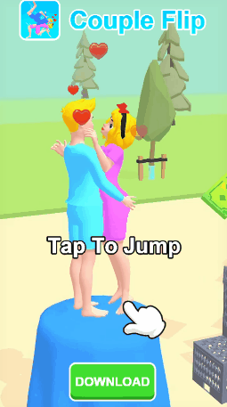
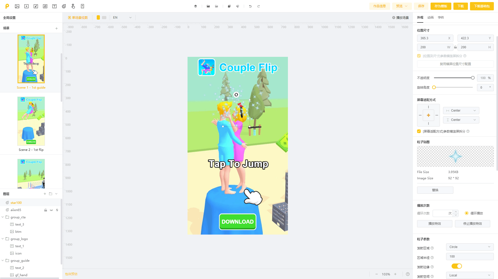
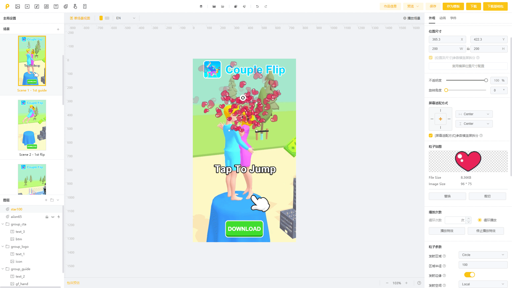

# 《情侣翻越 2》特效粒子替换

Playturbo特效库里有丰富的特效供您选择，但有时当现有特效无法需求时，可以通过灵活替换粒子贴图来满足创作者的更多想法。**本讲将在上一讲《情侣翻越1》案例的基础上，演示如何通过特效粒子贴图的替换，来实现更多丰富的效果！**

## <mark style="color:blue;">一、教学目的</mark>

* 特效粒子贴图替换通过特效粒子贴图的替换，来实现更多的特效效果。<mark style="background-color:red;">粒子替换</mark>

## <mark style="color:blue;">二、特征标签</mark>

* 【制作难度】：⭐⭐⭐
* 【适用产品】：超休闲
* 【玩法】跑酷、竞速
* 【交互方式】：点击
* 【线程】：单线程
* 【功能】：强调动画、定时触发

## <mark style="color:blue;">三、作品预览</mark>

|                     手机试玩效果最佳                    | 竖屏                                        | 横屏                                   |
| :---------------------------------------------: | ----------------------------------------- | ------------------------------------ |
| .png>) | .gif>) |   |
|                       扫码试玩                      | [点击试玩](https://tinyurl.com/45jdv822)      | [点击试玩](https://tinyurl.com/45jdv822) |

## <mark style="color:blue;">四、制作思路</mark>

playable主体详细制作思路请见上篇[《情侣翻越-1》](https://playturbo-doc.mindworks-creative.com/playturbo-an-li-jiao-xue-ji-di/tu-wen-an-li/zi-you-bian-ji-an-li/qing-lv-fan-yue-1-pao-ku-shi-pin-fen-duan#yi-jiao-xue-mu-de)

## <mark style="color:blue;">五、制作指南</mark>

### Step1 - 替换场景1中的爱心特效

**核心目标：**选择合适的特效并替换粒子贴图。

| **原效果**                             | **新效果**                                   |
| ----------------------------------- | ----------------------------------------- |
|  | .gif>) |

<table data-header-hidden><thead><tr><th></th><th width="45"></th><th></th></tr></thead><tbody><tr><td><strong>图示</strong></td><td></td><td><strong>步骤</strong></td></tr><tr><td>
原爱心特效

星星特效
</td><td>1</td><td>
✨替换粒子特效 在上一讲《情侣翻越1》中，我们在制作原【爱心特效】时，从特效库现成特效中选用了相对合适爱心特效，爱心在不同位置生成并垂直上升。 

但现有特效中没有“爱心从中间集中生成，并向上发散开来”的效果，这时我们可以选择其他特效（比如：星星特效），并通过替换粒子来实现。
</td></tr><tr><td>
1-添加星星特效

2-替换粒子贴图

3-调整特效参数

完成效果
</td><td></td><td>

<ol><li>找到可用来替换的特效并添加，此处用【星星特效】进行替换</li></ol>
  

<ol start="2"><li>替换粒子贴图✨，将“星星”替换为“爱心”</li></ol>
 

（左图可以看到，仅替换粒子贴图还达不到完美的效果，还需要调整特效参数）

 
<ol start="3"><li>调整特效参数</li></ol><ul><li>可调整发射区域、透明度、旋转角度、粒子数量、产生频率等参数，详细可参考左图</li></ul></td></tr><tr><td></td><td>2</td><td>
<strong>横屏排版</strong>

每个场景竖屏制作完成后，均需进行<a href="https://playturbo-doc.mindworks-creative.com/playturbo-ke-wan-guang-gao-zi-you-bian-ji-zhi-zuo/xin-shou-ru-men/shi-yong-ru-kou#di-er-bu-chuang-jian-zuo-pin">横屏排版</a>。
</td></tr><tr><td>/</td><td>3</td><td>
<strong>屏幕适配</strong>

对各机型/横竖屏进行<a href="https://playturbo-doc.mindworks-creative.com/bian-ji-qi-gong-neng-jie-shao/zhi-zuo-jian-yi/4.-shi-jue-wen-ti#b.-mo-ren-kuo-pei-fang-an">屏幕适配</a>，并预览适配效果是否合适。
</td></tr></tbody></table>

### Step2 - 整体预览

<table data-header-hidden><thead><tr><th></th><th width="40"></th><th></th></tr></thead><tbody><tr><td><strong>图示</strong></td><td></td><td><strong>步骤</strong></td></tr><tr><td></td><td>1</td><td>
<strong>整体预览</strong>

全部制作完成后，可对不同机型/横竖屏进行整体预览。
</td></tr></tbody></table>
