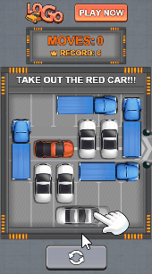

# 停车解密布局-模板自由制作

## <mark style="color:blue;">**一、对比展示**</mark> 

我们先来看一下使用**模板自由制作**前后的对比

\*建议搭配DEMO和[功能介绍文档](../../../ke-wan-gong-ju-zi-you-bian-ji-qi/zi-you-bian-ji-qi-shi-yong-zhi-nan/zu-jian-ku-kuai-jie-bu-ju/ting-che-jie-mi-bu-ju.md)食用效果更佳哦！

| 迭代前                                                                        | 迭代后                                                                      |
| -------------------------------------------------------------------------- | ------------------------------------------------------------------------ |
|  |  |
| [点击试玩](https://tinyurl.com/mr2pejc3)                                       | [点击试玩](https://tinyurl.com/5brmtez7)                                     |

## <mark style="color:blue;">**二、迭代内容概括**</mark> 

模板迭代后的改动，主要在以下几方面：

<mark style="color:red;">**1.重点：调整「停车解密布局」**</mark><mark style="color:red;">（包含「背景及道路」、「布局元素」、「出口」三部分内容）</mark>

2.替换产品信息及其他资产

3.调整横屏适配

4.调整指引动画

5.调整玩法参数

接下来，我们按照操作顺序详细介绍

<figure><figcaption></figcaption></figure>

## <mark style="color:blue;">**三、迭代内容详解**</mark> 

### 1.创建项目 

选择模板【停车解谜v1】 - 自由制作

填写项目名称后，点击"确定"进入项目编辑页

\*创建项目后，建议您先将准备好的所有资产上传进【项目资产】内，方便后续替换使用

<figure><figcaption></figcaption></figure>

### <mark style="color:red;">2.</mark><mark style="color:red;">**调整停车解密布局**</mark>

**\*此步骤为**_**停车解密类玩法**_**模板迭代的核心步骤**，分「背景及道路」、「布局元素」、「出口」三个部分

| Step1-背景及道路                                                                       | Step2-布局元素                                                                                                                                                                                                 | Step3-设置出口                                                                                                          |
| --------------------------------------------------------------------------------- | ---------------------------------------------------------------------------------------------------------------------------------------------------------------------------------------------------------- | ------------------------------------------------------------------------------------------------------------------- |
|  |  |  |

首先，点击画布右上方的图标，进入【快捷布局】，即停车解密布局

<figure><figcaption></figcaption></figure>

#### 2.1 背景及道路

<mark style="background-color:yellow;">此环节是对停车解密布局的底图及道路构成进行设置</mark>

1）替换底图：点击底图"road"旁的替换图标，对道路底图进行替换

<figure><figcaption></figcaption></figure>

2）修改行列数：在本案例中，我们将行数调整为7，形成一个7x6的网格

<figure><figcaption></figcaption></figure>

3）可以根据预想关卡的布局来自由设置行列数，格子的大小亦可根据元素(汽车)的大小决定

<mark style="color:red;">**注意：**</mark><mark style="color:red;">底图与网格的设置应是匹配的</mark>

<figure><figcaption>
底图与网格匹配
</figcaption></figure>

<figure><figcaption>
底图与网格不匹配
</figcaption></figure>

4）启用网格：选中【区域】，点击【全选】图标，启用全部网格

<figure><figcaption></figcaption></figure>

完成「背景及道路」的设置，点击下一步，进行「布局元素」的设置

#### 2.2 布局元素

<mark style="background-color:yellow;">此环节是对停车解密布局中需要进行解密的主体元素和障碍元素进行摆放设置</mark>

1）替换目标元素图片：在本案例中，目标车辆占坑数量为2，所以只需替换\[target\_car2]分组下的车辆图片

<figure><figcaption></figcaption></figure>

2）非目标元素也是如此，只需将对应非目标元素分类下的图片替换即可

<figure><figcaption></figcaption></figure>

3）放置车辆：选中主元素图片，在网格中点击即可放置

4）点击上/下/左/右箭头移动元素位置；点击旋转按钮将元素旋转至需要的角度

<figure><figcaption></figcaption></figure>

5）依次摆放所有元素至网格内。对于不需要的元素，可删除或不放置进网格

<figure><figcaption></figcaption></figure>

6）倒退设置：选择任一元素，点击编辑按钮进入【倒退设置】

在本案例中，我们启用【倒退设置】，并选择倒退方式为【退后】。点击【应用到全部】，将此倒退方式应用到所有元素上

<figure><figcaption></figcaption></figure>

7）设置障碍类：在本案例中，我们选择不添加障碍物，因此可以跳过此步骤或关闭【设置障碍类】

<figure><figcaption></figcaption></figure>

至此，我们完成了「布局元素」的设置，点击下一步，进行「出口」设置

#### 2.3 设置出口

<mark style="background-color:yellow;">此环节是将停车解密布局中的某些网格设置为「出口」，当主元素到达出口后将继续朝着设定的方向进行移动</mark>

1）单击选中"区域1"，将出口方向设置为【固定朝向】

2）在网格中的出口位置(底图左侧的缺口位置)点击放置出口，然后点击旋转按钮将出口朝向调整为向左

<figure><figcaption></figcaption></figure>

3）选择对应元素：在本案例中，目标元素只有\[target\_car2]分组下的元素，因此"区域1出口"对应的元素我们只勾选\[target\_car2]分组即可

<figure><figcaption></figcaption></figure>

点击【完成】，保存对快捷布局的设置

### 3.替换资产

#### 3.1 全局设置

1）点击【全局设置】，对背景图片及常驻信息进行替换

<figure><figcaption></figcaption></figure>

2）调整logo和常驻下载按钮的【屏幕适配方式】分别为：左上角适配、右上角适配

_相关阅读：_ [shi-pei-gui-ze-yu-shi-pei-fang-shi.md](../../../ke-wan-gong-ju-zi-you-bian-ji-qi/zi-you-bian-ji-qi-shi-yong-zhi-nan/bian-ji-ye-mian-fen-qu-jie-shao/can-shu-she-zhi-qu/shi-pei-gui-ze-yu-shi-pei-fang-shi.md "mention") [zhi-zuo-ji-qiao-shi-pei-xiang-guan.md](../../../ke-wan-gong-ju-zi-you-bian-ji-qi/zi-you-bian-ji-qi-zhi-zuo-ji-qiao-zhong-xin/tong-yong-zhi-zuo-ji-qiao/zhi-zuo-ji-qiao-shi-pei-xiang-guan.md "mention")

<figure><figcaption></figcaption></figure>

#### 3.2 普通场景

1）进入场景1，点击【玩法模板】-【玩法编辑】，对核心资产进行替换

_相关阅读：_ [wan-fa-mo-ban.md](../../../ke-wan-gong-ju-zi-you-bian-ji-qi/zi-you-bian-ji-qi-shi-yong-zhi-nan/bian-ji-ye-mian-fen-qu-jie-shao/ding-bu-zi-chan-ku/wan-fa-mo-ban.md "mention")

<figure><figcaption></figcaption></figure>

2）替换步数面板图片，并调整"最佳纪录"文本

<figure><figcaption></figcaption></figure>

3）返回项目编辑，选中指引文本\[text\_guide]，在右侧调整文本内容，并向上移动到合适的位置

<figure><figcaption></figcaption></figure>

4）选中指引元素图片\[car2]，将其替换为我们的目标元素

<figure><figcaption></figcaption></figure>

5）因当前"指引手指"和"指引元素"还在模板初始位置，需进行调整。可直接选中指引组\[initial\_guidance]，将位置调整到合适(即与目标元素重叠)

<figure><figcaption></figcaption></figure>

6）进入场景2，替换结束页面的logo图片和分数面板，并微调其位置大小

<figure><figcaption></figcaption></figure>

### 4.调整横屏适配

完成资产替换和竖屏排版后，我们还需切换到横屏模式，对横屏排版适配进行调整

1）场景1：依次选中指引文本\[text\_guide]和指引组\[initial\_guidance]，调整到合适的位置

2）场景2：选中logo图片，点击【复用竖屏位置尺寸配置】，微调位置即可

<figure><figcaption></figcaption></figure>

### 5.调整指引动画

因模板的初始指引动画是向右移动，而我们的案例需要向左移动，所以需调整指引动画的运动方向

选中指引组\[initial\_guidance]，将"位移动画"的横向位移距离由"110"改为"-110"即可，其他无需调整

<figure><figcaption></figcaption></figure>

### 6.调整玩法参数

在原模板中，有对【额外跳转时机】进行5步的设定。即当玩家有效操作5次后，会额外触发一次跳转应用商店，返回后可继续试玩

在本案例中，我们选择关闭【额外跳转时机】，直接将数值拖拽到0即可

<figure><figcaption></figcaption></figure>

### 7.**整体预览** 

建议在制作过程中，每完成一部分操作，就及时预览，检查设置是否正确

全部制作完成后，可对不同机型/不同语言/横竖屏进行整体预览，确认无误

<figure><figcaption></figcaption></figure>

## <mark style="color:blue;">四、资源提供</mark>

在教程最后，我们为您**提供了本案例所使用到的全部资源，**点击压缩包即可下载。您可以用此资源跟着教程尝试制作，以便尽快上手使用【快捷布局】迭代此类素材


