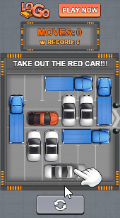
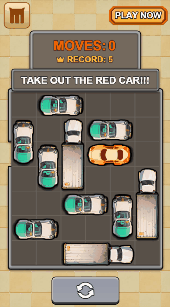

# 《停车解谜v1》模板自由制作

## <mark style="color:blue;">**一、对比展示**</mark> 

我们先来看一下使用**模板自由制作**前后的对比

| 迭代前                                                                        | 迭代后                                                                      |
| -------------------------------------------------------------------------- | ------------------------------------------------------------------------ |
|  |  |

## <mark style="color:blue;">**二、迭代内容概括**</mark> 

模板迭代后的改动，主要在以下几方面：

<mark style="color:red;">**1.重点：调整「停车解密布局」**</mark><mark style="color:red;">（包含「背景及道路」、「布局元素」、「出口」三部分内容）</mark>

2.调整玩法参数

3.替换产品信息及其他资产

4.调整横屏适配

5.调整指引动画

接下来，我们按照操作顺序详细介绍

<figure><figcaption></figcaption></figure>

## <mark style="color:blue;">**三、迭代内容详解**</mark> 

### 1.创建项目 

* 选择模板【停车解谜v1】 - 自由制作
* 填写项目名称后，点击"确定"进入项目编辑页

<figure><figcaption></figcaption></figure>

### <mark style="color:red;">2.</mark><mark style="color:red;">**调整停车解密布局**</mark>

\*此步骤为_停车解密类玩法_模板迭代的核心步骤，分「背景及道路」、「布局元素」、「出口」三个部分

| Step1-背景及道路                                                                       | Step2-布局元素                                                                        | Step3-设置出口                                                                        |
| --------------------------------------------------------------------------------- | --------------------------------------------------------------------------------- | --------------------------------------------------------------------------------- |
|  |  |  |

首先，点击画布右上方的图标，进入【快捷布局】，即停车解密布局

_【快捷布局】功能介绍可查阅：_ [ting-che-jie-mi-bu-ju.md](../../../ke-wan-gong-ju-zi-you-bian-ji-qi/zi-you-bian-ji-qi-shi-yong-zhi-nan/zu-jian-ku/ting-che-jie-mi-bu-ju.md "mention")

<figure><figcaption></figcaption></figure>

#### 2.1 背景及道路

<mark style="background-color:yellow;">此环节是对停车解密布局的底图及道路构成进行设置</mark>

* 替换底图：点击底图"road"旁的替换图标，对道路底图进行替换

<figure><figcaption></figcaption></figure>

* 修改行列数：在本案例中，我们将行数调整为7，形成一个7x6的网格

<figure><figcaption></figcaption></figure>

* 可以根据预想关卡的布局来自由设置行列数，格子的大小亦可根据元素(汽车)的大小决定
* <mark style="color:red;">**注意：**</mark><mark style="color:red;">底图与网格的设置应是匹配的</mark>

<figure><figcaption>
底图与网格匹配
</figcaption></figure>

<figure><figcaption>
底图与网格不匹配
</figcaption></figure>

* 启用网格：选中【区域】，点击【全选】图标，启用全部网格

<figure><figcaption></figcaption></figure>

完成「背景及道路」的设置，点击下一步，进行「布局元素」的设置

#### 2.2 布局元素

<mark style="background-color:yellow;">此环节是对停车解密布局中需要进行解密的主体元素进行摆放设置</mark>

* 替换目标元素图片：在本案例中，目标车辆占坑数量为2，所以只需替换\[target\_car2]分组下的车辆图片

<figure><figcaption></figcaption></figure>

* 非目标元素也是如此，只需将对应非目标元素分类下的图片替换即可

<figure><figcaption></figcaption></figure>

* 放置车辆：选中主元素图片，在网格中点击即可放置
* 点击上/下/左/右箭头移动元素位置；点击旋转按钮将元素旋转至需要的角度

<figure><figcaption></figcaption></figure>

* 依次摆放所有元素至网格内
* 对于不需要的元素，可删除或不放置进网格

<figure><figcaption></figcaption></figure>

* 倒退设置：选择任一元素，点击编辑按钮进入【倒退设置】
* 在本案例中，我们启用【倒退设置】，并选择倒退方式为【退后】
* 点击【应用到全部】，将此倒退方式应用到所有元素上

<figure><figcaption></figcaption></figure>

至此，我们完成了「布局元素」的设置，点击下一步，进行「出口」设置

#### 2.3 设置出口

<mark style="background-color:yellow;">此环节是将停车解密布局中的某些网格设置为「出口」，当主元素到达出口后将继续朝着设定的方向进行移动</mark>

* 单击选中"区域1"，将出口方向设置为【固定朝向】
* 在网格中的出口位置(底图左侧的缺口位置)点击放置出口，然后点击旋转按钮将出口朝向调整为向左

<figure><figcaption></figcaption></figure>

* 选择对应元素：在本案例中，目标元素只有\[target\_car2]分组下的元素，因此"区域1出口"对应的元素我们只勾选\[target\_car2]分组即可

<figure><figcaption></figcaption></figure>

点击【完成】，保存对快捷布局的设置

### 3.替换资产

在替换资产前，建议您先将准备好的所有资产上传进【项目资产】内，方便后续替换使用

* 点击【全局设置】，对背景图片及常驻信息进行替换

<figure><figcaption></figcaption></figure>

* 调整logo和常驻下载按钮的【屏幕适配方式】分别为：左上角适配、右上角适配

_相关阅读：_ [shi-pei-gui-ze-yu-shi-pei-fang-shi.md](../../../ke-wan-gong-ju-zi-you-bian-ji-qi/zi-you-bian-ji-qi-shi-yong-zhi-nan/bian-ji-ye-mian-fen-qu-jie-shao/can-shu-she-zhi-qu/shi-pei-gui-ze-yu-shi-pei-fang-shi.md "mention") [zhi-zuo-ji-qiao-shi-pei-xiang-guan.md](../../../ke-wan-gong-ju-zi-you-bian-ji-qi/zi-you-bian-ji-qi-zhi-zuo-ji-qiao-zhong-xin/tong-yong-zhi-zuo-ji-qiao/zhi-zuo-ji-qiao-shi-pei-xiang-guan.md "mention")

<figure><figcaption></figcaption></figure>

* 进入场景1，点击【玩法模板】-【玩法编辑】，对核心资产进行替换

_相关阅读：_ [wan-fa-mo-ban.md](../../../ke-wan-gong-ju-zi-you-bian-ji-qi/zi-you-bian-ji-qi-shi-yong-zhi-nan/bian-ji-ye-mian-fen-qu-jie-shao/ding-bu-zi-chan-ku/wan-fa-mo-ban.md "mention")

<figure><figcaption></figcaption></figure>

* 替换步数面板图片，并调整"最佳纪录"文本

<figure><figcaption></figcaption></figure>

* 返回项目编辑，选中指引文本\[text\_guide]，在右侧调整文本内容，并向上移动到合适的位置

<figure><figcaption></figcaption></figure>

* 选中指引元素图片\[car2]，将其替换为我们的目标元素

<figure><figcaption></figcaption></figure>

* 因当前"指引手指"和"指引元素"还在模板初始位置，需进行调整。可直接选中指引组\[initial\_guidance]，将位置调整到合适(即目标元素重叠)

<figure><figcaption></figcaption></figure>

* 进入场景2，替换结束页面的logo图片和分数面板

<figure><figcaption></figcaption></figure>

### 4.调整横屏适配

完成资产替换和竖屏排版后，我们还需切换到横屏模式，对横屏排版进行调整

1）场景1：依次选中指引文本\[text\_guide]和指引组\[initial\_guidance]，调整到合适的位置

2）场景2：选中logo图片，点击【复用竖屏位置尺寸配置】，微调位置即可

<figure><figcaption></figcaption></figure>

### 5.调整指引动画

### 6.**整体预览** 

全部调整完成后，我们对不同机型/不同语言/横竖屏进行整体预览试玩

<figure><figcaption></figcaption></figure>
