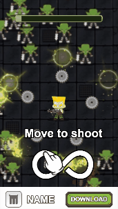
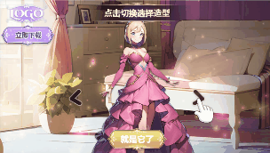

# 交互视频《模拟移动》教程

温馨提示：本篇教程主要讲解**如何通过交互视频来实现"模拟玩家实时操作"的效果**，建议搭配DEMO食用效果更佳哦！

## <mark style="color:blue;">一、特征标签</mark> 

* 【制作难度】：⭐⭐
* 【适用产品】：普遍适用(尤其是摇杆玩法产品)
* 【交互方式】：按下/抬起
* 【自由度】：固定流程
* 【核心资产】：视频
* 【核心功能】：按下-继续播放视频；抬起-暂停播放视频

## <mark style="color:blue;">二、效果预览</mark> 

| 手机试玩效果最佳                                                                               | 竖屏                                                                                | 横屏                                                                                 |
| -------------------------------------------------------------------------------------- | --------------------------------------------------------------------------------- | ---------------------------------------------------------------------------------- |
|  |  |  |
| 扫码试玩                                                                                   | [点击试玩](https://tinyurl.com/3tndebp6)                                              | [点击试玩](https://tinyurl.com/3tndebp6)                                               |

## <mark style="color:blue;">三、玩法梳理</mark> 

**我们在开始制作之前需要将本案例的玩法逻辑进行简单的梳理：**

1）进入试玩，自动播放【丧失围攻视频】<mark style="background-color:yellow;">（初始视频1）</mark>

2）视频播放结束，出现【操作指引】，引导玩家按下继续对抗丧尸

3）玩家全屏任意按下，播放【对抗丧尸视频】<mark style="background-color:yellow;">（核心视频2）</mark>，同时加载进度条；每当玩家抬起，暂停播放【对抗丧尸视频】，同时进度条停止加载，并出现【操作指引】

4）视频播放结束，自动跳转商店，玩家从商店返回可继续试玩

5）玩家全屏任意按下，播放【对抗丧尸视频】<mark style="background-color:yellow;">（核心视频3）</mark>，同时加载进度条；每当玩家抬起，暂停播放【对抗丧尸视频】，同时进度条停止加载，并出现【操作指引】

6）视频播放结束，进度条停止加载，并出现【操作指引】，玩家按下即跳转商店

<figure><figcaption></figcaption></figure>

## <mark style="color:blue;">四、制作思路</mark> 

**核心思想：**场景拆分逻辑清晰，图层结构简单，单个场景里的动画和事件尽可能少

**场景拆分：**因本案例玩法较简单，我们只需用 1 个场景来制作即可

<table data-full-width="false"><thead><tr><th width="164">场景名称</th><th>场景1-核心玩法</th></tr></thead><tbody><tr><td><strong>效果图</strong></td><td></td></tr><tr><td><strong>场景描述</strong></td><td>玩家按下就播放视频，抬手就暂停播放视频，以此来模拟玩家实时交互的效果</td></tr><tr><td><strong>核心资产</strong></td><td>
<strong>静帧图片：</strong>操作指引、进度条

<strong>视频：</strong>初始视频1、核心视频2、核心视频3

<mark style="color:red;">注：因为我们对本案例的DEMO有"核心视频播放4s后,有一次强制跳转"的设定，为了便于理解和制作，将核心视频拆分成了两段(核心视频2总时长为4s)。若您不需要中途的强制跳转，只需准备一段核心视频即可</mark>
</td></tr><tr><td><strong>核心动画</strong></td><td>
操作指引：位移缓动

进度条：缩放缓动
</td></tr><tr><td><strong>核心事件</strong></td><td>
触发对象：视频图层

触发事件：按下；抬起

响应事件：继续播放视频；暂停播放视频
</td></tr></tbody></table>

## <mark style="color:blue;">五、制作指南</mark> 

\*核心内容为Step3【事件设置】

### Step1 - 场景搭建 

建议您在创建项目后，先将所有资产上传进【项目资产】内，方便后续添加使用

#### **1.全局设置**

1）在【全局设置】中添加背景音乐、背景图片

2）在【全局场景】下添加常驻下载按钮、logo等产品信息

#### **2.场景1**

1）将所需视频、图片添加进场景1

<mark style="color:red;">温馨提示："进度条"和"操作指引"相关资产，都可从【预设库】直接获取哦！</mark>

<figure><figcaption></figcaption></figure>

2）调整各资产到合适的位置大小

3）根据资产类型对资产进行编组、排序、命名

<figure><figcaption></figcaption></figure>

4）将核心视频(核心视频2+核心视频3)设为"隐藏"状态，并关闭【入场自动播放】，在后续通过事件来控制视频的显示和播放

<figure><figcaption></figcaption></figure>

5）调整横屏排版：可选中所有最高层级的图层，使用【复用竖屏位置尺寸配置】功能一键排版，然后再适当调整【位置】和【缩放比例】即可

<figure><figcaption></figcaption></figure>

6）调整屏幕适配方式：在本案例中，我们想要竖屏下的产品信息始终位于屏幕底部，所以我们要调整其适配方式。直接选中该图层，在右侧【屏幕适配方式】处点击向下图标即可（其他图层默认居中适配，无需调整）

<figure><figcaption></figcaption></figure>

### Step2 - 动画设置 

在本案例中，需要设置动画的资产有：指引手指、指引文案、进度条(选做)、角色(选做)

<mark style="color:red;">温馨提示：若您使用了预设，则无需自己设置动画！</mark>

#### **1.指引手指**

1）选中手指图片\[gf\_hand]，添加动画-通用-位移缓动，参数设置如下(手指横向移动动画)：

<figure><figcaption></figcaption></figure>

2）选中手指组\[gf\_1]，添加动画-通用-位移缓动，参数设置如下(手指纵向移动动画)：

<figure><figcaption></figcaption></figure>

#### **2.指引文案**

选中指引文本\[tguidelines]，添加动画-强调动画-上下来回，参数设置如下（设置完成后可隐藏整个指引组，在后续通过事件控制）：

<figure><figcaption></figcaption></figure>

#### 3.进度条(选做)

1）选中进度条图片\[progress\_bar]，将其【锚点】修改为（0,50），并取消勾选【参数横竖屏拆分】

注意：进度条图片左右需贴边，不能留空

<figure><figcaption></figcaption></figure>

2）添加动画-通用-缩放缓动，参数设置如下：

注意：这里的【持续时间】代表的是进度条加载到头所需的总时长。在本案例中，我们设定了"在进度条快加载完时，玩家不能再交互"，也就是当所有视频播放结束后，进度条需要差一截才到头，所以就需要"进度条播放的总时长＞所有视频加起来的总时长"。本案例的三段视频总时长为8.7s左右，所以在这里我们可以将进度条的【持续时间】设置为10s或更长

<figure><figcaption></figcaption></figure>

#### 4.角色(选做)

1）选中角色图片\[role\_1]，将其【锚点】修改为（50,100），并取消勾选【参数横竖屏拆分】

<figure><figcaption></figcaption></figure>

2）添加动画-通用-缩放缓动，参数设置如下（设置完成后可隐藏该图层，在后续通过事件控制）：

<figure><figcaption></figcaption></figure>

### <mark style="background-color:red;">Step3 - 事件设置</mark> 

本案例的所有事件集中设置在三个视频图层上以及场景1上，我们按操作顺序依次讲解

#### <mark style="color:red;">1.图层: video\_01（初始视频1）</mark>

1）选中图层\[video\_01]，添加事件-开始时

* 添加响应事件：从头播放进度条动画

<figure><figcaption></figcaption></figure>

2）添加事件-结束时

* 添加响应事件：隐藏初始视频1；显示核心视频2、显示角色图片、显示操作指引组
* 添加响应事件：从头播放所有指引相关动画；同时暂停播放进度条动画

<figure><figcaption></figcaption></figure>

#### <mark style="color:red;">2.图层: video\_02（核心视频2）</mark>

1）选中图层\[video\_02]，添加事件-按下

* 添加响应事件：设置埋点，修改埋点名称为"玩家第一次按下"
* 添加响应事件：隐藏角色图片、隐藏操作指引组
* 添加响应事件：继续播放核心视频2；并播放进度条动画和一次点击音效

<figure><figcaption></figcaption></figure>

2）添加事件-抬起

* 添加响应事件：暂停播放视频核心视频2
* 添加响应事件：显示操作指引组；并从头播放操作指引相关动画；同时暂停播放进度条动画

<figure><figcaption></figcaption></figure>

3）复制事件：复制\[video\_01]的"结束时"事件

<figure><figcaption></figcaption></figure>

粘贴事件：选中\[video\_02]，粘贴 - 仅粘贴图层事件

<figure><figcaption></figcaption></figure>

* 修改响应事件为：隐藏核心视频2；显示核心视频3；并删除显示角色图片
* 添加响应事件：跳转应用商店（此步骤就是前面提到的"强制跳转"）

<figure><figcaption></figcaption></figure>

#### <mark style="color:red;">3.图层: video\_03（核心视频3）</mark>

1）复制事件：复制整个图层\[video\_02]

<figure><figcaption></figcaption></figure>

2）粘贴事件：选中\[video\_03]，粘贴 - 仅粘贴图层事件（即一键粘贴该图层的所有事件）

<figure><figcaption></figcaption></figure>

3）事件-按下

* 修改响应事件为：继续播放视频\[video\_03]；删除埋点事件、删除隐藏角色图片；

<figure><figcaption></figcaption></figure>

4）事件-抬起

* 修改响应事件为：暂停播放视频\[video\_03]

<figure><figcaption></figcaption></figure>

5）事件-结束时

* 删除响应事件：删除隐藏视频\[video\_02]、删除显示视频\[video\_03]、删除跳转应用商店
* 添加响应事件：禁用\[video\_03]的按下事件、禁用\[video\_03]的抬起事件（在设置完下一步的场景事件后，还需在这里添加一个响应事件"启用场景1的按下事件"）

<mark style="background-color:yellow;">注：这代表当最后一段视频播放结束，该视频的"按下/抬起"事件将不再生效，场景1的"按下"事件(即跳转事件)开始生效</mark>

<figure><figcaption></figcaption></figure>

#### <mark style="color:red;">4.场景: Scene 1</mark>

1）点击场景1 ，添加事件-按下

* 添加响应事件：跳转应用商店
* 添加响应事件：上报试玩结束
* 添加响应事件：从头播放一次点击音效

<figure><figcaption></figcaption></figure>

2）添加事件-定时触发

* 设置执行延迟时间为0s
* 添加响应事件：禁用场景1的按下事件

<mark style="background-color:yellow;">注：这代表一进入试玩，场景1的"按下"事件(即跳转事件)即被禁用，不会生效。然后我们在核心视频3的"结束时"事件下添加"启用场景1的按下事件"</mark>

<figure><figcaption></figcaption></figure>

以上，就是本案例用到的全部事件。完成所有事件设置，我们的素材就制作完成了。

### Step4 - 整体预览 

1）建议在制作过程中，每完成一部分操作，就及时预览，检查设置是否正确

2）全部制作完成后，可对不同机型/不同语言/横竖屏进行整体预览，确认无误

<figure><figcaption></figcaption></figure>

## <mark style="color:blue;">六、资源提供</mark>

在教程最后，我们为您**提供了本案例所使用到的全部资源，**点击压缩包即可下载。您可以用此资源跟着教程尝试制作，以便尽快上手使用自由编辑器制作此类素材


