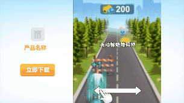

# 交互视频《3步交互》教程

温馨提示：本篇教程以跑酷玩法为例，主要讲解空白制作**如何制作3步跳转的交互视频素材**，建议搭配[DEMO](https://tinyurl.com/bdcmpfe4)食用效果更佳哦！其他玩法产品只需将DEMO内的"按下"事件改为符合产品的交互方式，即可适用！

## <mark style="color:blue;">一、特征标签</mark> 

* 【制作难度】：⭐
* 【适用产品】：普遍适用
* 【交互方式】：按下
* 【自由度】：固定流程
* 【核心资产】：视频
* 【核心功能】：按下-跳转到下一场景；视频开始时-禁用按下事件；视频结束时-启用按下事件

## <mark style="color:blue;">二、效果预览</mark> 

<table><thead><tr><th width="210.33333333333331">手机试玩效果最佳</th><th>竖屏</th><th>横屏</th></tr></thead><tbody><tr><td></td><td></td><td></td></tr><tr><td>扫码试玩</td><td><a href="https://tinyurl.com/y4d4ckad">点击试玩</a></td><td><a href="https://tinyurl.com/y4d4ckad">点击试玩</a></td></tr></tbody></table>

## <mark style="color:blue;">三、玩法梳理</mark> 

**我们在开始制作之前需要将本案例的玩法逻辑进行简单的梳理：**

1）进入试玩，自动播放1次【跑酷视频1】

2）视频结束，出现【操作指引】，引导玩家滑动躲避障碍物

3）玩家按下即播放【跑酷视频2】，视频结束，再次出现【操作指引】，引导玩家滑动躲避障碍物

4）玩家按下即播放【跑酷视频3】，视频结束，再次出现【操作指引】，引导玩家滑动躲避障碍物

5）玩家按下即播放【跑酷视频4】，视频结束，跳转应用商店，同时进入结束页面

<figure><figcaption></figcaption></figure>

## <mark style="color:blue;">四、制作思路</mark> 

**核心思想：**场景拆分逻辑清晰，图层结构简单，单个场景里的动画和事件尽可能少

**场景拆分：**为了便于理解&操作简单，本案例我们拆分为4个场景来制作

<table data-full-width="false"><thead><tr><th width="115">场景名称</th><th width="233">场景1&#x26;2-核心玩法</th><th width="226">场景3-核心玩法</th><th>场景4-结束页面</th></tr></thead><tbody><tr><td><strong>效果图</strong></td><td></td><td></td><td></td></tr><tr><td><strong>场景描述</strong></td><td>【跑酷视频】播放结束，出现操作指引，引导玩家滑动继续跑酷</td><td>【跑酷视频】播放结束，出现操作指引，引导玩家滑动继续跑酷</td><td>奖励面板+跳转按钮</td></tr><tr><td><strong>核心资产</strong></td><td>
<strong>视频：</strong>跑酷视频1/跑酷视频2

<strong>静帧图片：</strong>操作指引

<strong>音频：</strong>点击音效
</td><td>
<strong>视频：</strong>跑酷视频3+跑酷视频4

<strong>静帧图片：</strong>操作指引

<strong>音频：</strong>点击音效
</td><td>
<strong>静帧图片：</strong>视频尾帧截图、遮罩、奖励面板、跳转按钮

<strong>粒子：</strong>彩带粒子

<strong>音频：</strong>胜利音效
</td></tr><tr><td><strong>核心动画</strong></td><td>
<strong>操作指引：</strong>位移缓动

<strong>操作指引组：</strong>淡入
</td><td>
<strong>操作指引：</strong>位移缓动

<strong>操作指引组：</strong>淡入
</td><td>
<strong>奖励面板组：</strong>放大出现

<strong>跳转按钮：</strong>缩放缓动

<strong>遮罩：</strong>淡入
</td></tr><tr><td><strong>核心事件</strong></td><td>
<strong>触发对象：</strong>视频图层

<strong>触发事件：</strong>按下

<strong>响应事件：</strong>跳转到下一场景

<strong>触发对象：</strong>视频图层

<strong>触发事件：</strong>开始时

<strong>响应事件：</strong>禁用按下事件

<strong>触发对象：</strong>视频图层

<strong>触发事件：</strong>结束时

<strong>响应事件：</strong>启用按下事件
</td><td>
<strong>触发对象：</strong>视频图层

<strong>触发事件：</strong>按下

<strong>响应事件：</strong>隐藏视频3；从头播放视频4

<strong>触发对象：</strong>视频图层

<strong>触发事件：</strong>开始时

<strong>响应事件：</strong>禁用按下事件

<strong>触发对象：</strong>视频图层

<strong>触发事件：</strong>结束时

<strong>响应事件：</strong>启用按下事件
</td><td>
<strong>触发对象：</strong>跳转按钮组

<strong>触发事件：</strong>按下

<strong>响应事件：</strong>跳转应用商店
</td></tr></tbody></table>

## <mark style="color:blue;">五、制作指南</mark> 

\*核心内容为Step4【事件设置】

### Step1 - 场景搭建 

建议您在创建项目后，先将所有资产上传进【项目资产】内，方便后续添加使用

#### **1.全局设置**

1）在【全局设置】中添加背景音乐、背景图片

2）在【全局场景】下添加常驻下载按钮、logo等产品信息，并调整位置大小

<figure><figcaption></figcaption></figure>

3）横屏排版：切换到横屏模式，对产品信息组重新排版。并隐藏不需要的底图\[banner]（需勾选\[显示隐藏参数]横竖屏拆分）

<figure><figcaption></figcaption></figure>

#### **2.普通场景**

**2.1 场景1**

1）在场景1中添加核心玩法相关资产：跑酷视频1、操作指引、点击音效

2）调整各资产到合适的位置大小，并根据资产类型对资产进行编组、排序、命名

3）视频参数：入场自动播放1次

<figure><figcaption></figcaption></figure>

4）横屏排版：切换到横屏模式，选中所有最高层级的图层，使用【复用竖屏位置尺寸配置】功能一键排版，然后再适当调整各图层的【位置】和【缩放比例】，让画面展示出完整的核心玩法相关内容

<figure><figcaption></figcaption></figure>

**2.2 场景2&场景3**<mark style="background-color:orange;">**（此步骤建议在完成事件设置后进行，避免重复操作）**</mark>

1）因场景2、场景3的制作步骤基本同场景1一致，可以通过"复制场景"功能快速完成场景搭建。复制场景后，替换相应视频即可

<figure><figcaption></figcaption></figure>

2）注意：场景3还需额外添加视频4"video\_4"，并关闭入场自动播放

3）可复制视频3图层，对视频4进行"仅粘贴位置大小"的操作，即可对齐视频的位置与大小

<figure><figcaption></figcaption></figure>

**2.3 场景4**

1）在场景4中添加结束页面相关资产：视频尾帧截图、遮罩、奖励面板、跳转按钮、胜利音效、产品信息组_（因"全局场景"的层级只能设置"置于场景顶层或底层"，在结束页面，原有的产品信息组会被遮挡，因此可以复制"全局场景"的产品信息组到场景4，自由调整层级，并关闭"全局场景"）_

2）调整各资产到合适的位置大小，并根据资产类型对资产进行编组、排序、命名

3）勾选场景4为【结束场景】，以便上报试玩结束

<figure><figcaption></figcaption></figure>

4）横屏排版：同样，切换到横屏模式，选中奖励面板组\[group\_end]，使用【复用竖屏位置尺寸配置】功能一键排版，再微调各图层的位置大小

<figure><figcaption></figcaption></figure>

### Step2 - 横竖屏适配 

完成场景的搭建后，我们还需对部分图层的"屏幕适配方式"进行调整（相关阅读:[zhi-zuo-ji-qiao-shi-pei-xiang-guan.md](../../../../ke-wan-gong-ju-zi-you-bian-ji-qi/zi-you-bian-ji-qi-zhi-zuo-ji-qiao-zhong-xin/tong-yong-zhi-zuo-ji-qiao/zhi-zuo-ji-qiao-shi-pei-xiang-guan.md "mention")）

在本案例中，我们想要竖屏下的常驻信息组始终位于各机型屏幕的底部，所以我们调整其"屏幕适配方式"为贴底适配（其他图层默认居中适配，无需调整）

<figure><figcaption></figcaption></figure>

### Step3 - 动画设置 

在本案例中，用到的动画和粒子特效如下，我们依次展开介绍：

场景1-3：指引手指位移动画、指引文案位移动画、指引组淡入动画

场景4：奖励面板组入场动画、跳转按钮缩放动画、遮罩淡入动画、彩带粒子

#### **1.指引手指：位移缓动**

选中指引手指图片\[guide\_hand]，添加动画-通用-位移缓动，作为滑动循环指引动画。参数设置如下：

<figure><figcaption></figcaption></figure>

#### **2.指引文本：位移缓动**

选中指引文本\[text\_guide]，添加动画-通用-位移缓动，作为循环指引动画。参数设置如下：

<figure><figcaption></figcaption></figure>

#### 3.指引组：淡入

选中指引组\[group\_guide]，添加动画-进场动画-淡入，作为整个指引组的入场动画。参数设置如下：

<figure><figcaption></figcaption></figure>

#### 4.奖励面板组：放大出现

选中奖励面板组\[group\_end]，添加动画-进场动画-放大出现，作为整个奖励组的入场动画。参数设置如下：

<figure><figcaption></figcaption></figure>

#### 5.跳转按钮：缩放缓动

选中跳转按钮组\[btn]，添加动画-通用-缩放缓动，作为循环指引动画。参数设置如下：

<figure><figcaption></figcaption></figure>

#### 6.遮罩：淡入

选中遮罩图片\[mask]，添加动画-进场动画-淡入，作为遮罩的入场动画。参数设置如下：

<figure><figcaption></figcaption></figure>

#### 7.彩带**粒子特效**

1）打开公共粒子库，选择并添加合适的粒子特效到场景2

2）调整粒子到合适的位置（注意横竖屏都要调整）

<figure><figcaption></figcaption></figure>

### <mark style="background-color:red;">Step4 - 事件设置</mark> 

完成所有动效的设置，我们对试玩的逻辑 也就是"事件"进行设置

本案例与事件设置相关的主要内容有：

* 按下视频：跳转到下一场景；隐藏素材；从头播放视频
* 视频开始时：禁用按下事件
* 视频结束时：启用按下事件
* 按下跳转按钮：跳转应用商店

接下来，我们按顺序依次讲解

#### <mark style="color:red;">1.图层: video\_1</mark>

在场景1中选中图层\[video\_1]

1）添加事件 - 按下，依次添加响应事件：

* 设置埋点。选择埋点id1，并编辑埋点名称为"第一次按下"
* 从头播放1次点击音效
* 跳转到下一场景

<figure><figcaption></figcaption></figure>

2）添加事件 - 开始时，添加响应事件：

* 禁用事件：\[video\_1]按下

3）添加事件 - 结束时，依次添加响应事件：

* 启用事件：\[video\_1]按下
* 从头播放指引组的淡入动画、从头播放指引文本的位移动画、从头播放指引手指的位移动画

<mark style="background-color:yellow;">注：禁用事件&启用事件的设置是为了保证在视频播放期间，玩家不可点击，需要等到视频结束才允许交互</mark>

<figure><figcaption></figcaption></figure>

#### <mark style="color:red;">2.图层: video\_2、video\_3、video\_4</mark>

复制场景1，由此创建场景2、场景3，并替换相应视频

1）在场景2中选中图层\[video\_2]，修改埋点id与埋点名称

2）在场景3中选中图层\[video\_3]，修改埋点id与埋点名称，并删除响应事件"跳转到下一场景"

3）添加响应事件：隐藏\[video\_3]，隐藏指引组，从头播放\[video\_4]

<figure><figcaption></figcaption></figure>

4）选中图层\[video\_4]，添加事件 - 结束时，添加响应事件：

* 跳转应用商店
* 跳转到下一场景

<figure><figcaption></figcaption></figure>

#### <mark style="color:red;">3.图层: 跳转按钮</mark>

在场景4中选中图层\[btn]，添加事件 - 按下，添加响应事件：

* 设置埋点。选择埋点id4，并编辑埋点名称为"结束页触发跳转"
* 跳转应用商店

<figure><figcaption></figcaption></figure>

#### <mark style="color:red;">4.图层: 常驻下载按钮</mark>

进入"全局场景"，选中常驻下载按钮组\[group\_button]，添加事件 - 按下

添加响应事件：跳转应用商店

<figure><figcaption></figcaption></figure>

以上，就是本案例用到的全部事件。完成所有事件设置，我们的素材就制作完成了。

### Step5 - 整体预览 

1）建议在制作过程中，每完成一部分操作，就及时预览，检查设置是否正确

2）全部制作完成后，可对不同机型/不同语言/横竖屏进行整体预览，确认无误

<figure><figcaption></figcaption></figure>

## <mark style="color:blue;">六、资源提供</mark>

在教程最后，我们为您**提供了本案例所使用到的全部资源，**点击压缩包即可下载。您可以用此资源跟着教程尝试制作，以便尽快上手使用自由编辑器制作此类素材


