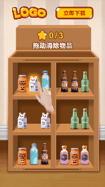

# 《货架三消》空白制作教程

温馨提示：本篇教程主要讲解**如何通过空白制作来做出"拖拽"三消玩法的2D素材**，建议搭配DEMO食用效果更佳哦！

## <mark style="color:blue;">一、特征标签</mark> 

* 【制作难度】：⭐⭐⭐
* 【适用产品】：消除玩法产品
* 【交互方式】：拖拽到指定位置
* 【自由度】：半自由
* 【核心资产】：静帧图片
* 【核心功能】：拖拽到指定位置-隐藏/显示素材；全局变量

## <mark style="color:blue;">二、效果预览</mark> 

| 手机试玩效果最佳                                                                          | 竖屏                                                                                | 横屏                                                                                   |
| --------------------------------------------------------------------------------- | --------------------------------------------------------------------------------- | ------------------------------------------------------------------------------------ |
|  |  |  |
| 扫码试玩                                                                              | [点击试玩](https://tinyurl.com/yf989yf6)                                              | [点击试玩](https://tinyurl.com/yf989yf6)                                                 |

## <mark style="color:blue;">三、玩法梳理</mark> 

**我们在开始制作之前需要将本案例的玩法逻辑进行简单的梳理：**

1）进入试玩，展示图示【货架初始画面】

2）出现【操作指引】，引导玩家向下拖动白色盒子完成排序消除

3）玩家拖动白色盒子到指定位置，播放【成功反馈】；否则返回原位

注意：①所有物品都能被拖拽，但只有拖拽正确才放置；②当绿色瓶子完成排序消除，褐色瓶子的拖拽事件即生效

4）玩家每完成一组排序消除，星星数量+1；当玩家完成三组消除(即星星数量为"3/3")时，进入结束页面

5）结束页面玩家全屏任意按下，跳转商店

<figure><figcaption></figcaption></figure>

## <mark style="color:blue;">四、制作思路</mark> 

**核心思想：**场景拆分逻辑清晰，图层结构简单，单个场景里的动画和事件尽可能少

**场景拆分：**根据玩法梳理内容，我们可将本案例拆分为 2 个场景来制作，即核心玩法场景+结束页场景

<table data-full-width="false"><thead><tr><th width="136">场景名称</th><th width="321">场景1-核心玩法</th><th>场景2-结束页</th></tr></thead><tbody><tr><td><strong>效果预览</strong></td><td></td><td></td></tr><tr><td><strong>场景描述</strong></td><td>玩家依次拖动三个目标物品(白色盒子/绿色瓶子/褐色瓶子)到指定位置，即可成功放置完成消除；拖动其他物品则返回原位</td><td>结束页面: 奖励面板+跳转按钮</td></tr><tr><td><strong>核心资产</strong></td><td>
<strong>静帧图片：</strong>货架、物品&#x26;物品外发光图片、指引手指

<strong>粒子特效：</strong>消除反馈

<strong>音效：</strong>按下拖拽音效、消除音效
</td><td>
<strong>静帧图片：</strong>弹窗面板、奖励图片、跳转按钮

<strong>粒子特效：</strong>胜利反馈

<strong>音效：</strong>胜利音效
</td></tr><tr><td><strong>核心动画</strong></td><td>手指指引：位移+透明度+旋转缓动</td><td>
奖励面板：缩放+透明度缓动

跳转按钮：缩放+透明度缓动
</td></tr><tr><td><strong>核心事件</strong></td><td>
触发对象：单个物品

触发事件：拖拽；拖拽到指定位置

响应事件：隐藏素材；显示素材；赋值(全局变量)
</td><td>
触发对象：场景2

触发事件：按下

响应事件：跳转应用商店；上报试玩结束
</td></tr></tbody></table>

## <mark style="color:blue;">五、制作指南</mark> 

\*核心内容为Step4【事件设置】

### Step1 - 场景搭建 

建议您在创建项目后，先将所有资产上传进【项目资产】内，方便后续添加使用

#### **1.全局设置**

1）在【全局设置】中添加背景音乐、背景图片

2）在【全局场景】下添加常驻下载按钮、logo等产品信息

<figure><figcaption></figcaption></figure>

#### **2.场景1**

1）将与核心玩法相关的资产添加进场景1

2）调整各资产到合适的位置大小，根据资产类型对资产进行编组、排序、命名

<mark style="color:orange;">**注意:**</mark>&#x20;

a. 此类玩法(指在玩家交互后,物品位置发生改变的玩法)的制作逻辑为 "在不同位置添加相同的物品，然后先隐藏放置后的物品，再通过事件设置显示放置后的物品，隐藏原位置的物品"，以此来实现目标效果

因此，"可被拖拽并放置的物品"就需要准备两张相同的图片资源。在本案例中，我们想要物品在拖拽过程中有外发光效果，所以各准备了一张普通物品图片以及一张物品外发光图片

b. 此外在本案例中，我们想要实现"在拖拽起某个物品后，其层级是在其他所有物品之上的"。<mark style="color:orange;">因图层有前后顺序的层级影响，所以每个物品也都需要准备两张相同的图片资源，将其中一张设为"可被拖动的物品"，另一张则设为"不可被拖动/仅在原地显示的物品"，然后将前者所有的图片编组，并将其层级置于后者的上方</mark>

c. 因为有三次不同位置的手指指引，所以手指图片也需要添加三个

<figure><figcaption>
示意图
</figcaption></figure>

3）调整图层初始状态：将所有可被拖动的物品(即层级较高的)设为"隐藏"状态，将所有不可被拖动的物品(即层级较低的)设为"显示"状态；将指引手指1和3设为"隐藏"状态，指引手指2设为"显示"状态。后续我们将通过事件来控制这些图层的隐藏/显示

<figure><figcaption></figcaption></figure>

#### **3.场景2**

1）将与结束页面相关的资产添加进场景2

2）同样的，调整各资产到合适的位置大小，根据资产类型对资产进行编组、排序、命名

<figure><figcaption></figcaption></figure>

### Step2 - 横竖屏适配 

完成所有竖屏的排版后，我们还需对"横屏的排版"以及"横竖屏的屏幕适配方式"进行调整

#### 1.调整横屏排版

1）切换到横屏模式，选中所有最高层级的图层

2）使用【复用竖屏位置尺寸配置】功能一键排版，然后再适当调整各图层的【位置】和【缩放比例】即可

3）全局场景和场景2同理

<figure><figcaption></figcaption></figure>

#### 2.调整屏幕适配方式 

在本案例中，我们想要竖屏下的产品信息始终位于屏幕最上方，所以我们要调整其适配方式。直接在竖屏模式下选中产品信息组\[group\_product]，在右侧【屏幕适配方式】处点击向上图标即可完成设置（其他图层默认居中适配，无需调整）

<figure><figcaption></figcaption></figure>

### Step3 - 动效设置 

在本案例中，使用到的动效如下：

动画：手指指引、奖励面板+跳转按钮

粒子特效：消除反馈(星星粒子)、结束页胜利反馈(星星/彩带粒子)

#### **1.动画:**&#x20;

**1-1）手指指引**

1）选中手指组\[hand\_1]，依次添加动画-通用-位移缓动、透明度缓动，来作为手指及物品的指引动画，参数设置如下：

<figure><figcaption>
位移缓动
</figcaption></figure>

<figure><figcaption>
透明度缓动
</figcaption></figure>

2）选做：再选中手指图片\[gf\_hand1]，添加动画-通用-旋转缓动，参数设置如下：

<figure><figcaption></figcaption></figure>

3）hand2 和hand3 的动画设置同理，可直接复制-粘贴，然后调整位移动画的"位移距离"即可

**1-2）奖励面板+跳转按钮**

1）选中奖励面板组\[board]，依次添加动画-通用-缩放缓动、透明度缓动，来作为入场动画

<figure><figcaption></figcaption></figure>

2）参数设置如下：

<figure><figcaption></figcaption></figure>

3）复制该组图层的动画到跳转按钮组\[btn\_download]，然后再添加一个缩放动画，作为入场后的循环指引动画

<figure><figcaption></figcaption></figure>

#### **2.粒子特效**

**2-1）消除反馈**

1）在【公共资产库】中选择合适的粒子特效并添加

2）因本案例有3处不同的消除区域，所以需要再复制两个粒子图层

3）依次调整三个粒子特效的位置到对应区域，然后进行编组

4）将三个粒子特效设为"隐藏"状态，后续我们通过事件来控制粒子的显示和播放

<figure><figcaption></figcaption></figure>

**2-2）结束页胜利反馈**

同理，对场景2中的胜利反馈粒子特效进行设置（注:场景2的粒子特效因为是入场自动播放的，也可以直接设为"显示"状态）

<figure><figcaption></figcaption></figure>

### <mark style="background-color:red;">Step4 - 事件设置</mark> 

本案例的所有事件集中设置在"所有可被拖动的物品组"以及"场景"上，我们按操作顺序依次讲解

<mark style="background-color:green;">**Part1：全局变量**</mark>

首先，因为要实现：

a. 计算成功操作次数：玩家每完成一组消除，星星数量+1；当完成三组消除(即星星数量为3)时，进入结束页面

b. 无操作指引：当玩家完成任意一组消除后，出现下一组手指指引；玩家每3秒钟内无任何操作时，出现对应手指指引

要想实现以上效果，就需要使用[【全局变量】](../../../ke-wan-gong-ju-zi-you-bian-ji-qi/zi-you-bian-ji-qi-shi-yong-zhi-nan/bian-ji-ye-mian-fen-qu-jie-shao/ding-bu-zi-chan-ku/quan-ju-bian-liang.md)，以下是对本案例所使用到的全局变量的梳理，我们以其中一个物品为例，展开介绍（若您在制作时不需要相关效果，可直接删除相关变量）

<figure><figcaption></figcaption></figure>

#### <mark style="color:red;">1.添加全局变量</mark>

1）点击上方【全局变量】图标，添加变量

2）填写变量名称，如Cumulative\_times，并设置变量类型与初始值，保存

3）按照同样的方法，依次添加Guidelines与Corresponding\_finger两个变量

<figure><figcaption></figcaption></figure>

#### <mark style="color:red;">2.为所有"可被拖动的物品组"添加触发事件与响应事件</mark>

以第一个物品即道具6\[Proper6\_a1]为例，选中该组图层

1）添加事件-拖拽，选择拖拽方向为"任意方向"

* 添加响应事件：赋值，赋值Guidelines=2 (对应: 玩家有操作，隐藏整个手指组并取消计时)
* 添加响应事件：显示外发光道具6；隐藏原位置道具6；隐藏初始外发光道具1(白色盒子)
* 添加响应事件：从头播放1次按下音效

2）添加事件-抬起

* 添加响应事件：赋值，赋值Guidelines=1 (对应: 玩家无操作，计时3秒后显示对应手指)
* 添加响应事件：显示原位置道具6；隐藏外发光道具6

<figure><figcaption></figcaption></figure>

3）快速复制事件给其他所有"可被拖动的物品组"

* 设置好以上两类事件，点击复制图层\[Proper6\_a1]

<figure><figcaption></figcaption></figure>

* 按住Ctrl键，全选所有"可被拖动的物品组"
* 点击粘贴按钮，选择【仅粘贴图层事件】

<figure><figcaption></figcaption></figure>

* 这样，所有"可被拖动的物品组"都有了对应的拖拽事件与抬起事件
* 然后将每个物品组所对应的响应对象进行微调即可

<figure><figcaption></figcaption></figure>

#### <mark style="color:red;">3.为三个"可被拖动并放置的物品组"添加触发事件与响应事件</mark>

以白色盒子即道具1\[Proper1\_a2]为例，选中该组图层

1）添加事件-拖拽到指定位置

2）编辑指定区域，并选择拖拽方向为"任意方向"

<figure><figcaption></figcaption></figure>

* 添加响应事件：设置埋点，并填入埋点名称如"玩家正确放置白色盒子"
* 添加响应事件：赋值，赋值Guidelines=1 (对应: 玩家无操作，计时3秒后显示对应手指)；赋值Cumulative\_times+1 (对应: 已完成一组消除)；赋值Corresponding\_finger=2  (对应: ≠1,白色盒子已消除，显示指引手指2或3)
* 添加响应事件：禁用道具1白色盒子\[Proper1\_a2]的拖拽事件与抬起事件
* 添加响应事件：隐藏外发光道具1白色盒子；显示放置后的道具1
* 添加响应事件：执行延迟0.1s后，隐藏第三个格子整个组\[proper\_C]；同时显示并播放消除粒子特效；从头播放1次消除音效

<figure><figcaption></figcaption></figure>

3）快速复制事件给其他两个"可被拖动并放置的物品组"

* 点击复制\[Proper1\_a2]的"拖拽到指定位置"事件

<figure><figcaption></figcaption></figure>

* 按住Ctrl键，选中两外两个组\[Proper2\_a3]和\[Proper3\_a3\_yes]
* 点击粘贴按钮，选择【仅粘贴图层事件】
* 然后依次将两个物品组所对应的响应对象进行微调

4）<mark style="color:orange;">**注意：**</mark><mark style="color:orange;">在前期玩法梳理阶段，我们设定了"只有当绿色瓶子完成消除后，褐色瓶子的拖拽事件才生效"，所以对应地，相关指引手指的出现也是有先后顺序的，所以hand2和hand3不需要用全局变量来控制，只需在绿色瓶子被"拖拽到指定位置"后，隐藏hand2并显示hand3就可以</mark>

因此，我们需要对道具2\[Proper2\_a3]的响应事件进行额外调整

* 在执行延迟后添加响应事件：隐藏hand2；显示hand3
* 添加响应事件：隐藏"仅可被拖动"的道具3；显示"可被拖动并放置"的道具3

<figure><figcaption></figcaption></figure>

以上，我们就完成了所有"可被拖动的物品组"的事件设置。接下来，我们在场景上添加事件

#### <mark style="color:red;">4.在"场景1"下添加条件判断与响应事件</mark>

选中场景1 - 添加事件 - 条件判断

**1）条件判断1-3：计算成功操作次数**

* 编辑条件判断1为：Cumulative\_times=1 (对应: 玩家已完成一组消除)
* 勾选"只生效一次"
* 添加响应事件：隐藏文本0；显示文本1

<figure><figcaption></figcaption></figure>

* 同理，依次添加条件判断2和条件判断3，并设置对应文本的显示/隐藏
* 在条件判断3额外添加响应事件：执行延迟0.7s后，跳转到下一场景

<mark style="color:orange;">注：也就是当玩家累计完成三组消除后，进入结束页面</mark>

<figure><figcaption></figcaption></figure>

<mark style="color:orange;">**注意：**</mark><mark style="color:orange;">前面有提到，hand2和hand3有出现的先后顺序，所以不需要用全局变量来控制。和"无操作指引"相关的变量仅用来判断道具1的状态：如果道具1未完成放置就显示hand1并播放其动画；如果道具1完成了放置就隐藏hand1，显示组\[hand\_2\_3]，并播放对应动画（组里hand2和hand3的状态由道具2的拖拽控制）</mark>

按照这个逻辑，我们设置条件判断4-7

**2）条件判断4-5：无操作指引（控制是否要出现无操作指引）**

* 编辑条件判断4：Guidelines=1 (对应: 玩家无操作，计时3秒后显示对应手指)。添加响应事件：执行延迟3s后，显示整个手指组；从头播放对应手指指引动画
* 编辑条件判断5：Guidelines=2 (对应: 玩家有操作，隐藏整个手指组并取消计时)。添加响应事件：隐藏整个手指组；取消3s执行延迟

<figure><figcaption></figcaption></figure>

**3）条件判断6-7：无操作指引（控制实际要出现哪一个手指）**

* 编辑条件判断6：Corresponding\_finger=1 (对应: 白色盒子还未消除，显示初始指引手指1)。添加响应事件：显示hand1；隐藏组\[hand\_2\_3]
* 编辑条件判断7：Corresponding\_finger≠1 (对应: 白色盒子已消除，显示指引手指2或3)。添加响应事件：隐藏hand1；显示组\[hand\_2\_3]

<figure><figcaption></figcaption></figure>

<mark style="background-color:green;">**Part2：普通事件**</mark>

#### <mark style="color:red;">1.场景: Scene 1</mark>

1）选中场景1 - 添加事件 - 定时触发

2）添加响应事件：执行延迟0s即入场时，显示外发光道具1；显示并播放hand1全部动画

<figure><figcaption></figcaption></figure>

#### <mark style="color:red;">2.场景: Scene 2</mark>

1）同理，选中场景2 - 添加事件 - 定时触发

2）添加响应事件：执行延迟0s即入场时，从头播放1次胜利音效；显示并播放彩带粒子特效；从头播放奖励面板与跳转按钮的全部动画

<figure><figcaption></figcaption></figure>

<mark style="color:orange;">说明：以上两组【定时触发】事件，是针对"进入场景时需要立即播放相关效果"的设置。您也可以不设置这两组事件，在Step1-场景搭建时，将对应素材设置为"显示"状态/打开入场自动播放即可</mark>

3）继续在场景2下添加事件 - 按下

4）添加响应事件：设置埋点4，并填写埋点名称如"结束页触发跳转"

5）添加响应事件：上报试玩结束；跳转应用商店

<figure><figcaption></figcaption></figure>

#### <mark style="color:red;">3.图层：常驻下载按钮组</mark>

1）进入全局场景，选择图层\[group\_download]

2）添加事件 - 按下

3）添加响应事件 - 跳转应用商店

<figure><figcaption></figcaption></figure>

以上，就是本案例用到的全部事件。完成所有事件设置，我们的素材就制作完成了。

### Step5 - 整体预览 

1）建议在制作过程中，每完成一部分操作，就及时预览，检查设置是否正确

2）全部制作完成后，可对不同机型/不同语言/横竖屏进行整体预览，确认无误

<figure><figcaption></figcaption></figure>

## <mark style="color:blue;">六、资源提供</mark>

在教程最后，我们为您**提供了本案例所使用到的全部资源，**点击压缩包即可下载。您可以用此资源跟着教程尝试制作，以便尽快上手使用自由编辑器制作此类素材



<mark style="background-color:blue;">**补充说明：**</mark>

当前受工具功能限制，**暂时无法通过空白制作做出全自由的"货架三消玩法"的素材**(也就是像模板"货架物品三消"那样能拖动任意物品到任意位置)，因此，在您制作此类玩法的素材时，我们建议：

1）优先使用模板[【货架物品三消】](https://tinyurl.com/65wy2v5m)进行 换肤制作 或 自由制作；

2）若您想自行设计货架布局或加入其它玩法，则推荐您参考本案例DEMO和教程进行空白制作(拖拽到正确位置才放置，不正确就返回原位)

<figure><figcaption></figcaption></figure>

