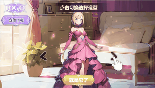

# 轮播组件-空白制作教程

温馨提示：本篇教程主要讲解**如何使用轮播组件 制作轮播类玩法的可玩素材，**建议搭配[DEMO](https://tinyurl.com/4mjzxhkz)和[功能介绍文档](../../../ke-wan-gong-ju-zi-you-bian-ji-qi/zi-you-bian-ji-qi-shi-yong-zhi-nan/zu-jian-ku-kuai-jie-bu-ju/lun-bo-zu-jian.md)食用效果更佳哦！

## <mark style="color:blue;">一、特征标签</mark> 

* 【制作难度】：⭐⭐
* 【适用产品】：通用
* 【交互方式】：切换轮播时
* 【自由度】：全自由
* 【核心资产】：图片
* 【核心功能】：轮播设置、事件切换轮播时

## <mark style="color:blue;">二、效果预览</mark> 

<table><thead><tr><th width="205.33333333333331">手机试玩效果最佳</th><th>竖屏</th><th>横屏</th></tr></thead><tbody><tr><td></td><td></td><td></td></tr><tr><td>扫码试玩</td><td><a href="https://tinyurl.com/4mjzxhkz">点击试玩</a></td><td><a href="https://tinyurl.com/4mjzxhkz">点击试玩</a></td></tr></tbody></table>

## <mark style="color:blue;">三、玩法梳理</mark> 

**我们在开始制作之前先对本案例的玩法逻辑进行简单的梳理：**

* 进入试玩，展示角色造型A和操作指引，引导玩家点击向右箭头切换造型；
* 玩家可点击任一箭头或拖拽角色来切换不同造型，每交互一次，切换一个造型；
* 直到玩家按下"就是它了"确认按钮，跳转结束场景
* 结束场景 玩家按下按钮跳转商店

<figure><figcaption></figcaption></figure>

## <mark style="color:blue;">四、制作思路</mark> 

**核心思想：**场景拆分逻辑清晰，图层结构简单，单个场景里的动画和事件尽可能少

**场景拆分：**根据上一环节的玩法梳理，我们可将本案例拆分为2个场景来制作

<table data-full-width="false"><thead><tr><th width="133">场景名称</th><th width="279">场景1-核心玩法</th><th>场景2-结束场景</th></tr></thead><tbody><tr><td><strong>效果图</strong></td><td></td><td></td></tr><tr><td><strong>场景描述</strong></td><td>引导玩家点击箭头切换造型</td><td>产品信息+跳转按钮</td></tr><tr><td><strong>核心资产</strong></td><td>
<strong>静帧图片：</strong>角色造型*3、切换箭头、操作指引

<strong>视听包装：</strong>闪光粒子特效、点击音效
</td><td>
<strong>静帧图片：</strong>背景图片、logo、跳转按钮

<strong>视听包装：</strong>星光粒子特效
</td></tr><tr><td><strong>核心动画</strong></td><td><strong>指引手指&#x26;确认按钮：</strong>脉冲向前</td><td><strong>跳转按钮：</strong>脉冲向前</td></tr><tr><td><strong>核心事件</strong></td><td>
<strong>触发对象：</strong>轮播组件

<strong>触发事件：</strong>切换轮播时

<strong>响应事件：</strong>播放动效反馈
</td><td>
<strong>触发对象：</strong>跳转按钮

<strong>触发事件：</strong>按下

<strong>响应事件：</strong>跳转应用商店
</td></tr></tbody></table>

## <mark style="color:blue;">五、制作指南</mark> 

\*核心内容为**Step2【组件参数设置】**和**Step5【事件设置】**

### Step1 - 场景搭建 

建议您在创建项目后，先将所有资产上传进<mark style="color:red;">【项目资产】</mark>内，方便后续添加使用

#### **1. 全局场景**

1）在【全局设置】中添加背景音乐、背景图片，为整体设计定下基调

2）在【全局场景】下添加常驻下载按钮、logo等产品信息，并调整各资产的位置大小，进行合理编组

<figure><figcaption></figcaption></figure>

#### **2. 场景1**

1）添加轮播组件：在场景1中点击【玩法模板】，选择【组件库】下的轮播组件并添加

<figure><figcaption></figcaption></figure>

2）添加指引手指、指引文案、确认按钮、点击音效，并调整各资产的位置大小，进行合理编组

<figure><figcaption></figcaption></figure>

#### 3.场景2

1）在场景2中添加产品logo、跳转按钮及背景图片，调整背景图的尺寸和模糊度

<figure><figcaption></figcaption></figure>

2）将场景2勾选为【结束场景】，并取消勾选启用【全局场景】

<figure><figcaption></figcaption></figure>

### <mark style="color:red;">Step2 - 组件参数设置</mark> 

#### 1.选择轮播样式

首先挑选一个合适的轮播样式，在本案例中，我们选择使用【渐隐缩放轮播】

<figure><figcaption></figcaption></figure>

#### 2.设置轮播资源

1）点击替换按钮，替换初始轮播资源

<figure><figcaption></figcaption></figure>

2）点击"+"号，依次上传所有轮播资源（拖拽可调整资源顺序）

<figure><figcaption></figcaption></figure>

3）点击轮播组调整「坑位尺寸」，即每个图片坑位的尺寸大小。在本案例中，我们将坑位尺寸设为1200\*1200

<figure><figcaption></figcaption></figure>

#### 3.坑位设置

「排列方式」默认水平，「坑位数」默认为3，在此不作调整

<figure><figcaption></figcaption></figure>

#### 4.交互方式

1）在本案例中，我们选择「手动」轮播，且交互方式同时勾选「点击」和「拖拽」，也就是玩家既可以通过点击按钮切换图片，也可以通过拖拽图片进行切换

2）点击替换按钮，可替换箭头样式

<figure><figcaption></figcaption></figure>

#### 5.高级设置

「动画播放时长」、「透明度」、「缩放」为默认值即可，在此不作调整

<figure><figcaption></figcaption></figure>

完成以上，我们轮播组件的参数就设置好了。

### Step3 - 横竖屏适配 

完成竖屏的排版后，我们还需对"横屏的排版"以及"横竖屏的屏幕适配方式"进行调整，以适配不同机型

#### **1.调整横屏排版**

1）在场景1中切换到横屏模式，选中所有最高层级的图层(包含轮播组件)，使用【复用竖屏位置尺寸配置】功能一键排版

<figure><figcaption></figcaption></figure>

2）再分别调整各图层的【位置】和【缩放比例】，让画面展示出完整的核心玩法相关内容

<figure><figcaption></figcaption></figure>

3）同理，我们再依次切换到【场景2】和【全局场景】，完成横屏的排版

<figure><figcaption>
场景2
</figcaption></figure>

<figure><figcaption>
全局场景
</figcaption></figure>

#### 2.调整屏幕适配方式 

在本案例中，我们可以将产品信息组\[group\_info]的"屏幕适配方式"在横屏下设为 贴左上角适配；在竖屏下设为 贴顶适配（其他图层默认居中适配，无需调整）

<figure><figcaption>
横屏
</figcaption></figure>

<figure><figcaption>
竖屏
</figcaption></figure>

### Step4 - 动效设置 

在本案例中，用到的动画和粒子特效如下，我们依次展开介绍

**场景1：**指引手指点击动画、确认按钮缩放动画、闪光粒子特效

**场景2：**跳转按钮缩放动画、星光粒子特效

#### 1.指引手指：脉冲向前

选中手指图片\[gf\_hand]，添加动画-强调动画-脉冲向前，作为循环点击动画。参数设置如下：

<figure><figcaption></figcaption></figure>

#### **2.**确认按钮：脉冲向前

复制该动画到按钮组\[group\_btn]，微调参数，关闭自动播放，作为循环指引动画。参数设置如下：

<figure><figcaption></figcaption></figure>

#### 3.跳转按钮：脉冲向前

复制该动画到场景2的跳转按钮组\[ctat]，微调参数，作为循环指引动画。参数设置如下：

<figure><figcaption></figcaption></figure>

#### 4.粒子特效

1）打开公共粒子库，选择并添加合适的粒子特效(如闪光粒子)，用来丰富画面效果

2）调整粒子到合适的位置（注意横竖屏都要调整）

3）注意：场景1的粒子需先设为"隐藏"状态，后续通过事件控制播放

<figure><figcaption></figcaption></figure>

### <mark style="color:red;">Step5 - 事件设置</mark> 

完成所有动效的设置，我们对试玩的逻辑 也就是"事件"进行设置

本案例与事件设置相关的内容有：切换轮播时播放一系列效果反馈；按下确认按钮跳转下一场景；按下跳转按钮后跳转应用商店

接下来，我们按顺序依次讲解

#### <mark style="color:red;">1.图层: 轮播组件</mark>

选中轮播组件，**添加事件 - 切换轮播时**，依次添加响应事件：

* 隐藏指引手指
* 从头播放确认按钮的缩放动画
* 显示并播放粒子特效
* 从头播放1次点击音效

<figure><figcaption></figcaption></figure>

#### 2.图层：确认按钮组

选中确认按钮组\[group\_btn]，**添加事件 - 按下**，添加响应事件：跳转到下一场景

<figure><figcaption></figcaption></figure>

#### 3.图层: 跳转按钮组

选中跳转按钮组\[ctat]，**添加事件 - 按下**，添加响应事件：跳转应用商店

<figure><figcaption></figcaption></figure>

#### 4.图层: 常驻下载按钮组

复制该事件到常驻下载按钮组\[ctat]

<figure><figcaption></figcaption></figure>

以上，就是本案例用到的全部事件。完成所有事件设置，我们的素材就制作完成了。

### Step6 - 整体预览 

1）建议在制作过程中，每完成一部分操作，就及时预览，检查设置是否正确

2）全部制作完成后，可对不同机型/不同语言/横竖屏进行整体预览，确认无误

<figure><figcaption></figcaption></figure>

## <mark style="color:blue;">六、资源提供</mark>

在教程最后，我们为您**提供了本案例所使用到的全部资源，**点击压缩包即可下载。您可以用此资源跟着教程尝试制作，以便尽快上手使用自由编辑器和【轮播组件】制作此类素材


