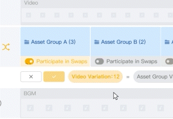

# 叉乘&时序叉乘 - 功能教程

✨叉乘 & 时序叉乘

* 叉乘：资产组在时间轴上的排列顺序是固定不变的，仅资产组内的素材参与排列组合
* 时序叉乘：开启后，不仅资产组内的素材进行组合，资产组在时间轴上的排列顺序也会被打乱重组，从而增加视频的组合数

<figure><figcaption></figcaption></figure>

## <mark style="color:blue;">一、叉乘</mark>

### 1.创建资产组 

* 点击【新建资产组】创建需要的资产组
* 注: 视频、图片、音频、文本都可以创建资产组，参与叉乘

<figure><figcaption></figcaption></figure>

### 2.添加素材 

* 可以通过本地上传或者在资产库中添加素材
* 注: 添加的视频素材时长最好保持一致

<figure><figcaption></figcaption></figure>

### 3.添加资产组到轨道 

* 添加素材后，点击【资产组】回到上一级

<figure><figcaption></figcaption></figure>

* 点击【+】按钮就可以把资产组添加到轨道上

<figure><figcaption></figcaption></figure>

### 4.调整资产组内素材 

资产组要添加到轨道上后，才可以在资产组内对视频进行基础调整（大小、时长、音频音量等）

<figure><figcaption></figcaption></figure>

### 5.调整资产组 

* 资产组可当做普通素材一样进行大小、时长、音量等调节
* 资产组之间也可添加转场

<figure><figcaption></figcaption></figure>

### 6.查看叉乘组合数量 

资产添加到轨道上后，预览界面下方会通过【单个比例的组合视频数】，显示一共可以叉乘出多少个素材

<figure><figcaption></figcaption></figure>

## <mark style="color:blue;">二、时序叉乘</mark>

### 1.启用【时序叉乘】 

* 如需进行时序叉乘只需要点击轨道旁的交叉标志
* **注：只有主轨道上的资产组才可以参与时序叉乘**

<figure><figcaption></figcaption></figure>

### 2.打开【参与叉乘】按钮 

进入时序叉乘界面后，在需要参与叉乘的资产组下打开【参与叉乘】按钮

<figure><figcaption></figcaption></figure>

### 3.查看时序叉乘组合数量 

* 点击【参与叉乘】后，会实时显示一共可以叉乘出多少个素材
* 确认无误后，点击【√】按钮保存设置

<figure><figcaption></figcaption></figure>

## <mark style="color:blue;">三、导出与下载</mark>

### 1.导出 

制作完成后，点击编辑界面右上角的【导出】按钮，转跳到批量导出界面

<figure><figcaption></figcaption></figure>

勾选需要下载的视频后，点击【导出】

<figure><figcaption></figcaption></figure>

### 2.下载 

点击批量导出界面右上角的按钮，点击【→】即可转跳到【导出&下载历史】界面，查看导出情况

<figure><figcaption></figcaption></figure>

点击图示按钮即可将视频下载到本地

<figure><figcaption></figcaption></figure>
