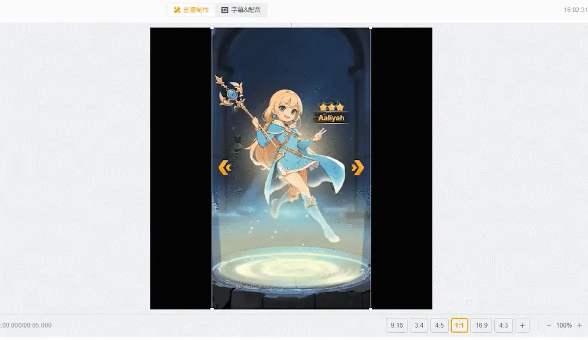
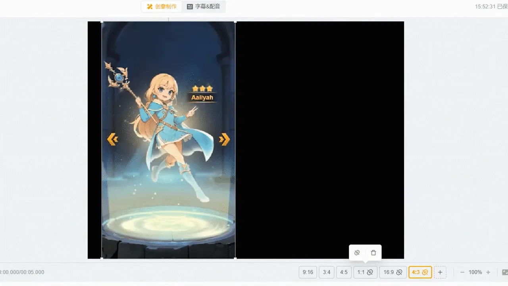

# 功能教程 - 尺寸联动

✨**尺寸联动：**可以同时建立多个尺寸的画布，并将多个画布联动到一起。画布联动后，使得相同素材只需在一个画布中进行位置大小的调整，其他联动画布也会随之变动的功能。

<figure><figcaption></figcaption></figure>

## 操作步骤

### 1.添加多尺寸 

项目创建前以及项目创建后都可以添加多尺寸画布

#### **1）项目创建前**

* 在项目创建前，直接勾选需要的画布比例

<figure><figcaption></figcaption></figure>

* 创建成功进入项目后，即可在预览区右下方看到多个尺寸的联动的画布

<figure><figcaption></figcaption></figure>

#### **2）项目创建后**

* 项目创建后，若想新增多尺寸，可点击预览区右下角的【+】，勾选所需的画布尺寸即可

<figure><figcaption></figcaption></figure>

注：制作中若想删除部分尺寸，可直接点击相应尺寸，点击删除图标即可删除

<figure><figcaption></figcaption></figure>

### 2.联动画布&取消联动 

#### **1）画布联动**

* 每个尺寸上方都有联动标记，显示画布联动的状态
* <mark style="color:red;">画布创建最初</mark><mark style="color:red;">**默认所有画布联动**</mark>

<figure><figcaption></figcaption></figure>

* 画布联动后，相同素材只需在**一个**画布中进行位置大小的调整，其他联动画布即会随之变动
* <mark style="color:red;">注意：只有素材的</mark><mark style="color:red;">**位置大小**</mark><mark style="color:red;">会受联动影响，其他调整不会受影响</mark>

<figure><figcaption></figcaption></figure>

#### **2）取消联动**

* 点击画布上的联动标记即可取消联动
* 预览区右下方会显示出哪些画布是已经取消联动的

<figure><figcaption></figcaption></figure>

* 取消联动的画布，相同素材在画布中可以随意调整位置大小，其他画布不受影响

<figure><figcaption></figcaption></figure>

