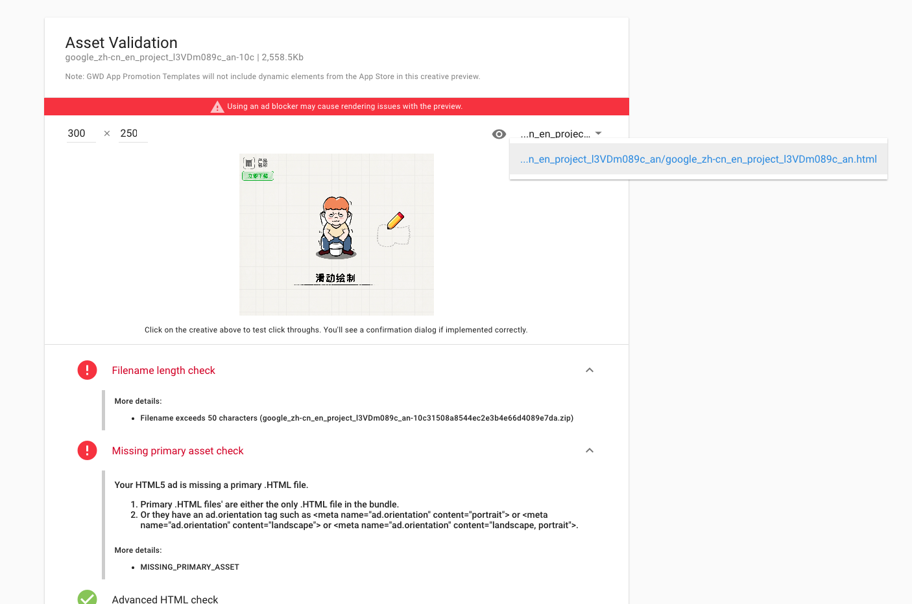

# 可玩广告渠道上传规范

## 目前支持的广告渠道/测试APP <a href="#currently-supported-a-d-networks--test-apps" id="currently-supported-a-d-networks--test-apps"></a>

<table data-full-width="false"><thead><tr><th width="137">渠道</th><th width="129">文件大小</th><th width="202">格式</th><th width="162">测试地址</th><th>测试APP</th></tr></thead><tbody><tr><td>AdColony</td><td>2 MB</td><td>单个 HTML 文件</td><td></td><td><a href="https://install.appcenter.ms/orgs/iosdeveloper-dbmy/apps/ios-playable-preview/distribution_groups/all-users-of-ios-playable-preview">IOS</a><br><a href="https://install.appcenter.ms/orgs/iosdeveloper-dbmy/apps/android-playable-preview/distribution_groups/all-users-of-android-playable-preview">Android</a></td></tr><tr><td>Applovin</td><td>5MB</td><td>单个 HTML 文件</td><td><a href="https://p.applov.in/playablePreview?create=1&#x26;qr=1">Playable Preview</a></td><td><a href="https://install.appcenter.ms/orgs/iosdeveloper-dbmy/apps/ios-playable-preview/distribution_groups/all-users-of-ios-playable-preview">IOS</a><br><a href="https://install.appcenter.ms/orgs/iosdeveloper-dbmy/apps/android-playable-preview/distribution_groups/all-users-of-android-playable-preview">Android</a></td></tr><tr><td>Facebook</td><td>2 MB HTML / 5 MB Zip</td><td>包含资源的单个 HTML 或 Zip</td><td><a href="https://developers.facebook.com/tools/playable-preview/">Playable Preview (Beta)</a></td><td></td></tr><tr><td>Google Ads</td><td>5 MB</td><td>压缩的 HTML 文件<mark style="color:red;"><strong>（tips：将下载到本地的压缩包，解压一次，上传里面的那个压缩包哦）</strong></mark></td><td><a href="https://h5validator.appspot.com/adwords/asset">Google Playable Testing</a></td><td></td></tr><tr><td>ironSource</td><td>5 MB</td><td>单个 HTML 文件</td><td><a href="https://developers.is.com/ironsource-mobile/general/html-upload/">Submit an HTML asset for review</a></td><td></td></tr><tr><td>Liftoff</td><td>5MB</td><td>包含资源的 Zip 文件</td><td></td><td></td></tr><tr><td>Mintegral</td><td>5MB</td><td>包含资源的单个 HTML 或 Zip</td><td><a href="https://www.mindworks-creative.com/review/doc">Mindworks Playable Testing</a></td><td></td></tr><tr><td>Moloco</td><td>2MB HTML / 5MB Zip</td><td>包含资源的单个 HTML 或 Zip</td><td></td><td></td></tr><tr><td>广点通</td><td>3MB</td><td>包含资源的 Zip 文件</td><td></td><td></td></tr><tr><td>TikTok</td><td>3MB</td><td>包含资源的 Zip 文件</td><td></td><td></td></tr><tr><td>Unity Ads</td><td>5MB</td><td>单个 HTML 文件</td><td></td><td><a href="https://apps.apple.com/us/app/ad-testing/id1463016906">IOS</a><br><a href="https://play.google.com/store/apps/details?id=com.unity3d.auicreativetestapp">Android</a></td></tr><tr><td>Vungle</td><td>5MB</td><td>包含资源的单个 HTML 或 Zip(将主 html 文件命名为“ad.html”)</td><td></td><td><a href="https://vungle.com/creative-verifier/">iOS and Android</a></td></tr></tbody></table>

<mark style="color:red;">**注意：**</mark>需要包含所需广告的特定尺寸、格式和 APIS，请确保在实现场景时已涵盖所有这些内容。

**注意：**如果您想知道为什么音频在可播放加载时不播放，这是因为每个广告网络都有一项总体政策，即在用户至少进行一次交互之前不会播放广告中的音频。因此，这不是音频在加载时播放的方式。


## 特定渠道的可玩广告测试

以下内容提供了一些有关如何测试特定渠道的可玩广告的指南

### 1.Applovin

_如果您希望在 Applovin 构建中使用外部请求（例如分析），则需要在上传请求许可之前联系 Applovin。否则播放将被拒绝_

为了测试您的 Applovin 版本，请按照以下步骤操作：

1）从您的 Creative Suite 帐户下载 Applovin 版本

2）导航至[Applovin 可玩预览工具](https://p.applov.in/playablePreview?create=1)

3）拖入您的index.html 文件或手动查找它

<div align="left">

<figure><figcaption></figcaption></figure>

</div>

4）如果可播放的格式不正确或超过文件大小限制，您将出现如下错误：

<div align="left">

<figure><figcaption></figcaption></figure>

</div>

5）您现在可以在预览中测试可玩性，并更改方向

6）当成功点击应用程序商店时，预览工具将显示一条消息 - 请确保这种情况发生在所有预期位置

<div align="left">

<figure><figcaption></figcaption></figure>

</div>

### 2.Facebook

为了测试您的 Facebook 版本，请按照以下步骤操作：

1）从您的 Creative Suite 帐户下载 Facebook 版本

2）导航至[Facebook 可玩预览工具](https://developers.facebook.com/tools/playable-preview/)

3）拖入您的文件或手动查找它

<div align="left">

<figure><figcaption></figcaption></figure>

</div>

4）如果可播放的格式不正确或超过文件大小限制，您将出现如下错误：

<div align="left">

<figure><figcaption></figcaption></figure>

</div>

5）您现在可以在预览中测试可玩性，并更改分辨率

6）当成功点击应用程序商店时，预览工具将显示一条消息 - 请确保这种情况发生在所有预期位置

7）一旦右侧的所有规格项目都变成绿色，就可以将可播放的内容上传到广告管理器

<div align="left">

<figure><figcaption></figcaption></figure>

</div>

### 3.ironSource

ironSource 测试工具已于 2023 年 3 月弃用。

如果您计划将ironSource 用于可玩广告，则必须确保您的构建与该平台兼容。为此，您需要在ironSource 仪表板中提交您的构建以供审核。

提交构建版本以供审核是一个简单的过程，但必须遵循正确的步骤以确保提交成功。为了帮助您完成此过程，ironSource 提供了[详细的指南](https://developers.is.com/ironsource-mobile/general/html-upload/) ，解释了如何逐步提交构建以供审核。

通过遵循ironSource指南中提供的说明，您可以确保您的构建得到高效且有效的审核，并且您的可播放广告有质量保证。

<div align="left">

<figure><figcaption></figcaption></figure>

</div>

### 4.Mintegral

为了测试您的 Mintegral 版本，请按照以下步骤操作：

1）从您的 Creative Suite 帐户下载 Mintegral 版本

2）导航至[Mintegral 可玩预览工具](https://www.mindworks-creative.com/review/)

<div align="left">

<figure><figcaption></figcaption></figure>

</div>

3）拖入您的 zip 存档文件或手动查找它

4）在预览工具中播放可玩内容。如果可玩内容存在任何错误，例如大小错误、格式错误或任何缺少 API，则会以红色突出显示

5）然后，您可以预览可玩内容并更改方向

6）当成功点击应用程序商店时，预览工具将显示一条消息 - 请确保这种情况发生在所有预期位置

7）一旦你满意了，并且测试用例都是绿色的，你就可以将你的 Playable 发送到 Mintegral 了

<div align="left">

<figure><figcaption></figcaption></figure>

</div>

### 5.TikTok

目前，TikTok 上的可玩游戏还没有可用的测试工具。

**其他补充：**

显示方向和语言必须存储在位于一级目录的 config.json 文件中

* 方向必须以 0、1、2（响应式、纵向、横向）值存储
* 语言代码必须存储在`playable_languages`数组中

举例：

```
"playable_orientation": 0,
"playable_languages":["ja","ko"]
```

en：英语  ja：日语  Ko：韩语  Zh-Hant：繁体中文


### 6.Unity Ads

为了测试您的 Unity Ads 版本，请按照以下步骤操作：

1）从 Creative Suite 帐户的下载菜单中复制 Unity Ads 链接

<div align="left">

<figure><figcaption></figcaption></figure>

</div>

2）从 Unity下载[Android](https://play.google.com/store/apps/details?id=com.unity3d.auicreativetestapp)或[iOS测试应用程序](https://apps.apple.com/us/app/ad-testing/id1463016906)

3）打开应用程序并输入可播放广告的网址

4）按**“初始化”**

5）广告加载后，按**“显示”**

6）如果广告加载失败，或者要检查广告的状态，请返回主屏幕并按**“分析”**。任何问题都会在创意报告中显示

举例：

<div align="left">

<figure><figcaption></figcaption></figure>

</div>

<mark style="color:red;">注意：</mark>您的可玩广告必须包含 App Store 和 Google Play 应用商店网址才能通过 QA。在执行以下步骤之前，请确保您已在可玩 UI 中设置这些链接：

**可玩设置> iOS/Android 安装游戏链接**。[更多详细信息请参见此处](https://docs.lunalabs.io/docs/playable/playable-setup/settings/ad-network-settings#global-settings)

请确保对于 iOS 应用商店链接，您使用的是`apps.apple.com/`域名，而**不是**域名`itunes.apple/com/`


### 7.Vungle

为了测试您的 Vungle 版本，请按照 Vungle[此处](https://support.vungle.com/hc/en-us/articles/4908908675355-Test-Your-Playable-Asset-With-Our-Creative-Verifier)提供的这些步骤进行操作。


### 8.Google&#x20;

1）请先勾选【Select for App Campaigns】，然后点击【UPLOAD】上传正确的压缩包

<div align="left">

<figure><figcaption></figcaption></figure>

</div>

2）第一个错误提示：是zip文件名长度，可以随便修改，不用管

3）第二个错误提示：技术人员已排查过，文件没有问题，疑似是检测工具自身的问题，可以忽略

<div align="left">

<figure><figcaption></figcaption></figure>

</div>
