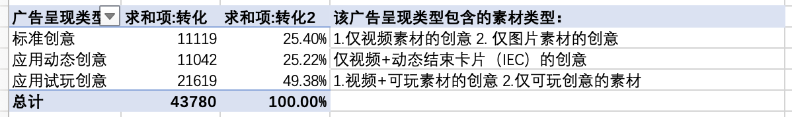

# Mintegral 数据分析查看

## <mark style="color:blue;">一、</mark> <mark style="color:blue;"></mark><mark style="color:blue;">**查看报表**</mark>

数据总览查看路径：点击“首页”可查看不同周期的数据概况

<figure><figcaption></figcaption></figure>

**页面说明：**

* 广告（广告单元）表格中，仅显示花费前20的数据。
* 点击广告名称或者广告单元名称，打开相应的广告以及广告单元报表，可查看更详细的数据。

<figure><figcaption></figcaption></figure>

## <mark style="color:blue;">**二、详细数据报表**</mark>

### a. 广告效果监控报表

“广告效果监控”可见不同维度的数据，同时此报表页面可以分流量/分地区设置出价。

<figure><figcaption></figcaption></figure>

### b. 素材监控报表

“素材监控”可见不同素材类型维度的数据，同时可见不同广告类型维度的数据。

<figure><figcaption></figcaption></figure>

**1）勾选对应的广告呈现类型，可查看不同素材组合具体的投放表现。Mintegral的广告呈现类型分为：**

* 标准创意：仅投放视频或者图片素材
* 应用动态创意：投放展示中素材组合包含互动式结束页（iec）
* 应用试玩创意：投放展示中素材组合包含互动素材（2d/3d 试玩素材)

<figure><figcaption></figcaption></figure>

**2）查看试玩素材投放效果**

* 点开“高级选项”， 取消勾选“素材ID”和“素材名称”，勾选“结束卡片ID”、“结束卡片名称” 与“广告呈现类型”
* 选择“应用试玩创意”或者“应用动态创意”，可以分别查看对应素材投放的效果

<figure><figcaption>
应用试玩创意
</figcaption></figure>

<figure><figcaption>
应用动态创意
</figcaption></figure>

## <mark style="color:blue;">三、“素材监控”数据查看 详细说明</mark>

### 1.按<mark style="color:green;">广告呈现类型Ad Output Type</mark>看安装转化效果

* IEC-动态结束卡片转化的安装：11042, 占25.22%
* Playable-可玩素材转化的安装：21619，占49.38%
* IEC+Playable 所有交互素材的转化安装：11042+21619=32661，占74.60%

<figure><figcaption>
示例
</figcaption></figure>

### 2.按<mark style="color:green;">创意名称Ad Name</mark>看安装转化效果

创意名称Ad Name = **创意组名称 Creative Set Name** + **素材名称 Creative Name** + **结束卡片名称 Endcard Name**

<mark style="color:red;">创意组是一个包含多个素材的组合，可以放进去视频/可玩/图片三种类型的素材，但是至少包含1个视频，1个1200x627图片，1个icon；一般是多个视频，多个可玩素材，多个图片，一个icon</mark>

* 创意名称1: auto\_default\_ALL\_Video\_1.mp4  安装转化50个，占比5.10%；
* 创意名称2: auto\_default\_ALL\_Video\_1\_.mp4\_Image\_1.jpg 安装转化100个，占比10.20%；
* 创意名称3: auto\_default\_ALL\_icon\_512x512 安装转化30个，占比3.06%；
* 创意名称4: auto\_default\_ALL\_Video\_1.mp4\_IEC\_1\_android 安装转化100个，占比10.20%；
* 创意名称5: auto\_default\_ALL\_Video\_1.mp4\_Playable\_1\_android 安装转化500个，占比51.02%；
* 创意名称6: auto\_default\_ALL\_Playable\_1\_android 安装转化200个，占比20.41%

_auto\_default\_ALL 是创意组名称；Video\_1.mp4 是视频素材；Image\_1.jpg和icon\_512x512 是图片素材；IEC\_1\_android (html5格式）是动态结束卡片素材；Playable\_1\_android (html5格式）是可玩素材_

<figure><figcaption>
示例
</figcaption></figure>

### 3.按可玩素材<mark style="color:green;">作为单个素材Creative投放</mark> 或 <mark style="color:green;">作为结束页卡片Endcard配合投放</mark> 看转化效果

<mark style="color:red;">注意：如果同一条可玩素材作为Endcard与视频素材配合作为创意一起投放时候，按</mark><mark style="color:red;">**结束页卡片名称**</mark><mark style="color:red;">查看素材数据；如果同一条可玩素材单独投放的时候，按</mark><mark style="color:red;">**创意名称**</mark><mark style="color:red;">查看素材数据。</mark>

同一条素材需要分开作为素材或作为结束页卡片查看数据，大部分时候可玩素材都是作为结束页卡片进行投放。

#### ⭐可玩素材<mark style="color:green;">作为Endcard</mark> 的时候转化效果：

* 可玩素材A作为Endcard 的时候转化效果 Playable\_1\_android 安装转化1000个；
* 可玩素材B作为Endcard 的时候转化效果 IEC\_1\_android 安装转化800个；
* 可玩素材C作为Endcard 的时候转化效果 Playable\_2\_android 安装转化700个；
* 可玩素材D作为Endcard 的时候转化效果 Playable\_3\_android 安装转化300个

<figure><figcaption>
示例
</figcaption></figure>

#### ⭐可玩素材<mark style="color:green;">单独作为创意Creative</mark> 的时候转化效果：

* 可玩素材A单独作为创意Creative 的时候转化效果 Playable\_1\_android 安装转化200个；
* 可玩素材B单独作为创意Creative 的时候转化效果 Playable\_2\_android 安装转化1个；
* 可玩素材D单独作为创意Creative 的时候转化效果 Playable\_3\_android 安装转化3个

<mark style="color:red;">注意：IEC不能单独作为素材投放</mark>

<figure><figcaption>
示例
</figcaption></figure>

