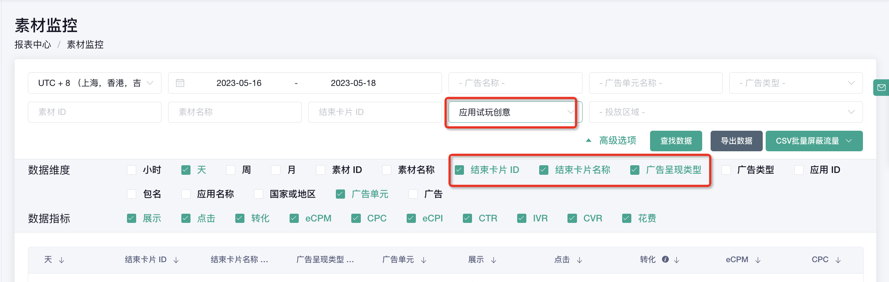

# Mintegral 数据分析查看

## <mark style="color:blue;">一、</mark> <mark style="color:blue;"></mark><mark style="color:blue;">**查看报表**</mark>

数据总览查看路径：点击“首页”可查看不同周期的数据概况

<figure><figcaption></figcaption></figure>

**页面说明：**

* 广告（广告单元）表格中，仅显示花费前20的数据。
* 点击广告名称或者广告单元名称，打开相应的广告以及广告单元报表，可查看更详细的数据。

<figure><figcaption></figcaption></figure>

## <mark style="color:blue;">**二、详细数据报表**</mark>

### a. 广告效果监控报表

“广告效果监控”可见不同维度的数据，同时此报表页面可以分流量/分地区设置出价。

<figure><figcaption></figcaption></figure>

### b. 素材监控报表

“素材监控”可见不同素材类型维度的数据，同时可见不同广告类型维度的数据。

<figure><figcaption></figcaption></figure>

**1）勾选对应的广告呈现类型，可查看不同素材组合具体的投放表现。Mintegral的广告呈现类型分为：**

* 标准创意：仅投放视频或者图片素材
* 应用动态创意：投放展示中素材组合包含互动式结束页（iec）
* 应用试玩创意：投放展示中素材组合包含互动素材（2d/3d 试玩素材)

<figure><figcaption></figcaption></figure>

**2）查看试玩素材投放效果**

* 点开“高级选项”， 取消勾选“素材ID”和“素材名称”，勾选“结束卡片ID”、“结束卡片名称” 与“广告呈现类型”。
* 选择“应用试玩创意”或者“应用动态创意”，可以分别查看对应素材投放的效果。

<figure><figcaption>
Playable数据查看
</figcaption></figure>

<figure><figcaption>
iec数据查看
</figcaption></figure>
