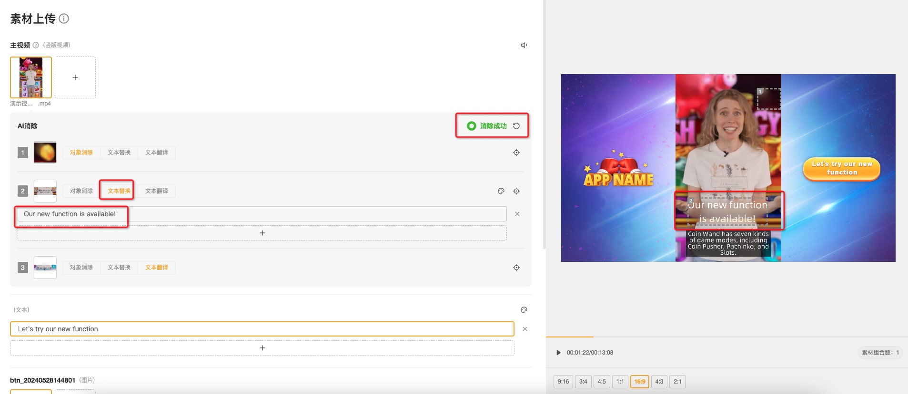

# 亮点功能:视频AI消除

对于已上传的主视频，可以使用AI技术高效移除视频中特定元素（如画面中文本、字幕、水印或徽标等不需要的元素）

常见应用场景如下：

&#x20;**1.对象消除**：消除视频画面中不需要的元素，例如水印、徽标、字幕等。**上传的原始视频内容会被修改**。

&#x20;**2.文本替换**：消除视频画面中不需要的元素，并在此基础上替换为文本内容。**上传的原始视频内容会被修改**。

&#x20;**3.文本翻译**：翻译视频中的文本内容（需进入"语言裂变"界面操作），**但不改变原始视频内容**。

**使用 视频AI消除 的步骤：**

## <mark style="color:blue;">第一步: 添加消除区域</mark>

在使用【布局模板】编辑项目时，可以对**已添加的主视频**进行AI消除操作。

1.选中主视频后，点击“**添加**”，展开该视频的AI消除区域编辑页面。

<figure><figcaption></figcaption></figure>

2.在画面中框选需要处理的区域，即希望移除或替换的特定元素。

3.然后拖动时间轴上的指针，确认消除时间范围（默认对视频的所有时间段进行消除，可根据实际需求手动修改）

<mark style="color:red;">Tips：使用键盘的</mark> <mark style="color:red;"></mark><mark style="color:red;">**"←" "→"**</mark><mark style="color:red;">键，可对指针进行逐帧微调</mark>

4.消除区域及其时间范围确认后，点击"√"保存当前框选

<figure><figcaption></figcaption></figure>

5.一个视频内可添加多个区域，批量保存提交。

<figure><figcaption></figcaption></figure>

## <mark style="color:blue;">第二步: 编辑任务属性</mark>

保存需要处理的区域后，在【素材上传】页面，对已添加的框选区域进行消除任务属性编辑。

框选区域支持三种任务类型，以满足不同的编辑需求。

### 场景一：对象消除

* 对象消除：在指定时间范围内，擦除视频中框选区域的内容。
* 适用场景：用于移除原视频画面中的多余水印、徽标、字幕等不需要的元素。

<figure><figcaption>
对象消除 前
</figcaption></figure>

<figure><figcaption>
对象消除 后
</figcaption></figure>

### 场景二：文本替换

* 文本替换：在指定时间范围内，在擦除视频中框选区域内容的基础上，替换内容为文本内容。该框选区域类似于布局模板中的文本坑位，每组【文本替换】均支持添加多个文本，进行素材组合，最终可以批量导出多个版本的视频。
* 适用场景：将原视频画面中的元素替换为文本。

<figure><figcaption>
文本替换 前
</figcaption></figure>

<figure><figcaption>
文本替换 后
</figcaption></figure>

### 场景三：文本翻译

* 文本翻译：在指定时间范围内，将视频中框选区域的文字翻译为多种语言（需进入"语言裂变"界面进行翻译）。
* 适用场景：将原视频画面中的文本内容翻译为其他语言。

<figure><figcaption>
文本翻译 前
</figcaption></figure>

<figure><figcaption>
文本翻译 后
</figcaption></figure>

### 小结

下表展示了三种不同任务对多语言项目导出结果的影响：

<table><thead><tr><th width="135">任务类型</th><th width="308">项目原语言（原视频）</th><th>翻译语言（项目其他原语言）</th></tr></thead><tbody><tr><td>对象消除</td><td>框选区域被消除</td><td>框选区域被消除</td></tr><tr><td>文本替换</td><td>框选区域被消除，并使用新文本填充</td><td>框选区域使用新文本的译文填充</td></tr><tr><td>文本翻译</td><td>原始视频内容</td><td>框选区域使用原文本的译文填充</td></tr></tbody></table>

## <mark style="color:blue;">第三步: 提交任务</mark>

* 完成任务编辑后，点击“**开始消除**”按钮，批量提交该视频下的AI消除任务
* AI消除需要一定时间，请您耐心等待

<figure><figcaption></figcaption></figure>

* 任务提交后，您可以在导航栏的任务中心查看历史任务进展

<figure><figcaption></figcaption></figure>
