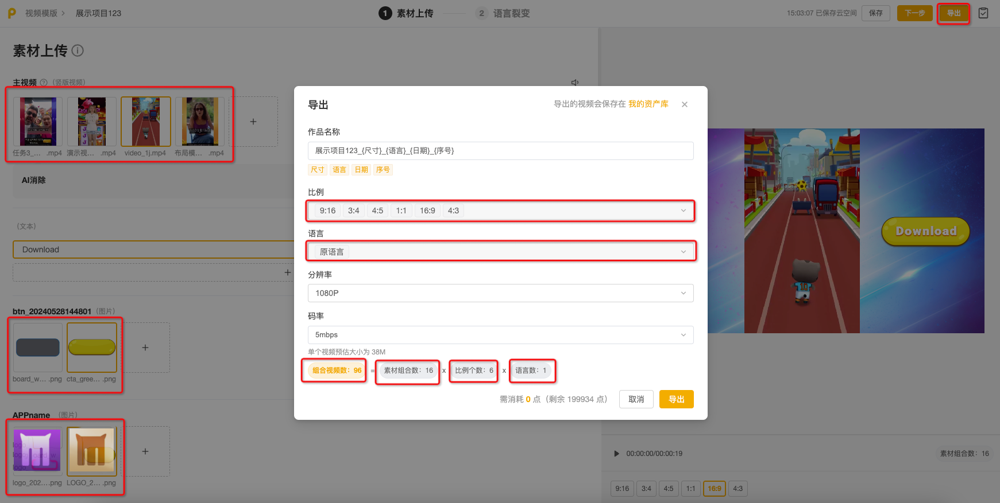
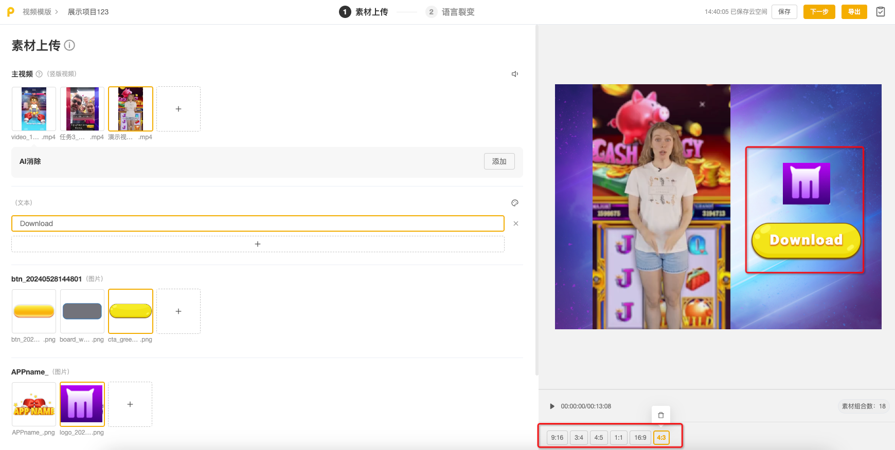
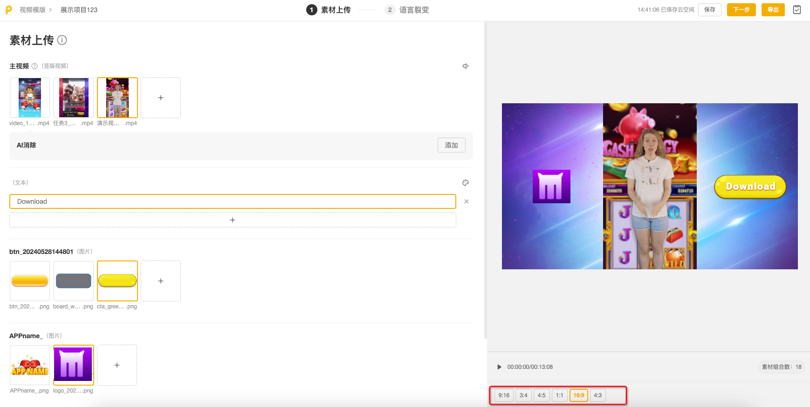

# 素材上传(含尺寸裂变-布局模板)

新建项目后，默认进入【素材上传】编辑界面

## <mark style="color:blue;">一、素材上传</mark>

1.点击坑位旁的"+"号，从本地或资产库中上传素材

2.根据布局模版结构，将所需素材一一上传到相应坑位中，如主视频、LOGO图，背景图等&#x20;

<figure><figcaption></figcaption></figure>

💡<mark style="color:red;">**温馨提示：添加素材后需要删除原视频模板附带的素材哦**</mark>

<figure><figcaption></figcaption></figure>

💡**温馨提示：鼠标悬浮于【素材上传】旁的符号，可查看每种类型素材的上传格式要求**

<figure><figcaption></figcaption></figure>

## <mark style="color:blue;">二、素材组合</mark>

素材组合是指在布局模板中的单个坑位内，允许用户上传多个素材；导出视频时，可以一次性批量导出多个版本视频，无需逐个版本进行导出操作

当多个坑位都上传了多个素材时，系统会自动生成各坑位内素材的所有可能组合，并批量导出这些组合的视频版本

<figure><figcaption></figcaption></figure>

假设一个布局模板有两个坑位，分别为 A 和 B。我们在坑位 A 中上传了素材1和素材2，在坑位 B 中上传了素材3和素材4。系统可以批量导出以下视频版本：

* A1 + B3
* A1 + B4
* A2 + B3
* A2 + B4

这四个版本展示了各种可能的组合，即坑位A 内的两个素材与坑位 B 内的两个素材的所有组合结果

<figure><figcaption></figcaption></figure>

## <mark style="color:blue;">三、视频AI消除</mark>

具体使用方法可直接查阅 [liang-dian-gong-neng-shi-pin-ai-xiao-chu.md](liang-dian-gong-neng-shi-pin-ai-xiao-chu.md "mention")

## <mark style="color:blue;">四、尺寸裂变</mark>

💡Playturbo提供的布局模版覆盖多个尺寸，满足多个广告媒体素材要求，包含：

* 9:16：适用于Mintegral, TikTok ads, Instagram 等
* 16:9：适用于Mintegral, YouTube ads, TikTok ads
* 3:4：适用于Mintegral
* 4:3：适用于Mintegral, LinkedIn ads, Facebook videos
* 1:1：适用于Instagram posts, TikTok ads
* 4:5：适用于Facebook Feed
* 2:1：适用于Facebook

1.完成所有素材上传后，可在图示位置调整需要裂变的尺寸（支持删除、新增）

2.系统会根据布局模板的样式自动完成每个尺寸的适配，以适应不同的显示设备或平台需求。此功能可助您轻松修改视频的宽高比例或分辨率，而无需重新编辑整个视频

<figure><figcaption></figcaption></figure>

示例：假如现在有一个竖版视频，我们需要在横屏设备上播放。使用布局模板的尺寸裂变功能，您可轻松地调整视频的尺寸，以适应横屏显示，并确保视频内容完整显示且不失真

<figure><figcaption></figcaption></figure>

3.点击切换不同尺寸，可在视频预览区域 预览相应的效果

<figure><figcaption></figcaption></figure>

确认无误后，点击【下一步】，进入【语言裂变】编辑界面
