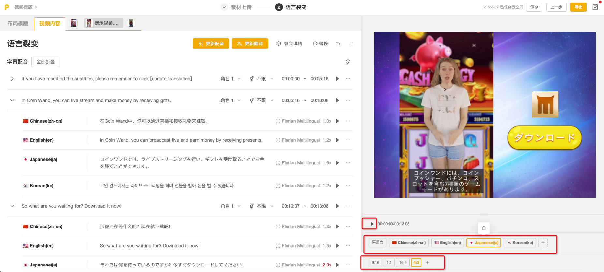

# 语言裂变(通用)

完成【素材上传】页面的编辑，点击【下一步】，进入【语言裂变】编辑页面。左侧展示所有素材的翻译结果，右侧展示预览窗口及语言和尺寸的添加情况

当视频需要用于不同国家地区时，可通过语言裂变功能快速完成视频翻译，并一次性批量导出多个语言版本的视频

<figure><figcaption></figcaption></figure>

## <mark style="color:blue;">一、选择裂变语言和内容</mark>

1.在弹窗内勾选需要裂变的语言和要翻译的内容。可选内容包括：

* **布局模板**中附带的且需要翻译的内容，如按钮文本、产品名称、推广文案等
* **已添加的主视频**中需要翻译的内容，包括视频字幕与配音，以及AI消除添加的文本替换和文本翻译的内容

2.确认内容后，点击【翻译】，稍等片刻

<figure><figcaption></figcaption></figure>

💡<mark style="color:red;">**翻译内容生成后，您仍可在图示位置再次修改语言或需要翻译的内容（新增或删除）**</mark>

<figure><figcaption></figcaption></figure>

## <mark style="color:blue;">二、语言裂变:布局模版</mark>

在「布局模版」翻译栏，您可对布局模版中附带的文本（如按钮文本、产品名称、推广文案等）进行翻译调整

1.单击对应语言的文本框（右侧预览窗口也会随之切换），可手动微调翻译结果

<figure><figcaption></figcaption></figure>

2.点击AI按钮，可使用AI工具进行文本处理，包括：重新翻译、丰富内容、精简内容。也支持在文本框输入自定义指令，如：缩短字数在10个字之内

<figure><figcaption></figcaption></figure>

3.AI改写后，可选择：替换、重新翻译、弃用翻译、切换不同翻译结果等操作

<figure><figcaption></figcaption></figure>

4.点击图示按钮，可修改文本样式；支持按语言选择不同字体

💡<mark style="color:red;">该文本样式将同步应用到所有语言</mark>

<figure><figcaption></figcaption></figure>

## <mark style="color:blue;">三、语言裂变:视频内容</mark>

在「视频内容」翻译栏，您可对已添加的主视频包含的内容进行翻译调整

「视频内容」分为一个或多个翻译栏，这取决于您在选择裂变内容时所**勾选的视频数量**。每添加一个主视频，对应一个需要翻译的视频翻译栏

<figure><figcaption></figcaption></figure>

每个主视频翻译栏包括三个模块：

* **文本翻译：**若该视频在【素材上传】页面提交了AI文本翻译任务，此处将展示原始文本及对应翻译结果
* **文本替换：**若该视频在【素材上传】页面提交了AI文本替换任务，此处将展示替换后的文本及对应翻译结果
* **字幕配音：**此处展示该视频的字幕翻译结果与配音结果。系统会自动识别视频中的说话人（角色）和对话内容（字幕），并将字幕翻译成指定语言

<figure><figcaption></figcaption></figure>

注：【文本翻译】与【文本替换】的操作同「布局模版」翻译栏；下面展开介绍【字幕配音】的操作

### <mark style="color:red;">1.视频字幕</mark>

💡<mark style="color:red;">单击任一文本框，右侧预览窗口会随之切换为该句字幕所在的位置和对应的语言</mark>

#### 1）查看原语言文本的断句是否需要调整。**若调整，该句字幕下的所有语言都会随之一起变动**

* 支持AI功能：可对原语言文本进行：丰富内容、精简内容。也支持在文本框输入自定义指令，如：缩短字数限制在10个字之内
* 可将长字幕分割为短字幕，分割位置为鼠标点击的位置；同理，也可将短字幕合并为长字幕（支持向上合并&向下合并）
* 支持新增字幕坑位、删除当前字幕

<figure><figcaption></figcaption></figure>

#### 2）修改翻译结果

<mark style="color:red;">如果修改了原语言字幕内容，需要</mark><mark style="color:red;">**更新其他语言的翻译结果**</mark>。可通过【重新翻译所有语言】或顶部【更新翻译】，批量更新其它语言的翻译结果

* 更新翻译：针对**所有字幕所有语言**的更新
* 重新翻译所有语言：针对**单句字幕所有语言**的更新

<figure><figcaption></figcaption></figure>

如果仅修改了其他语言的单句翻译内容，可通过【重新翻译】进行更新

* 重新翻译：针对**单句字幕单个语言**的更新

<figure><figcaption></figcaption></figure>

* 选中字幕文本框，可手动微调翻译结果，也可使用AI工具对文本进行处理

<figure><figcaption></figcaption></figure>

#### 3）修改字幕样式

* 点击图示按钮，可修改**字幕样式**和**位置大小；**
* 支持按语言选择不同字体（若有小众语言出现方块字，可自行从本地上传相应字体包）

💡<mark style="color:red;">该文本样式将同步应用到所有语言</mark>

<figure><figcaption></figcaption></figure>

### <mark style="color:red;">2.视频配音</mark>

#### 1）设置角色与性别

* 系统会根据视频中的说话人，自动匹配每段字幕的【角色】与【性别】
* 可手动添加角色、修改角色、修改性别
* 同一段字幕，所有语言共用一个角色设置；同一语言相同角色，共用同一个音色

举例：若视频为单人口播，则将原语言所有字幕统一设置为【角色1】即可；若视频为双人对话，则可根据人物的不同依次设置【角色1】【角色2】，并选择不同音色

<figure><figcaption></figcaption></figure>

#### 2）选择配音音色

配音音色当前分两大类：克隆音色、AI音色。您可根据实际需求自行选择

* **克隆音色：**能够复制原视频中说话人的声线和语气，使朗读效果更真实、自然
  * [#wu-qi-ta-bu-chong-yu-yin-ke-long-suo-zhi-chi-shang-chuan-de-sheng-yin-shuo-ming](yu-yan-lie-bian-tong-yong.md#wu-qi-ta-bu-chong-yu-yin-ke-long-suo-zhi-chi-shang-chuan-de-sheng-yin-shuo-ming "mention")
* **AI音色：**系统预设了丰富的AI音色，您可自由选择（点击按钮可视听）

<figure><figcaption></figcaption></figure>

<figure><figcaption>
<strong>AI音色</strong>
</figcaption></figure>

<mark style="color:red;">如果修改了字幕内容、角色或音色，需要</mark><mark style="color:red;">**更新配音**</mark><mark style="color:red;">才可生效</mark>。可通过【重新配音】或顶部【更新配音】，批量更新其它语言的配音结果

* 更新配音：针对**所有字幕**的配音更新
* 重新翻译所有配音：针对**单句字幕所有语言**的配音更新
* 重新配音：针对**单句字幕单个语言**的配音更新

<figure><figcaption></figcaption></figure>

💡为了确保视频翻译后语音与视频画面同步，翻译语言的配音会自动变速，以适配原语言字幕的时长。过慢或过快的异常变速会影响视频播放效果，您可以通过修改字幕的文本长度来更新配音。

<mark style="color:red;">Tips：可使用AI功能快速精简/丰富内容！</mark>

<figure><figcaption></figcaption></figure>

## <mark style="color:blue;">四、预览及导出</mark>

1.预览：完成所有字幕和配音的修改后，可在图示位置点击切换预览每种语言、每种尺寸的效果

<figure><figcaption></figcaption></figure>

2.导出

* 确认内容无误，点击右上角的「导出」，进行导出设置，根据视频用途选择适当的分辨率和码率
* <mark style="color:red;">注意：为了保证所有视频的成功导出，</mark><mark style="color:red;">**请不要删除【作品名称】下预设的各个占位符**</mark><mark style="color:red;">（{尺寸}</mark>_<mark style="color:red;">{语言}</mark>_<mark style="color:red;">{日期}\_{序号}）</mark>
* 注意：此处不允许选择部分比例或部分语言导出。如需调整，请在编辑时进行删减
* 弹窗内会展示导出视频总数量：组合视频数=素材上传页添加的素材组合数**×**项目比例数**×**项目语言数

<figure><figcaption></figcaption></figure>

* 导出任务提交后，您可在 **我的项目>>>导出&下载历史>>>视频项目** 列表中查看历史任务进展
* <mark style="color:red;">导出成功后，可将所有视频一键下载到本地，或直接推送到已授权的广告渠道账号中</mark>

<figure><figcaption></figcaption></figure>

## <mark style="color:blue;">五、其他补充: 语音克隆所支持上传的声音说明</mark>

**您必须是上传到平台的文件的合法所有者。您对在平台上上传和生成的所有文件负责，并对在其他地方发布这些文件的后果负责。**

如果您不确定能否发布包含克隆声音的内容，请在发布此类内容之前考虑本国版权法的立场。

在Playturbo，我们完全致力于尊重知识产权并采取措施防止技术被滥用：

* 我们只与遵守我们的服务条款、禁止将我们的技术用于任何违法或有害目的的客户合作；&#x20;
* 当使用可识别的声音时，我们仅供建立技术演示，使用的是开源作品或属于公共领域的短片段，并尽可能选择社会和政治中立的背景。同时，我们的演示清楚说明所呈现内容的人工生成来源；&#x20;
* 我们努力支持声音所有者及其许可方主张权利，对所有已知的侵权行为进行审查和处理；
* 所有询问专业级语音克隆服务的客户必须获得声音所有者的许可；
* 我们模型生成的所有音频都将带有水印，以便可以追溯到我们；&#x20;
* 我们正在开发的技术属于新兴领域，尚未出台明确的法规。作为一个人工智能研究实验室，我们的目标之一是提高对这项技术的认识，包括其存在、潜力以及局限性。
