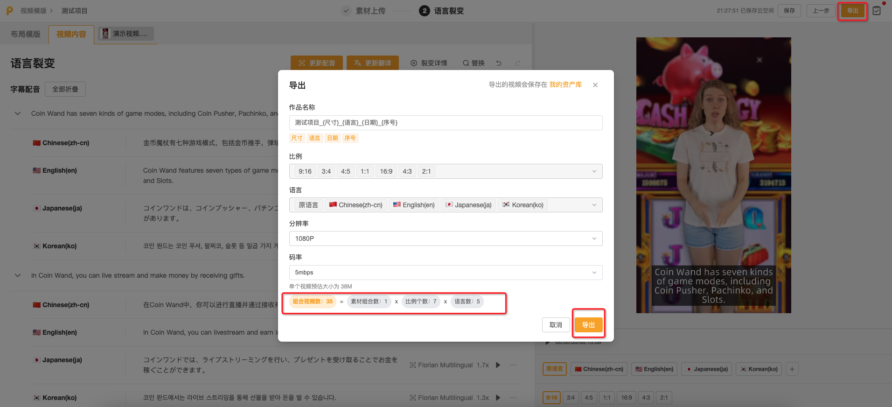

# 语言裂变

完成【素材上传】页面的编辑，点击【下一步】，进入【语言裂变】编辑页面

当视频需要用于不同国家地区时，可通过语言裂变功能快速完成视频翻译，并一次性批量导出多个语言版本的视频

## <mark style="color:blue;">一、选择裂变语言和内容</mark>

1.在弹窗内勾选需要裂变的语言和要翻译的内容。可选内容包括：

* **布局模板**中附带的且需要翻译的内容，如按钮文本、产品名称、推广文案等
* **已添加的主视频**中需要翻译的内容，包括视频字幕与配音，以及AI消除添加的文本替换和文本翻译的内容

2.确认内容后，点击【翻译】，稍等片刻

<figure><figcaption></figcaption></figure>

💡<mark style="color:red;">翻译内容生成后，您仍可在图示位置再次修改语言或需要翻译的内容（新增或删除）</mark>

<figure><figcaption></figcaption></figure>

## <mark style="color:blue;">二、语言裂变:布局模版</mark>

在「布局模版」翻译栏，您可对布局模版中附带的文本（如按钮文本、产品名称、推广文案等）进行翻译调整

1.单击对应语言的文本框（右侧预览窗口也会随之切换），可手动微调翻译结果

<figure><figcaption></figcaption></figure>

2.点击AI按钮，可使用AI工具进行文本处理，包括：重新翻译、丰富内容、精简内容

<figure><figcaption></figcaption></figure>

3.AI改写后，可选择：替换、重新翻译、弃用翻译、切换不同翻译结果等操作

<figure><figcaption></figcaption></figure>

4.点击图示按钮，可修改文本样式

💡<mark style="color:red;">该文本样式将同步应用到所有语言</mark>

<figure><figcaption></figcaption></figure>

## <mark style="color:blue;">三、语言裂变:视频内容</mark>

在「视频内容」翻译栏，您可对已添加的主视频包含的内容进行翻译调整

「视频内容」分为一个或多个翻译栏，这取决于您在选择裂变内容时所**勾选的视频数量**。每添加一个主视频，对应一个需要翻译的视频翻译栏

<figure><figcaption></figcaption></figure>

每个主视频翻译栏包括三个模块：

* **文本翻译：**若该视频在【素材上传】页面提交了AI文本翻译任务，此处将展示原始文本及对应翻译结果
* **文本替换：**若该视频在【素材上传】页面提交了AI文本替换任务，此处将展示替换后的文本及对应翻译结果
* **字幕配音：**此处展示该视频的字幕翻译结果与配音结果。系统会自动识别视频中的说话人（角色）和对话内容（字幕），并将字幕翻译成指定语言

<figure><figcaption></figcaption></figure>

注：【文本翻译】与【文本替换】的操作同「布局模版」翻译栏；下面展开介绍【字幕配音】的操作

### <mark style="color:red;">1.视频字幕</mark>

💡<mark style="color:red;">单击任一文本框，右侧预览窗口会随之切换为该句字幕所在的位置和对应的语言</mark>

#### 1）查看原语言文本的断句是否需要调整。**若调整，该句字幕下的所有语言都会随之一起变动**

* 支持AI功能：可对原语言文本进行：丰富内容、精简内容
* 可将长字幕分割为短字幕，分割位置为鼠标点击的位置；同理，也可将短字幕合并为长字幕（支持向上合并&向下合并）
* 支持新增字幕坑位、删除当前字幕

<figure><figcaption></figcaption></figure>

* 如果修改了原语言字幕，可通过点击【重新翻译所有语言】或顶部「更新翻译」，批量更新其它语言的翻译结果
  * 更新翻译：针对**所有字幕所有语言**的更新
  * 重新翻译所有语言：针对**单句字幕所有语言**的更新

<figure><figcaption></figcaption></figure>

#### 2）修改翻译结果

* 选中字幕文本框，可手动微调翻译结果，也可使用AI工具进行文本处理
* 重新翻译：针对**单句字幕单个语言**的更新

<figure><figcaption></figcaption></figure>

💡<mark style="color:red;">每句字幕右侧都展示了该句配音的语速，预览时若觉得语速过快/过慢，可通过AI功能精简/丰富内容</mark>

<figure><figcaption></figcaption></figure>

#### 3）修改字幕样式

* 您可以点击字幕配音标题行右侧的按钮，展开字幕样式设置
*   点击图示按钮，可修改文本样式

    💡<mark style="color:red;">该文本样式将同步应用到所有语言</mark>

<figure><figcaption></figcaption></figure>

&#x20;    b.配音

* 您可以按照说话人进行配音音色选择：可以使用系统预设的音色（文本转语音）朗读字幕翻译结果，也可以使用原视频音色（语音克隆）朗读。语音克隆能够复制原视频中说话人的声线和语气，使朗读效果更真实、自然。

<figure><figcaption></figcaption></figure>

* 如果修改了字幕内容、说话人或说话人音色，可通过点击顶部「**更新配音**」，批量更新其它语言的配音结果。&#x20;

<figure><figcaption></figcaption></figure>

<figure><figcaption></figcaption></figure>

* 为了确保视频翻译后语音与视频画面同步，翻译语言的配音会自动变速，以适配原语言字幕的时长。过慢或过快的异常变速会影响视频播放效果，您可以通过修改字幕翻译文本长度来更新配音。

<figure><figcaption></figcaption></figure>

## <mark style="color:blue;">三、预览及导出</mark>

* 完成字幕和配音的修改后，可以在右下方可进行每种语言、尺寸的切换预览

<figure><figcaption></figcaption></figure>

* 完成素材上传及翻译后，点击导航栏「**导出**」，进行导出设置，根据视频用途选择适当的分辨率和码率。
* 可批量导出的视频数量=**素材上传页添加的素材组合数×项目比例数×项目语言数**。&#x20;
* 导出任务提交后，您可以在菜单栏**我的项目>>>导出&下载历史**列表中查看历史任务进展。

<figure><figcaption></figcaption></figure>

<mark style="color:red;">导出完成的视频可下载到本地，或直接推送到已授权的广告渠道账号。</mark>

### 2.视频内容（创意制作）翻译

在【视频内容】界面中，可以对在「创意制作」添加的字幕&配音、文本、图片和视频进行翻译。

<figure><figcaption></figcaption></figure>

#### 2.1文本&文本资产组：

对创意制作环节添加的文本或文本资产组内文本进行翻译。

#### 2.2字幕&配音：

1）**字幕**：

* 系统自动识别视频中对话角色（说话人）和对话内容（字幕），并翻译字幕翻译到指定语言。您可以在系统识别基础上修改说话人、字幕内容和字幕翻译结果。
* 选中原语言字幕后，您可以进行字幕分割、合并、删除、新增操作。
* 如果修改了原语音字幕，可通过点击顶部**「**更新翻译**」**，批量更新其它语言翻译结果。&#x20;

<figure><figcaption></figcaption></figure>

2）**配音**：

* 按照说话人进行配音音色选择。可以使用系统预设的音色（文本转语音）朗读字幕翻译结果，也可以使用原视频音色（语音克隆/语音转语音）朗读。&#x20;
* 为了确保视频翻译后语音与视频画面同步，翻译语言的配音会自动变速，以适配原语言字幕的时长。过慢或过快的异常变速会影响视频播放效果，您可以通过修改字幕翻译文本长度来更新配音。
* **如果修改了字幕内容、说话人或说话人音色，可通过点击顶部「更新配音」，批量更新其它语言的配音结果**。&#x20;

<figure><figcaption></figcaption></figure>

<mark style="color:red;">注意：如果项目原语言下只有手动添加的字幕，而不是通过对视频进行语音识别获得的字幕。这种情况下，由于原语言缺少可复制的原声，无法使用语音克隆（语音转语音）功能去朗读字幕翻译结果。</mark>&#x20;

#### 2.3图片&视频

在创意制作环节添加的图片或视频，可以按照语言维度进行素材组合。例如，如果视频中使用了USD标识图片，希望在中文下使用CNY标识图片，在日文下使用JPY标识图片。您可以选择创意项目中的USD标识图片，在中文和日文下分别上传对应的币种标识图片。

## <mark style="color:blue;">四、预览及导出</mark>

* 完成视频编辑工作后，点击导航栏「导出」，进行导出设置，根据视频用途选择适当的分辨率和码率。
* 可批量导出的视频数量=「创意制作」页添加的素材组合数×「尺寸裂变」页添加的比例数×「语言裂变」页添加的语言数。&#x20;
* 导出任务提交后，您可以在菜单栏【**我的项目-导出&下载历史】**列表中查看历史任务进展。&#x20;

<figure><figcaption></figcaption></figure>

<figure><figcaption></figcaption></figure>
