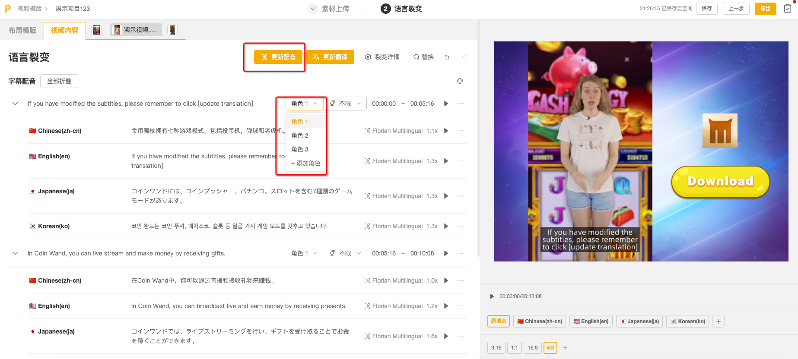
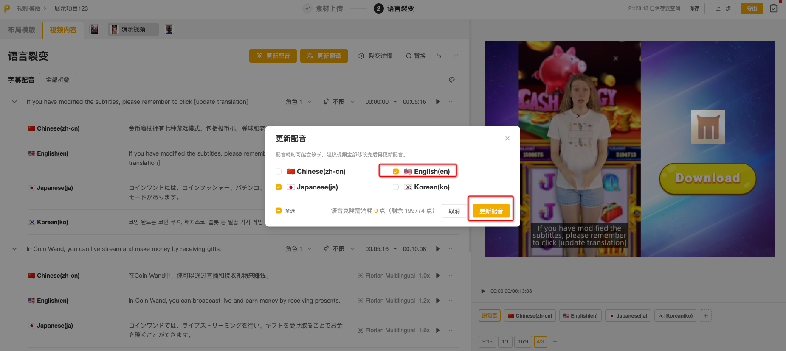
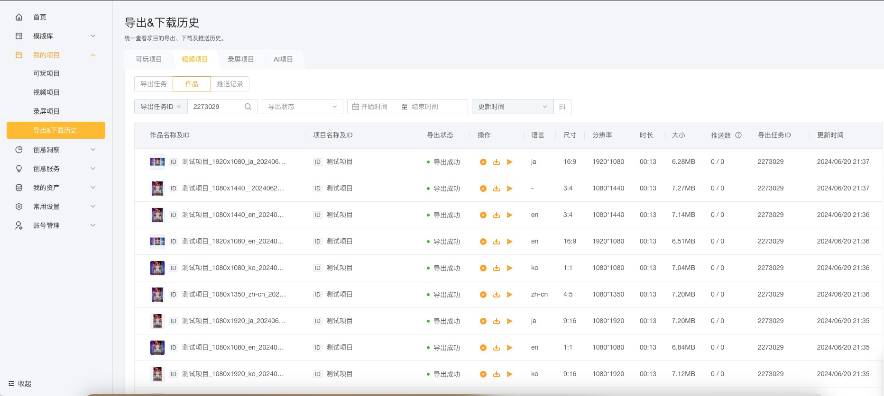

# 语言裂变

当需要将制作好的视频用于不同国家地区时，可通过语言裂变功能快速完成视频翻译，并一次性批量导出多个语言版本的视频。

素材上传完成后，点击导航栏「**下一步**」，选择需要翻译的内容。 可选内容范围包括：

* 布局模板中需要翻译的内容，如按钮文本、产品名称、推广文案等。
* 已添加的主视频中需要翻译的内容，包括视频字幕与配音，以及AI消除添加的文本替换和文本翻译的文本内容。

<mark style="color:red;">您可以在顶部的【</mark><mark style="color:red;">**语言裂变】**</mark><mark style="color:red;">中再次修改需要翻译的内容范围。</mark>

<figure><figcaption></figcaption></figure>

## <mark style="color:blue;">一、布局模版翻译</mark>

* 在「**布局模版**」翻译栏中，您可以对布局模版中已添加的的文本（如按钮文本、产品名称、推广文案等）进行翻译。
* 激活文本框后，您可以使用AI工具进行文本处理，包括缩写、扩写、改写和重新翻译。
* 点击文本后，右侧的视频预览区域会自动定位到该文本出现的起始时间进行播放。

<figure><figcaption></figcaption></figure>

## <mark style="color:blue;">二、视频翻译</mark>

视频翻译分为一个或多个翻译栏，每上传一个主视频，对应一个需要翻译的视频翻译栏。

<figure><figcaption></figcaption></figure>

每个主视频翻译栏包括三个模块：

1\)文本替换：若该视频提交了AI文本替换任务，此处展示替换后的文本及对应翻译结果。

2\)文本翻译：若该视频提交了AI文本翻译任务，此处展示原始文本及对应翻译结果。

3\)字幕配音：

### &#x20;    a.字幕

* 系统会自动识别视频中对话角色（说话人）和对话内容（字幕），并将字幕翻译成指定语言。

<figure><figcaption></figcaption></figure>

* 您可以在系统识别基础上修改说话人、字幕内容和字幕翻译结果。选中原语言字幕后，您可以进行字幕分割、合并、删除、新增操作。

<figure><figcaption></figcaption></figure>

* 您可以点击字幕配音标题行右侧的按钮，展开字幕样式设置。

<figure><figcaption></figcaption></figure>

* 如果修改了原语音字幕，可通过点击顶部「**更新翻译**」，批量更新其它语言翻译结果。&#x20;

<figure><figcaption></figcaption></figure>

### &#x20;    b.配音

* 您可以按照说话人进行配音音色选择：可以使用系统预设的音色（文本转语音）朗读字幕翻译结果，也可以使用原视频音色（语音克隆）朗读。语音克隆能够复制原视频中说话人的声线和语气，使朗读效果更真实、自然。

<figure><figcaption></figcaption></figure>

* 如果修改了字幕内容、说话人或说话人音色，可通过点击顶部「**更新配音**」，批量更新其它语言的配音结果。&#x20;

<figure><figcaption></figcaption></figure>

<figure><figcaption></figcaption></figure>

* 为了确保视频翻译后语音与视频画面同步，翻译语言的配音会自动变速，以适配原语言字幕的时长。过慢或过快的异常变速会影响视频播放效果，您可以通过修改字幕翻译文本长度来更新配音。

<figure><figcaption></figcaption></figure>

## <mark style="color:blue;">三、预览及导出</mark>

* 完成字幕和配音的修改后，可以在右下方可进行每种语言、尺寸的切换预览

<figure><figcaption></figcaption></figure>

* 完成素材上传及翻译后，点击导航栏「**导出**」，进行导出设置，根据视频用途选择适当的分辨率和码率。
* 可批量导出的视频数量=**素材上传页添加的素材组合数×项目比例数×项目语言数**。&#x20;
* 导出任务提交后，您可以在菜单栏**我的项目>>>导出&下载历史**列表中查看历史任务进展。

<figure><figcaption></figcaption></figure>

<mark style="color:red;">导出完成的视频可下载到本地，或直接推送到已授权的广告渠道账号。</mark>

### <mark style="color:blue;">**语言裂变**</mark>

当需要将制作好的视频用于不同国家地区时，可通过语言裂变功能快速完成视频项目翻译，并一次性批量导出多个语言版本的视频。

首次进入【语言裂变】页面时，需要选择待翻译的内容。 可选内容范围包括：

* 布局模板：在「尺寸裂变」使用的布局模版中需要翻译的文本内容，如按钮文本、产品名称、推广文案等。项目未使用布局模版的话，此处内容为空。&#x20;
* 视频内容： 在「创意制作」环节添加已上传的字幕&配音、文本、图片和视频。&#x20;

<figure><figcaption></figcaption></figure>

<mark style="color:red;">您可以在顶部的「</mark><mark style="color:red;">**语言裂变**</mark><mark style="color:red;">」中再次修改需要翻译的内容范围。</mark>

### 1.布局模版翻译

* 在【布局模版】界面中，您可以对布局模版中已添加的的文本（如按钮文本、产品名称、推广文案等）进行翻译。
* 激活文本框后，您可以使用AI工具进行文本处理，包括缩写、扩写、改写和重新翻译。
* 点击文本后，右侧的视频预览区域会自动定位到该文本出现的起始时间进行播放。

<figure><figcaption></figcaption></figure>

### 2.视频内容（创意制作）翻译

在【视频内容】界面中，可以对在「创意制作」添加的字幕&配音、文本、图片和视频进行翻译。

<figure><figcaption></figcaption></figure>

#### 2.1文本&文本资产组：

对创意制作环节添加的文本或文本资产组内文本进行翻译。

#### 2.2字幕&配音：

1）**字幕**：

* 系统自动识别视频中对话角色（说话人）和对话内容（字幕），并翻译字幕翻译到指定语言。您可以在系统识别基础上修改说话人、字幕内容和字幕翻译结果。
* 选中原语言字幕后，您可以进行字幕分割、合并、删除、新增操作。
* 如果修改了原语音字幕，可通过点击顶部**「**更新翻译**」**，批量更新其它语言翻译结果。&#x20;

<figure><figcaption></figcaption></figure>

2）**配音**：

* 按照说话人进行配音音色选择。可以使用系统预设的音色（文本转语音）朗读字幕翻译结果，也可以使用原视频音色（语音克隆/语音转语音）朗读。&#x20;
* 为了确保视频翻译后语音与视频画面同步，翻译语言的配音会自动变速，以适配原语言字幕的时长。过慢或过快的异常变速会影响视频播放效果，您可以通过修改字幕翻译文本长度来更新配音。
* **如果修改了字幕内容、说话人或说话人音色，可通过点击顶部「更新配音」，批量更新其它语言的配音结果**。&#x20;

<figure><figcaption></figcaption></figure>

<mark style="color:red;">注意：如果项目原语言下只有手动添加的字幕，而不是通过对视频进行语音识别获得的字幕。这种情况下，由于原语言缺少可复制的原声，无法使用语音克隆（语音转语音）功能去朗读字幕翻译结果。</mark>&#x20;

#### 2.3图片&视频

在创意制作环节添加的图片或视频，可以按照语言维度进行素材组合。例如，如果视频中使用了USD标识图片，希望在中文下使用CNY标识图片，在日文下使用JPY标识图片。您可以选择创意项目中的USD标识图片，在中文和日文下分别上传对应的币种标识图片。

## <mark style="color:blue;">四、预览及导出</mark>

* 完成视频编辑工作后，点击导航栏「导出」，进行导出设置，根据视频用途选择适当的分辨率和码率。
* 可批量导出的视频数量=「创意制作」页添加的素材组合数×「尺寸裂变」页添加的比例数×「语言裂变」页添加的语言数。&#x20;
* 导出任务提交后，您可以在菜单栏【**我的项目-导出&下载历史】**列表中查看历史任务进展。&#x20;

<figure><figcaption></figcaption></figure>

<figure><figcaption></figcaption></figure>

<mark style="color:red;">**导出完成的视频可下载到本地，或直接推送到已授权的广告渠道账号。**</mark>
