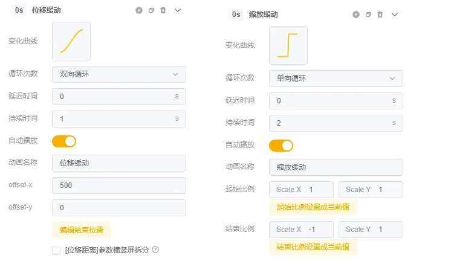

# 视频编辑器-使用指南

**使用 视频编辑器 的操作顺序建议：**

### <mark style="color:blue;">**STEP1: 创意制作**</mark>

1）新建项目后，在【创意制作】编辑页面从零开始制作视频项目 或 对视频模板进行迭代

使用指南： [chuang-yi-zhi-zuo-ye-mian-fen-qu-jie-shao](chuang-yi-zhi-zuo-ye-mian-fen-qu-jie-shao/ "mention") / [shi-pin-mu-ban-shi-yong-jian-yi.md](shi-pin-mu-ban-shi-yong-jian-yi.md "mention")

2）可根据实际需求，对素材进行批量组合

使用指南： [pi-liang-zu-he-gong-neng-cha-cheng](liang-dian-gong-neng/pi-liang-zu-he-gong-neng-cha-cheng/ "mention")

<figure><figcaption></figcaption></figure>

### <mark style="color:blue;">**STEP2: 尺寸裂变**</mark>

完成视频创意制作后，点击切换到【尺寸裂变】编辑页面

可通过以下两种方式快速完成尺寸拓展：

* 布局模板：系统将根据布局模板的样式自动完成多个尺寸的适配
* 不填充元素：需手动微调，默认填充背景为黑色

使用指南： [chi-cun-lie-bian-shi-pin-bian-ji-qi.md](liang-dian-gong-neng/chi-cun-lie-bian-shi-pin-bian-ji-qi.md "mention")

<figure><figcaption></figcaption></figure>

### <mark style="color:blue;">**STEP3: 语言裂变**</mark>

完成多尺寸的排版调整后，若需要将制作好的视频用于不同国家地区，可点击切换到【语言裂变】编辑页面，快速完成视频项目翻译，并一次性批量导出多个语言版本的视频

使用指南： [yu-yan-lie-bian-shi-pin-bian-ji-qi.md](liang-dian-gong-neng/yu-yan-lie-bian-shi-pin-bian-ji-qi.md "mention")

<figure><figcaption></figcaption></figure>

### <mark style="color:blue;">**STEP4:**</mark> <mark style="color:blue;"></mark><mark style="color:blue;">导出</mark>

完成视频创意制作、素材批量组合、视频尺寸裂变、视频语言裂变后，即可导出。选择适当的分辨率和码率后，点击【导出】

<figure><figcaption></figcaption></figure>
